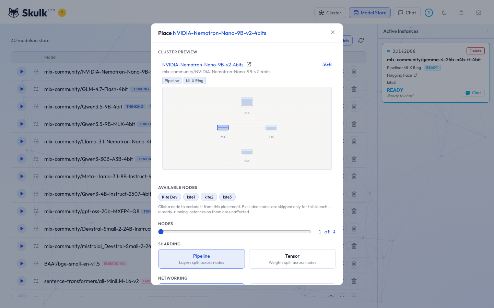
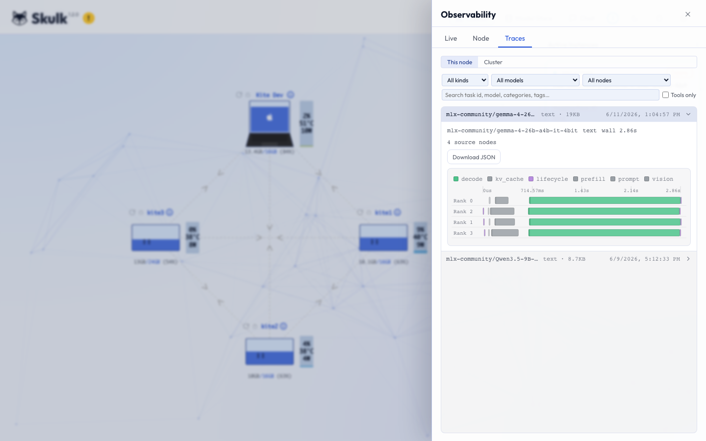
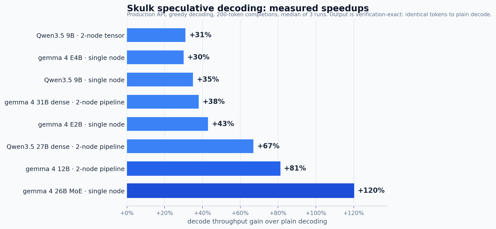
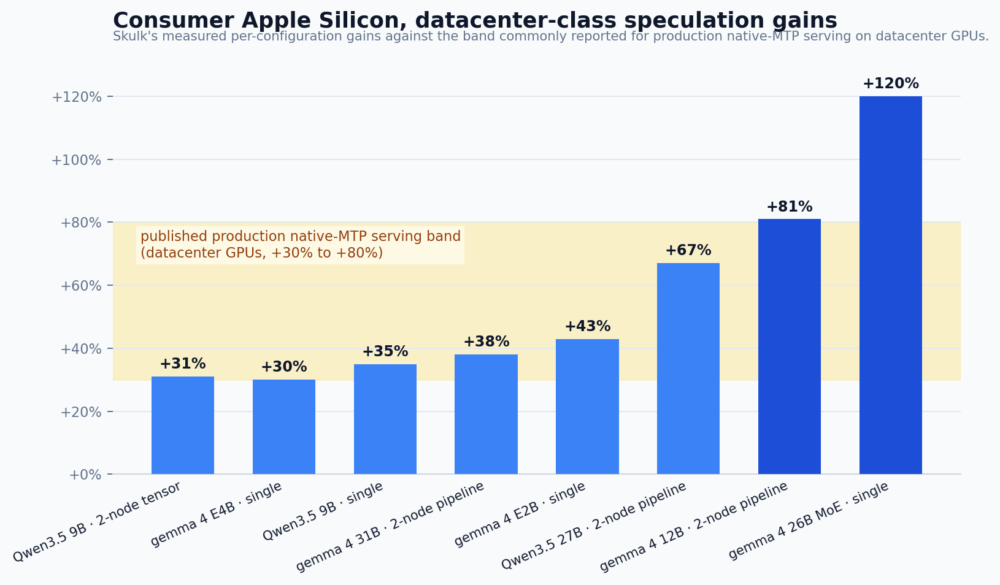
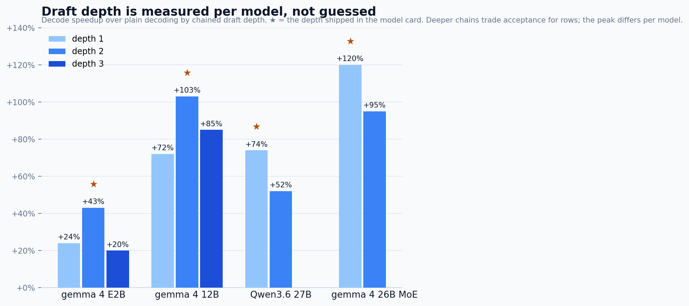
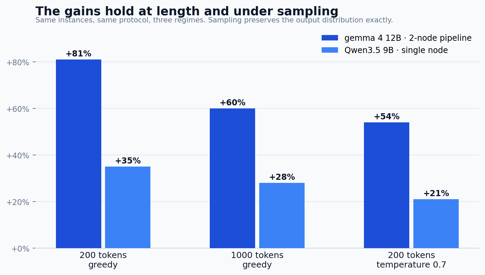

# **Skulk**

<!-- Copyright 2025 Foxlight Foundation -->

<div align="center">

[](https://foxlight-foundation.github.io/Skulk/release-notes/1.2.0/)
[](https://github.com/Foxlight-Foundation/Skulk/actions/workflows/pipeline.yml)
[](LICENSE)

[](https://foxlight-foundation.github.io/Skulk/)
[](https://foxlight-foundation.github.io/Skulk/build-and-runtime/)
[](https://foxlight-foundation.github.io/Skulk/release-notes/1.2.0/)
[](https://foxlight-foundation.github.io/Skulk/architecture/)

  <br>
  
</div>

<br>
Skulk runs AI models across one or more machines as a single cluster: point it at a few Apple Silicon machines and
it pools their memory and GPUs behind one OpenAI-compatible endpoint. Skulk builds on the distributed
inference foundations provided by exo and adds:

- Production-grade speculative decoding delivering 1.16–2.2× speedups across nodes and on heterogeneous hardware. 
- A real-time React dashboard with easy access to:
  - A central model store
  - A placement manager with live cluster
preview
  - Chat
  - Deep observability (cross-rank trace waterfalls, cluster timelines, and centralized
logging). 
- Flexible API wire formats including:
  - OpenAI Chat Completions and Responses
  - Claude Messages
  - Ollama
- One pipeline with continuous batching, selectable KV-cache quantization
backends, and rational context-length control 
- Stability hardening including
  - Placement failover in case nodes (including the master) go down
  - crash loops protection
  - Smarter placement management so that oversized placements are refused before they cause failures
- And much more.

## Why Skulk

Why would you use Skulk over another solution? What does it get you?

### Performance

- **Speculative decoding that actually ships.** Multi-token-prediction (MTP) drafting with a bonus-driven verify loop, chained draft depths measured per model card (`mtp_max_depth`), and support for both greedy and temperature sampling. Works on single-node, pipeline-sharded, and tensor-parallel placements, including heterogeneous multi-node rings where draft/accept decisions are explicitly broadcast so mixed hardware cannot silently diverge and wedge the GPU. On by default for supported cards, with a per-card `speculative_multi_node` opt-out; the dashboard shows a ⚡ MTP badge with the active depth on each running instance. Full guide: [Speculative Decoding](https://foxlight-foundation.github.io/Skulk/speculative-decoding/). **Why it matters:** measured 1.16–2.2× decode speedups with verification-exact output: the accepted tokens are identical to what plain decode would have produced.

- **Continuous batching.** `BatchGenerator` queues incoming requests and decodes them together token-by-token. `SKULK_MAX_CONCURRENT_REQUESTS` (default 8) controls the per-runner ceiling. **Why it matters:** multiple concurrent users share one model's forward pass; throughput scales with concurrency instead of head-of-line blocking.

### Reliability

- **Placements survive master failover.** A newly elected master seeds its session from the prior replicated state (placed instances, completed downloads, node info) and suppresses liveness-based pruning for a topology-settle grace window while gossip rebuilds. **Why it matters:** restarting or losing the coordinator node is a model-reload-sized blip (~20 s to resume serving), not a silent outage where every placement becomes a 404 until an operator notices.

- **Memory-safe placement, checked twice.** The placement fit-check and a worker-side pre-spawn guard share one memory model, GPU-wireable availability (total minus wired, anonymous, and compressor pages) rather than naive free RAM, so the master and the executing node cannot disagree about whether a model fits. Oversized placements are refused with the node and the GB arithmetic in the error. **Why it matters:** the failure mode this kills is the worst one on Apple Silicon: a mid-load Metal OOM that SIGABRTs the runner and leaks wired GPU memory until reboot.

- **Crash containment.** The crash circuit breaker is edge-triggered (one trip per crash loop, not one per failure) and GPU-wedge runner deaths are never retried, because each retry of a wedged load leaks wired memory. A wedged warmup marks the instance failed loudly instead of silently disabling the node. **Why it matters:** a misbehaving model gives up cleanly and tells you why; it cannot grind a node into the ground by retrying.

- **Event-storm immunity.** Clients that abandon requests (short timeouts against a loading model) used to be able to ignite a self-sustaining event storm that drowned replicas and churned master elections. Fixed at five layers, ending with a master-side cap that refuses to index task events for tasks that no longer exist. **Why it matters:** an impatient or buggy client cannot destabilize the cluster.

- **Ring formation under a deadline, on the right wires.** Distributed group connect runs under a hard timeout (`SKULK_GROUP_CONNECT_DEADLINE_SECONDS`, default 120) with a network diagnosis on expiry, instead of hanging forever on a failed rank handshake. Interconnect selection ranks observed links Thunderbolt > Ethernet > Wi-Fi > VPN, detecting Tailscale addresses so a VPN path is used only when nothing better exists. **Why it matters:** a half-formed ring self-heals through re-placement in seconds, and a Thunderbolt-connected cluster actually uses its Thunderbolt. Tailscale stays what it is for: reachability, not a data path.

- **Telemetry that cannot take down inference.** Node monitoring uses mactop; the previous poller's GPU queries could collide with MLX under load and reboot the machine. **Why it matters:** watching the cluster never costs you the cluster.

- **Hang detection.** Pipeline-collective evals carry per-eval timeouts (`SKULK_PIPELINE_EVAL_TIMEOUT_SECONDS`). Runner subprocesses watch their parent and exit if the agent dies. Always-on per-runner flight recorder retains the last 128 phase transitions. **Why it matters:** wedged Metal collectives produce a precise rank attribution in seconds instead of indefinite SSE silence; recovering disk + GPU memory after a SIGKILL is automatic.

- **Snapshot bootstrap + bounded replay retention.** The master writes periodic state snapshots; followers hydrate from a snapshot and replay only the retained tail. The live `events.bin` no longer grows without limit. **Why it matters:** rejoin time on a long-lived cluster is bounded by the snapshot, not by the entire event history. Disk use stops being an SLO concern.

- **Per-model runtime overrides.** Model cards carry `metal_fast_synch` and other Skulk-specific knobs the engine consults at runtime. `MLX_METAL_FAST_SYNCH` now defaults OFF cluster-wide, after it repeatedly wedged warmups (Nemotron, gpt-oss) for no measurable decode gain, and cards pin it back on only where it is proven safe and useful. **Why it matters:** known-bad upstream defaults don't bite you the first time you try a new model.

- **Trace janitor.** Hourly background task in the API drops saved trace files older than `tracing.retention_days` (default 3). **Why it matters:** debugging traces don't fill the disk during incident response.

### Observability

- **Cross-rank cluster timeline.** `/v1/diagnostics/cluster/timeline` stitches every node's flight recorder into one chronologically-ordered view. **Why it matters:** rank-disagreement signature of a distributed deadlock, the most common hang shape, is visible at a glance instead of requiring you to grep four logs simultaneously.

- **On-demand capture bundles.** `POST /v1/diagnostics/node/capture` collects live diagnostics, the runner's flight recorder, the process tree, and best-effort `sample`, `vmmap -summary`, and `footprint -p` output for the runner process. Cluster proxy version fans out across all reachable peers. **Why it matters:** you get macOS-native process introspection per runner without SSHing into each box.

- **Centralized logging stack.** Each node can emit structured JSON on stdout (configured via `skulk.yaml`, synced cluster-wide). `deployment/logging/` ships a Vector → VictoriaLogs → Grafana docker-compose. **Why it matters:** standard tooling: search across the whole cluster with LogsQL, build alerts in Grafana, no bespoke log viewer to maintain.

- **Tracing surface.** Cluster-wide tracing toggle, per-task trace sessions on runners, master merges per-rank traces and the API persists them. Native waterfall in the dashboard renders inline (no popup blockers, trace data never leaves the cluster). Inline filter bar, per-row expansion, sub-pixel-event clustering for dense traces. **Why it matters:** turn on, reproduce, inspect, turn off, all without a third-party hosted UI in the request path.

### Operator UX

- **Real React + TypeScript dashboard.** Topology view with per-node memory/GPU/temp/power, model picker + model store, placement manager with cluster preview, chat with conversation history, three-tab observability panel, settings panel that syncs across the cluster. Light + dark themes. **Why it matters:** you operate the cluster from a UI, not by curl-ing endpoints in a notebook.

- **Per-placement node exclusion.** Exclude specific nodes from a single launch without taking them out of the cluster. Click-to-toggle pills in the placement modal; `excluded_nodes` on `POST /place_instance`; previews via `excluded_node_ids` on `GET /instance/previews`. Already-running instances on excluded nodes are unaffected. **Why it matters:** keep a node available to other workloads while routing one specific placement around it.

- **Cluster-wide settings sync.** Toggling tracing, logging, KV-cache backend, or HF token in the dashboard propagates to every node via gossipsub. **Why it matters:** one knob to turn, every node honors it, no fleet-wide SSH loop.

### Inference

- **Rational context-length control.** Every placed instance derives a usable context ceiling, the smaller of the model's advertised context length and the KV-cache tokens that actually fit in memory beside the weight share on each hosting node, computed deterministically so all ranks of a multi-node placement enforce the identical limit. An explicit `max_tokens` that cannot fit is rejected with an OpenAI-style `context_length_exceeded` error; a window-filling prompt is rejected before prefill; an omitted `max_tokens` is clamped so generation ends with `finish_reason: "length"`. **Why it matters:** other stacks let the KV cache grow until the allocator kills the process mid-stream. Skulk tells the client no, precisely and immediately, and the node keeps serving.

- **KV cache backend choice.** Per-cluster selection between `default`, `mlx_quantized`, `turboquant`, `turboquant_adaptive`, and `optiq`. Configurable via `skulk.yaml` or `SKULK_KV_CACHE_BACKEND`. **Why it matters:** trade memory footprint against cache fidelity at the cluster level; pick what fits your hardware.

- **Family-aware behavior.** Gemma 4 multimodal (audio + vision), DeepSeek V3.2, GPT-OSS / Nemotron / Qwen 3.5 / Llama Nemotron Nano thinking-and-reasoning separation, structured output / JSON mode, OpenAI-compatible tool calling. **Why it matters:** new model releases land with explicit per-family handling, not a generic "the abstraction will figure it out."

### APIs

- **Four wire formats, one pipeline.** OpenAI Chat Completions, OpenAI Responses, Claude Messages, and Ollama-compatible endpoints all converge on the same internal `Task`. Adapters live in `src/skulk/api/adapters/`. **Why it matters:** clients pick the SDK they prefer; the cluster doesn't care.

- **Auto-generated OpenAPI.** Routes carry `tags`, `summary`, and `description`; Pydantic field descriptions flow into the schema. The interactive API browser is built from the live spec. **Why it matters:** the API surface is programmable: generate clients, run contract tests, no doc drift.

### Storage

- **Model store.** Optional cluster-shared host with rsync-style staging: download once, and every node stages locally instead of independently fetching from Hugging Face. **Why it matters:** large-model cluster cold start is bandwidth-bounded by one node, not N.

- **Custom model cards.** Operator-added `*.toml` files under `~/.local/share/skulk/custom_model_cards/` (XDG on Linux, `~/.skulk/...` on macOS). The capability resolver reads built-in + custom and prefers custom on `model_id` collision. **Why it matters:** ship your own quantized variant or override a built-in card without forking the repo.

### Operations

- **Runs as a real service.** One-shot installers (`deployment/install/install-launchd.sh` on macOS, `install-systemd.sh` on Linux) register Skulk as a user-level supervised service: starts at login/boot, restarts on crash with backoff, stops after a hot crash loop, and leaves a deliberate `skulk stop` stopped. The LaunchAgent can self-update on boot, operator knobs live in an env file at `~/.skulk/skulk.env`, and a separate `skulk-vector` agent ships logs without coupling log shipping to the inference lifecycle. **Why it matters:** a cluster node survives reboots, crashes, and upgrades unattended, with no terminal sessions to babysit.

- **Per-task cancellation.** `POST /v1/cancel/{command_id}` and the cooperative runner-task cancel both work; the dashboard exposes "Cancel task" on each running task in the Node tab. **Why it matters:** stuck or runaway requests are recoverable without restarting the runner.

### Engineering discipline

- **Strict typing, tests, docs.** `basedpyright` runs at `0 errors, 0 warnings, 0 notes` on the main branch. Placement, apply, and API paths have test coverage. Architecture docs (`architecture.md` for narrative, `architecture-reference.md` for the dense fact-sheet) are required to update on architectural shape changes. **Why it matters:** regressions surface in CI, the codebase stays legible to future contributors, and the docs reflect what the code actually does.

- **Stability claims are earned on hardware.** Every reliability fix above was reproduced and re-verified live on a multi-node Apple Silicon cluster, with batteries that deliberately kill the master mid-serving, bounce nodes during decode, spray abandoned requests at loading models, and soak concurrent clients for hours. The bugs those batteries surfaced were fixed before any user hit them. **Why it matters:** "it should survive that" and "we watched it survive that" are different claims; Skulk makes the second one.

## Prerequisites

### macOS

- [Xcode](https://developer.apple.com/xcode/)
- [uv](https://github.com/astral-sh/uv)
- [node](https://github.com/nodejs/node)
- [rustup](https://rustup.rs/)
- `mactop` for Apple Silicon monitoring
- [Nix](https://nixos.org/download/) for `nix fmt`, `nix flake check`, and the repo dev shell

```bash
brew install uv mactop node
curl --proto '=https' --tlsv1.2 -sSf https://sh.rustup.rs | sh
rustup toolchain install nightly
```

### Linux

- [uv](https://github.com/astral-sh/uv)
- Node 18+
- [rustup](https://rustup.rs/)

```bash
curl -LsSf https://astral.sh/uv/install.sh | sh
curl --proto '=https' --tlsv1.2 -sSf https://sh.rustup.rs | sh
rustup toolchain install nightly
```

## Getting Started

If you are brand new to Skulk, follow this order:

1. Install the prerequisites for your platform.
2. Clone the repo.
3. Build the dashboard.
4. Run `uv sync`.
5. Start Skulk with `uv run skulk`.
6. Open the dashboard at `http://localhost:52415`.
7. Confirm your node or cluster appears in the topology view.
8. Launch a model from the Model Store view, or place one through the API.
9. Wait until the model is placed and ready.
10. Then chat in the dashboard or send API requests.

Skulk's core runtime flow is:

1. start one or more nodes
2. confirm topology
3. place a model
4. wait for it to become ready
5. then use the dashboard or API

Important behavior:

- The dashboard will not let you chat unless a model is already placed and ready.
- The API behaves the same way in practice. If you send a chat request too early, you will usually get `404 No instance found for model ...`.

Build/runtime note:

- `uv` is the canonical source and runtime path for Skulk on macOS, including the official `mlx` + `mlx-metal` wheel stack.
- Nix is kept for reproducible development tooling, formatting, and `flake`-based validation. It should match the `uv` runtime contract instead of silently substituting a different MLX build.

## Choose Your Path

- **I want the fastest first success**: follow [Single-Node Quick Start](#single-node-quick-start).
- **I want a multi-node cluster**: follow [Cluster Quick Start](#cluster-quick-start).
- **I want shared storage and fewer duplicate downloads**: read [Model Store](#model-store) after the cluster quick start.
- **I want to integrate with code**: jump to [API Guide](#api-guide) and then [docs/api.md](docs/api.md).

## Platform Support

| Platform | Current state |
|----------|---------------|
| macOS on Apple Silicon | Primary target. Best experience today. |
| Multi-Mac clusters | Supported. Best results on matched macOS versions and fast networking. |
| RDMA over Thunderbolt 5 | Supported on eligible macOS 26.2+ hardware after OS-level setup. |
| Linux | Supported, but currently CPU-oriented in this fork. |

## Core Features

- **Distributed inference**: split work across devices instead of treating each machine as an island.
- **Speculative decoding**: measured 1.16–2.2× decode speedups via multi-token prediction, on by default for supported model cards, including multi-node placements on mixed hardware.
- **Skulk Dashboard**: React dashboard for topology, model store, chat, settings, and placement workflows.
- **Model Store**: centralize model files on one node and stage them to the rest of the cluster over the LAN.
- **Cluster-wide config sync**: update config from the dashboard and sync it across nodes.
- **Placement previews**: inspect valid placements before launching a model.
- **Thinking-aware chat UI**: chat with compatible models and surface reasoning content.
- **Alternative API compatibility**: OpenAI Chat Completions, OpenAI Responses, Claude Messages, and Ollama.
- **Experimental inference tuning**: OptiQ and other KV cache backends for long-context and memory experiments.

## Dashboard

Skulk serves a built-in dashboard at `http://localhost:52415`.
The React dashboard in `dashboard-react/` is the only supported UI.
The normal dashboard flow is: confirm topology, launch a model, wait for it to become ready, then open chat.

<p align="center">
  
</p>
<p align="center"><em>Start here: confirm the node or cluster looks healthy in the cluster view. Shown: a Gemma 4 MoE placed across all four nodes of a live cluster alongside a single-node Qwen instance running speculative decoding (the MTP D1 badge), with per-node memory, GPU, and temperature at a glance.</em></p>

<p align="center">
  
</p>
<p align="center"><em>Next: launch or download a model from the Model Store view. Running instances stay visible in the side panel wherever you are.</em></p>

<p align="center">
  
</p>
<p align="center"><em>Then: chat once a model is placed and ready, with conversation history in the sidebar.</em></p>

<p align="center">
  
</p>
<p align="center"><em>Placing a model: the placement manager previews exactly how a model will shard across the cluster before you commit, with per-node include/exclude pills and a Pipeline/Tensor selector.</em></p>

<p align="center">
  
</p>
<p align="center"><em>Debugging a distributed request: the observability panel's Traces tab shows one request's prefill, decode, and KV-cache phases across all four ranks, inline, without the trace data ever leaving the cluster.</em></p>

## Single-Node Quick Start

This path is for getting one machine working end-to-end from zero.

### 1. Install Prerequisites

Use the instructions in [Prerequisites](#prerequisites).

### 2. Clone the Repo, Build the Dashboard, and Start Skulk

```bash
git clone https://github.com/foxlight-foundation/Skulk.git
cd Skulk
npm --prefix dashboard-react install
npm --prefix dashboard-react run build
uv sync
uv run skulk
```

This starts the dashboard and API at `http://localhost:52415`.

### 3. Open the Dashboard

Go to `http://localhost:52415`.

From there:

1. Confirm your node appears in the topology view.
2. Open the Model Store view.
3. Launch a model.
4. Wait for the model to become ready.
5. Open chat and start using it.

### 4. Launch a Model with the API Instead

If you would rather use the API directly, this is the simplest flow.

1. Preview placements:

```bash
curl "http://localhost:52415/instance/previews?model_id=mlx-community/Llama-3.2-1B-Instruct-4bit"
```

2. Quick-launch a placement:

```bash
curl -X POST http://localhost:52415/place_instance \
  -H 'Content-Type: application/json' \
  -d '{
    "model_id": "mlx-community/Llama-3.2-1B-Instruct-4bit",
    "sharding": "Pipeline",
    "instance_meta": "MlxRing",
    "min_nodes": 1
  }'
```

3. Send a chat request:

```bash
curl -X POST http://localhost:52415/v1/chat/completions \
  -H 'Content-Type: application/json' \
  -d '{
    "model": "mlx-community/Llama-3.2-1B-Instruct-4bit",
    "messages": [{"role": "user", "content": "Hello from Skulk"}]
  }'
```

If you get `404 No instance found for model ...`, the model has not been placed yet or is not running.

## Cluster Quick Start

Use this path when you want more than one machine in the cluster.

1. Install Skulk on each node.
2. Build the dashboard on each node if you are running from source.
3. Start `uv run skulk` on each machine.
4. Open the dashboard on one node and confirm the cluster topology looks correct.
5. Use placement preview or the placement manager to launch a model.
6. Send chat requests through the dashboard or API.

Skulk can discover peers automatically in many local setups. If you want a fixed cluster topology, use `--bootstrap-peers` or the `SKULK_BOOTSTRAP_PEERS` environment variable.

If you are rolling out a version that uses snapshot bootstrap plus bounded
master replay retention, plan to upgrade every node in the cluster.
Mixed-version operation is acceptable during rollout, but once a new master has
compacted old replay history, an older restarted node that only knows how to
rebuild from event `0` may no longer be able to fully resync.

Example:

```bash
uv run skulk --bootstrap-peers /ip4/192.168.1.20/tcp/5678/p2p/12D3KooW...
```

## Model Store

The model store is one of Skulk's biggest additions over upstream exo.

Without it, each node may download model data independently.
With it, one node acts as the store host and the rest of the cluster stages from that machine over the LAN.
Staged files are kept on worker nodes by default so repeated placements can
reuse the local cache instead of re-copying large models every time.

Use the model store when:

- your models are large
- you have multiple nodes
- you want cleaner offline behavior after the first download
- you want model files to live on a large local or network-attached volume

Recommended path:

1. Start Skulk on all nodes.
2. Open the dashboard on the node that should hold the model store.
3. Go to **Settings**.
4. Toggle **This node is the store host**.
5. Choose the store path.
6. Save.
7. Restart Skulk on all nodes if the UI tells you the change requires restart.

For the full guide, see [docs/model-store.md](docs/model-store.md).

## API Guide

Skulk exposes several API surfaces:

- **OpenAI Chat Completions**: `/v1/chat/completions`
- **OpenAI Responses**: `/v1/responses`
- **Claude Messages**: `/v1/messages`
- **Ollama-compatible endpoints**: `/ollama/api/...`
- **Skulk control endpoints**: placement, model store, config, tracing, downloads, cluster state

The most important API doc lives here:

- [docs/api.md](docs/api.md)
- [website/docs/tracing.md](website/docs/tracing.md)

That guide is written to be both newcomer-friendly and integration-friendly. It includes:

- a first-success launch flow
- exact endpoint behavior
- copy-paste examples
- common failure cases
- store and config endpoints

For live debugging, the tracing guide explains the runtime cluster toggle, the
dashboard traces view, and the difference between local trace browsing and
cluster trace browsing.

## Tracing and Debugging

Tracing is now a runtime feature, not an env-var-first workflow.

Recommended path:

1. Open the dashboard.
2. Click the bug icon.
3. Enable tracing from the traces page.
4. Reproduce the workload.
5. Inspect traces in local or cluster scope.

The main control and browsing endpoints are:

- `GET /v1/tracing`
- `PUT /v1/tracing`
- `GET /v1/traces`
- `GET /v1/traces/cluster`

For details, examples, and operational notes:

- [website/docs/tracing.md](website/docs/tracing.md)
- [docs/api.md](docs/api.md)

## Common Workflows

### List Known Models

```bash
curl http://localhost:52415/v1/models
```

### List Downloaded Models Only

```bash
curl "http://localhost:52415/v1/models?status=downloaded"
```

### Search Hugging Face

```bash
curl "http://localhost:52415/models/search?query=qwen3&limit=5"
```

### Add a Custom Model Card

```bash
curl -X POST http://localhost:52415/models/add \
  -H 'Content-Type: application/json' \
  -d '{"model_id": "mlx-community/my-custom-model"}'
```

### Use the OpenAI Python SDK

```python
from openai import OpenAI

client = OpenAI(
    base_url="http://localhost:52415/v1",
    api_key="unused",
)

response = client.chat.completions.create(
    model="mlx-community/Llama-3.2-1B-Instruct-4bit",
    messages=[{"role": "user", "content": "Hello!"}],
)
print(response.choices[0].message.content)
```

Remember: that model must already be placed and running.

## Configuration

Skulk supports both environment variables and `skulk.yaml` (the legacy `exo.yaml` name is still honored).

`skulk.yaml` is especially useful for:

- `model_store`
- `inference.kv_cache_backend`
- `hf_token`

The dashboard Settings UI can write and sync config for you.

See:

- [skulk.yaml.example](skulk.yaml.example)
- [docs/model-store.md](docs/model-store.md)
- [docs/kv-cache-backends.md](docs/kv-cache-backends.md)

## Useful CLI Options

Current common options:

- `--no-api`
- `--api-port`
- `--no-worker`
- `--no-downloads`
- `--offline`
- `--no-batch`
- `--bootstrap-peers`
- `--libp2p-port`
- `--fast-synch`
- `--no-fast-synch`

Examples:

```bash
uv run skulk --offline
uv run skulk --no-worker
uv run skulk --api-port 52416
uv run skulk --bootstrap-peers /ip4/192.168.1.20/tcp/5678/p2p/12D3KooW...
```

## Environment Variables

| Variable | Description | Default |
|----------|-------------|---------|
| `SKULK_MODELS_PATH` | Extra colon-separated search paths for local or shared models | None |
| `SKULK_MODELS_DIR` | Primary downloaded-model directory | platform-specific |
| `SKULK_OFFLINE` | Use only local or pre-staged models | `false` |
| `SKULK_ENABLE_IMAGE_MODELS` | Enable image model cards and image workflows | `false` |
| `SKULK_LIBP2P_NAMESPACE` | Custom namespace for cluster isolation | None |
| `SKULK_FAST_SYNCH` | Control MLX fast synch behavior | Auto |
| `SKULK_TRACING_ENABLED` | Developer boot override for tracing. Prefer the dashboard traces toggle or `PUT /v1/tracing` for normal use. Legacy `SKULK_TRACING_ENABLED` is still accepted. | `false` |
| `SKULK_KV_CACHE_BACKEND` | KV cache backend selection | `default` |
| `SKULK_KV_CACHE_BITS` | Bit width for `mlx_quantized` | None |
| `SKULK_TQ_K_BITS` | Key-cache bits for TurboQuant backends | `3` |
| `SKULK_TQ_V_BITS` | Value-cache bits for TurboQuant backends | `4` |
| `SKULK_TQ_FP16_LAYERS` | Edge FP16 layers for `turboquant_adaptive` | `4` |
| `SKULK_NO_BATCH` | Force sequential generation | `false` |
| `SKULK_OPTIQ_BITS` | Bit width for `optiq` | `4` |
| `SKULK_OPTIQ_FP16_LAYERS` | Edge FP16 layers for `optiq` | `4` |
| `SKULK_MAX_CONCURRENT_REQUESTS` | Per-runner continuous-batching ceiling | `8` |
| `SKULK_MAX_OUTPUT_TOKENS` | Default generated-token budget when a request omits `max_tokens` | `4096` |
| `SKULK_GROUP_CONNECT_DEADLINE_SECONDS` | Hard deadline for distributed group formation before the runner exits with a network diagnosis | `120` |
| `SKULK_LOGGING_EXTERNAL` | Emit structured JSON logs on stdout for external shipping (Vector etc.) | `false` |
| `SKULK_BOOTSTRAP_PEERS` | Comma-separated static peers to dial on startup | None |
| `HF_TOKEN` | Hugging Face token | None |

Examples:

```bash
SKULK_OFFLINE=true uv run skulk
SKULK_ENABLE_IMAGE_MODELS=true uv run skulk
SKULK_KV_CACHE_BACKEND=optiq SKULK_OPTIQ_BITS=4 SKULK_OPTIQ_FP16_LAYERS=4 uv run skulk
```

## RDMA on macOS

RDMA is relevant only if you are building a multi-node Mac cluster on supported Thunderbolt 5 hardware.

High-level process:

1. Boot into Recovery.
2. Run `rdma_ctl enable`.
3. Reboot.
4. Make sure your cabling and macOS versions are appropriate.

Important caveats:

- RDMA clusters need the right hardware and cabling.
- Matching macOS versions matter.
- On Mac Studio, avoid the Thunderbolt 5 port next to Ethernet for this setup.
- If running from source, the repo contains `tmp/set_rdma_network_config.sh` for network setup help.

## Benchmarks

### Speculative decoding speedups (measured)

<p align="center">
  
</p>

Protocol: production API, greedy decoding, 200-token completions, median of 3 runs per arm on the same live instance, M4-class Apple Silicon. The output is verification-exact: speculation produces the identical tokens plain decoding would have produced, so the gain is free. The ratios hold under longer generations and temperature sampling, and the percentage is the portable number: absolute tok/s scales with memory bandwidth, the ratio travels with the model. Full methodology and per-configuration discussion in the [Speculative Decoding guide](https://foxlight-foundation.github.io/Skulk/speculative-decoding/).

<p align="center">
  
</p>

For external context, production native-MTP serving on datacenter GPUs typically lands in the +30% to +80% band. Skulk's worst configuration enters that band on consumer hardware, and two configurations clear the top of it. The multi-node pipeline results beat published distributed-speculation figures on comparable clusters.

<p align="center">
  
</p>

Draft depth is a measured property, not a guess: deeper chains trade acceptance for extra verify rows and the peak differs per model (single-node sweeps; the starred bar is the depth shipped in each model card). This is why `mtp_max_depth` lives on the card.

<p align="center">
  
</p>

The gains are not an artifact of short greedy runs: the same instances keep most of their advantage at 1000-token generations and under temperature sampling, where speculation still preserves the output distribution exactly.

### Community benchmarks

<details>
  <summary>Qwen3-235B (8-bit) on 4 × M3 Ultra Mac Studio with Tensor Parallel RDMA</summary>
  
</details>

<details>
  <summary>DeepSeek v3.1 671B (8-bit) on 4 × M3 Ultra Mac Studio with Tensor Parallel RDMA</summary>
  
</details>

<details>
  <summary>Kimi K2 Thinking (native 4-bit) on 4 × M3 Ultra Mac Studio with Tensor Parallel RDMA</summary>
  
</details>

## More Documentation

- [Speculative Decoding guide](https://foxlight-foundation.github.io/Skulk/speculative-decoding/)
- [docs/api.md](docs/api.md)
- [docs/model-store.md](docs/model-store.md)
- [docs/architecture.md](docs/architecture.md)
- [docs/kv-cache-backends.md](docs/kv-cache-backends.md)
- [CONTRIBUTING.md](CONTRIBUTING.md)

## Contributing

See [CONTRIBUTING.md](CONTRIBUTING.md) if you want to contribute code, docs, testing help, or design feedback.

## About exo

exo is the upstream distributed inference project Skulk was forked from; we keep this acknowledgment because Skulk still benefits from that foundation.
Skulk keeps that foundation, then pushes further on model-store workflows, dashboard UX, and newcomer-friendly cluster operation.
