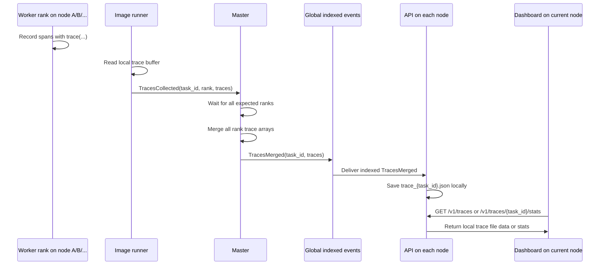

<!-- Copyright 2025 Foxlight Foundation -->

# Skulk Traces System Design

This document explains how the existing tracing system worked before the
cluster-wide tracing revamp on `feature/tracing-revamp`.

It is intentionally preserved as a baseline design reference. If behavior here
conflicts with the new tracing control plane and API surface on this branch,
trust the code on this branch first and use this document for historical and
migration context.

## Executive Summary

Skulk tracing is a distributed execution trace path for image-generation
workloads.

The short answer to the most important question is:

- trace content can be cross-rank and cross-node for a distributed image task
- trace files are still stored as local JSON artifacts on each node's API cache
- those local files are not authoritative cluster state
- trace availability across nodes is best-effort via event broadcast and replay,
  not guaranteed durable cluster-wide storage

In practice:

1. worker ranks record spans locally in memory during image pipeline execution
2. each participating rank emits a `TracesCollected` event when the task ends
3. the master waits for all expected ranks, merges their trace events, and
   emits one `TracesMerged` event
4. every API process that receives that merged event writes a local Chrome trace
   JSON file under its own trace cache directory
5. the dashboard on a given node reads only that node's local API trace cache

So the system is not "current-node only" in content, and it is not a
fully durable cluster-global trace store either. It is in between:
distributed collection plus local artifact persistence.

## Scope

Today this tracing system is primarily wired into the distributed image pipeline.

Relevant code paths:

- `src/exo/shared/tracing.py`
- `src/exo/worker/engines/image/pipeline/runner.py`
- `src/exo/worker/runner/image_models/runner.py`
- `src/exo/master/main.py`
- `src/exo/api/main.py`
- `dashboard-react/src/components/pages/TracesPage.tsx`
- `dashboard-react/src/components/pages/TraceDetailPage.tsx`

Important non-scope:

- it is not currently a general-purpose trace system for all task families
- it is not part of replicated `State`
- it is not snapshot-backed cluster metadata
- it is not a centralized long-term trace store

## Enablement and Storage

Tracing is controlled by:

- `SKULK_TRACING_ENABLED`
- legacy alias `EXO_TRACING_ENABLED`

These resolve through `src/exo/shared/constants.py` and default to `false`.

Local trace files are written to:

- `SKULK_TRACING_CACHE_DIR = SKULK_CACHE_HOME / "traces"`
- legacy alias `EXO_TRACING_CACHE_DIR`

Each saved artifact is named:

- `trace_{task_id}.json`

The on-disk file format is Chrome trace JSON, which means it can be opened in
Perfetto or other Chrome-trace-compatible tooling.

## Main Components

### 1. Worker trace recorder

`src/exo/shared/tracing.py` provides the trace data model and in-process buffer:

- `TraceEvent`
- `trace(...)` context manager
- `get_trace_buffer()`
- `clear_trace_buffer()`
- `export_trace(...)`
- `load_trace_file(...)`
- `compute_stats(...)`

The recorder is process-local and in-memory. There is no shared buffer across
nodes or across processes.

### 2. Image pipeline instrumentation

`src/exo/worker/engines/image/pipeline/runner.py` is where the actual trace
spans are recorded today.

It wraps major parts of the diffusion/pipeline execution in nested
`trace(...)` scopes, including categories such as:

- `sync`
- `async`
- nested compute and communication work within those phases

Nested trace scopes inherit parent categories, so the saved categories become
hierarchical values like:

- `sync/compute`
- `async/comm`

The image pipeline explicitly clears the process trace buffer at the start of a
diffusion run so traces do not leak across image requests.

### 3. Image runner event emission

`src/exo/worker/runner/image_models/runner.py` is responsible for turning the
local buffer into cluster events.

When tracing is enabled and the task completes or errors, the runner calls
`_send_traces_if_enabled(...)`, which:

1. reads the current in-memory buffer
2. converts each `TraceEvent` into `TraceEventData`
3. emits `TracesCollected(task_id, rank, traces)`
4. clears the local buffer

This currently happens on image generation and image edit task paths.

### 4. Master merge coordinator

`src/exo/master/main.py` handles distributed trace assembly.

For `ImageGeneration` and `ImageEdits` commands, if tracing is enabled, the
master records the set of expected device ranks for the selected instance in
`self._expected_ranks[task_id]`.

Later, in `_event_processor(...)`:

- `TracesCollected` is intercepted and handled specially
- it is not indexed directly into the main event log
- instead, `_handle_traces_collected(...)` stores the per-rank payload in
  `self._pending_traces[task_id][rank]`

Once all expected ranks have reported, `_merge_and_save_traces(...)`:

1. concatenates all collected trace arrays
2. emits one `TracesMerged(task_id, traces)` event
3. clears the pending merge buffers for that task

### 5. API persistence and serving

`src/exo/api/main.py` listens to indexed events from the event router.

When it sees a `TracesMerged` event, it calls `_save_merged_trace(...)`, which:

1. maps `TraceEventData` back into `TraceEvent`
2. writes `trace_{task_id}.json` to the local trace cache directory

The same API process exposes the trace endpoints:

- `GET /v1/traces`
- `GET /v1/traces/{task_id}`
- `GET /v1/traces/{task_id}/stats`
- `GET /v1/traces/{task_id}/raw`
- `POST /v1/traces/delete`

These endpoints only operate on files in the local node's trace cache
directory.

### 6. Dashboard UI

The React dashboard reads traces entirely through the local API:

- `dashboard-react/src/components/pages/TracesPage.tsx`
- `dashboard-react/src/components/pages/TraceDetailPage.tsx`

The UI supports:

- listing local trace artifacts
- deleting local trace artifacts
- downloading raw Chrome trace JSON
- opening a trace in Perfetto
- viewing computed summary stats by category and by rank

## End-to-End Flow

## Cross-Node Semantics

This is the part that tends to be confusing, so it is worth stating precisely.

### What is cross-node

For a distributed image task, the merged trace can include spans from ranks
that ran on different nodes.

Why:

- the master determines the expected ranks from the selected instance's shard
  assignments
- each rank sends its own `TracesCollected`
- the master merges all contributing rank traces into one `TracesMerged`

That means the merged trace payload is cluster-aware and can represent work
performed on multiple machines.

### What is local-only

The trace browser endpoints operate on local files:

- the dashboard on node X calls the API on node X
- that API lists files under node X's local trace cache directory
- no `/v1/traces` call fans out across the cluster

So the UI is local-file based, not a federated cluster query.

### Why traces still often appear on multiple nodes

`TracesMerged` is emitted into the regular indexed event stream, and each node's
API subscribes to that event stream through the event router.

As a result, every API process that is running and receives the merged event can
save its own local copy of the same trace file.

This creates a best-effort replication effect:

- not cluster state replication
- not durable object storage
- not a single authoritative trace database
- but often multiple local copies across nodes

### Why this is not fully durable cluster-wide storage

Trace artifacts are not part of `State`, and snapshots do not contain trace
payloads.

That matters because:

- `TracesMerged` is a pass-through event in `apply(...)`
- replay availability depends on the retained master event-log tail
- if a node misses the merged event and it later falls out of replay retention,
  that node cannot reconstruct the old trace from cluster state alone

So cross-node trace visibility is:

- stronger than current-node-only tracing
- weaker than authoritative replicated storage

## Event and Data Model

### In-memory trace event

`src/exo/shared/tracing.py`

- `TraceEvent(name, start_us, duration_us, rank, category)`

Fields:

- `name`: operation name
- `start_us`: wall-clock timestamp in microseconds
- `duration_us`: span duration in microseconds
- `rank`: device rank
- `category`: hierarchical grouping label

### Wire format events

`src/exo/shared/types/events.py`

- `TraceEventData`
- `TracesCollected(task_id, rank, traces)`
- `TracesMerged(task_id, traces)`

`TracesCollected` is the worker-to-master aggregation signal.

`TracesMerged` is the master-to-cluster publication event.

### Persisted file format

`export_trace(...)` writes Chrome trace JSON with:

- `"ph": "X"` complete-event spans
- `"pid": 0`
- `"tid": rank`
- metadata rows naming each rank thread as `"Rank {rank}"`

This is why Perfetto can display each rank as a separate execution lane.

### Stats format

`compute_stats(...)` derives:

- total wall time from the earliest start to the latest end
- aggregate totals by category
- aggregate totals by rank and category

The API exposes that through `TraceStatsResponse`.

## Detailed Lifecycle

### 1. Task starts

An image task is placed onto an instance. If tracing is enabled, the master
records the ranks expected to participate.

### 2. Worker executes pipeline

The image pipeline clears any old local trace buffer and starts recording nested
spans as the diffusion loop proceeds.

### 3. Worker finishes or errors

The image runner sends `TracesCollected` in a `finally` block, which means
collection happens even on error paths as long as the runner reaches that block.

### 4. Master waits for all ranks

The master accumulates per-rank trace payloads until it has received all
expected ranks for that task.

### 5. Master publishes merged trace

Once complete, the master emits one merged trace event into the indexed global
event stream.

### 6. APIs persist local artifacts

Each API instance that receives the merged event writes a local trace JSON file.

### 7. Dashboard inspects trace

The current node's dashboard lists whatever trace files exist in its own API
cache and can open them directly in Perfetto.

## What Traces Cover Today

The current code strongly indicates that this trace system is focused on the
image pipeline, not on all inference paths.

Evidence:

- the actual `trace(...)` instrumentation lives in
  `src/exo/worker/engines/image/pipeline/runner.py`
- the worker trace-export hook is in
  `src/exo/worker/runner/image_models/runner.py`
- the master only precomputes expected tracing ranks for `ImageGeneration` and
  `ImageEdits`

What this means operationally:

- distributed image requests can produce merged traces
- text-generation requests do not currently use this same trace pipeline
- the traces page is therefore more specialized than its name may suggest

## Relationship to State and Replay

Tracing uses the event system, but trace data is not part of the authoritative
cluster state model.

Specifically:

- `TracesCollected` and `TracesMerged` are pass-through events in
  `src/exo/shared/apply.py`
- they advance `last_event_applied_idx`
- they do not modify `State`

Implications:

- traces ride along the same ordered event transport as stateful events
- traces can be rebroadcast and replayed while still retained in the master log
- traces are not included in the state snapshot payload itself

This is why replay can help a node recover recent traces, but snapshots alone
cannot recreate them.

## Operational Limitations

### Local-file lifecycle

Deleting a trace through `/v1/traces/delete` removes only the local file on the
node whose API handled the request.

### Best-effort replication

Because trace files are written from merged events received by local APIs,
cluster-wide availability depends on:

- the API process being present and subscribed
- the merged event still being replayable if the node was behind
- the local trace file not having been deleted

### Rank-based identity

The persisted trace format groups by rank, not by node ID.

That is fine for pipeline debugging, but it means the trace viewer does not
directly label which node hosted each rank.

### Task-family coverage

The current implementation is not a universal tracing facility for all model
families or all control-plane operations.

### Test coverage gap

There does not appear to be dedicated focused test coverage for:

- master trace merge behavior
- API trace-file persistence behavior
- trace replay and cross-node availability semantics

That makes this system more reliant on careful manual verification than ideal.

## Practical Interpretation

If you are asking "is traces cross-node or only the current node?", the most
accurate answer is:

- the trace data for distributed image workloads is cross-node in content
- the browsing and storage model is local-file based per API node
- merged traces are commonly replicated to multiple nodes through the event
  stream, but that replication is best-effort rather than authoritative

If you need guaranteed cluster-wide retention and queryability, the current
trace system is not that. It is better thought of as:

- distributed trace capture
- master-side merge
- local artifact fan-out

## Suggested Verification Checklist

To verify the current behavior on a live cluster:

1. start multiple nodes with `SKULK_TRACING_ENABLED=1`
2. run a distributed image generation workload that spans multiple ranks
3. confirm the master receives `TracesCollected` from every expected rank
4. confirm a `TracesMerged` event is emitted
5. on more than one node, call `GET /v1/traces`
6. confirm `GET /v1/traces/{task_id}/stats` shows multiple ranks
7. open the raw file in Perfetto and verify multiple rank lanes are present

To test the durability boundary:

1. generate a traced image task
2. stop one node's API or keep that node offline during the merge
3. allow the master event log to compact past that trace event
4. bring the node back and request replay
5. confirm whether the node can or cannot reconstruct that older trace

That second test demonstrates the difference between event-fan-out replication
and authoritative state-backed storage.
