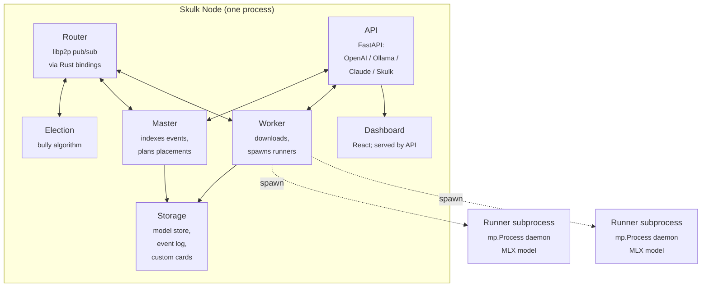
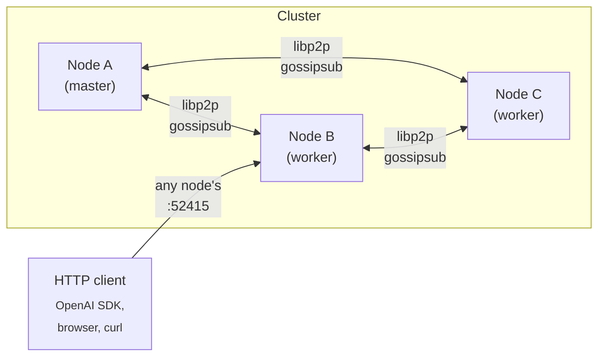
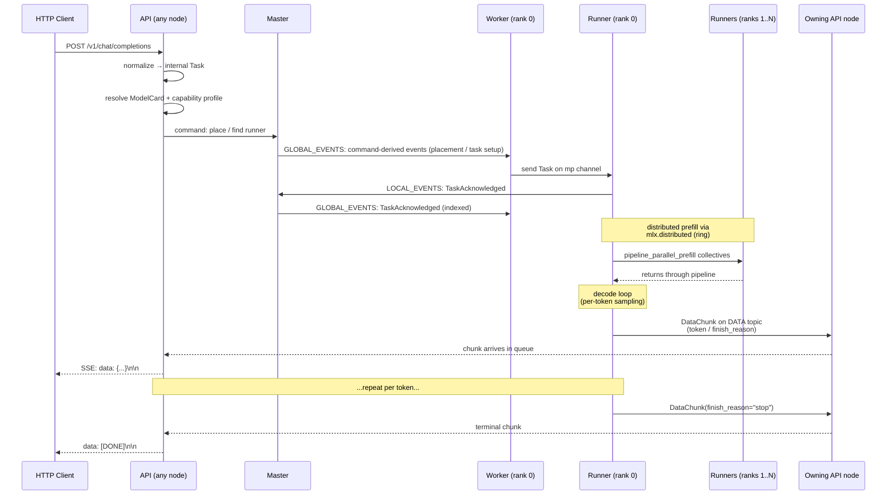

<!-- Copyright 2025 Foxlight Foundation -->

This is the long-form mental model for how Skulk is put together end to end. Read it once if you're picking the codebase up cold; come back to specific sections when you need to debug or extend a particular subsystem. For dense per-symbol lookups, see [Architecture Reference](architecture-reference).

## What Skulk is

Skulk is an interconnect fabric for multi-node AI compute: it connects multiple Apple Silicon (and increasingly Linux/CUDA) nodes into one cluster and moves work across them. Its headline use is distributed inference, where models are sharded across nodes, any node's API can serve cluster-wide requests, and the cluster keeps running through node arrivals, departures, and master failures. One Python binary (`uv run skulk`) is everything you need on each node: the same process is router, worker, master-eligible coordinator, election participant, API server, and, when its built assets are present, dashboard host. A headless node (for example a Linux worker with no built dashboard) runs as a full node and serves the API without the UI.

The design choices that shape almost everything else:

- **Event-sourced state.** All cluster-visible facts (instances, runners, downloads, tracing toggles) flow through an ordered event log. State is the result of `apply()`-ing events to a Pydantic model that is treated as immutable by convention (replaced wholesale by `apply()` rather than mutated in place).
- **One master at a time.** A bully election picks the master; only the master indexes events. Failover is automatic, and the promoted node seeds the new session from its replicated state, so placed instances survive a master restart: workers rebuild their runners and serving resumes after a model-reload-sized gap. Instances with a rank on the dead master are cleaned up once live topology confirms the node is gone.
- **libp2p pub/sub for transport.** Topics carry commands, events, election messages, and connection updates between nodes.
- **MLX as the inference backend.** Pipeline-parallel and tensor-parallel sharding strategies sit on top of `mlx.distributed`'s ring or jaccl/RDMA backends.
- **Subprocess isolation for runners.** Each model instance runs in its own `mp.Process` with its own MLX/Metal context, so a crash or hang in one runner can't bring down the rest of the node.

## The shape of a node

A single Skulk process hosts seven cooperating subsystems sharing one event loop and one set of typed channels:



Each subsystem has its own concern:

- **Router** wraps libp2p (via PyO3 Rust bindings) and exposes typed pub/sub topics: `GLOBAL_EVENTS`, `LOCAL_EVENTS`, `COMMANDS`, `DOWNLOAD_COMMANDS`, `STATE_SYNC_MESSAGES`, `ELECTION_MESSAGES`, `CONNECTION_MESSAGES`, `TELEMETRY`, `DATA`. Components subscribe by topic; payloads are validated Pydantic types.
- **Telemetry plane** (`TELEMETRY` topic) carries last-write-wins node readings that are *not* decisions: each node's `participation` role and `backends` (slice 1), its memory and system profile (slice 2, the highest-volume readings), and the observational readings node identity, disk, and rdma-ctl status (slice 3). They are gossiped into an in-memory `TelemetryView` (read by the planner for placement and by the dashboard via `GET /state`) instead of being event-sourced into `State`, so routine readings don't bloat the event log. The system profile includes a collector-agnostic accelerator block (GPU utilization, VRAM used and total, power, temperature, clock) that every node fills the same way regardless of platform: macOS fills it from mactop, and an AMD/Linux node fills it from passive amdgpu sysfs reads, so the dashboard renders a heterogeneous fleet uniformly and reports "not measured" rather than a fake zero for anything a given node cannot read. Because the context-admission ceiling must be identical across ranks but telemetry is unordered, the master computes it once at placement time and stamps it onto the instance (`context_token_limit`). **Connectivity readings stay on the control plane**, though: `node_network`, the thunderbolt maps, and the derived `thunderbolt_bridge_cycles` define the topology graph (`apply()` builds RDMA edges and TB-bridge cycles from them, and the planner reads `node_network` for host selection), so they remain ordered event-sourced state rather than last-write-wins telemetry. This is the telemetry slice of separating the control plane (decisions, event-sourced) from telemetry and data planes.
- **Data plane** (`DATA` topic) carries per-token generation output. The serving rank-0 worker streams `DataChunk` (`{command_id, chunk}`) directly to the owning API node, which demuxes by `command_id` into the per-command stream queue feeding the HTTP response. The master never sees these (no indexing, no disk write, no cluster-wide rebroadcast), so taking output off the ordered log is loss-free for correctness while removing the per-token master hop that dominated event-log volume. Ordering holds because a single rank-0 producer publishes each command's chunks in order. Inbound vision chunks (`InputChunkReceived`, low-volume) stay on the control plane for now. The plane can ride either libp2p gossipsub or an Eclipse Zenoh session, with key-addressed delivery and a namespace-isolated session on Zenoh. See [how the cluster communicates](cluster-communication) for the transports, ordering, trust model, and how speculative decoding rides the planes.
- **Election** runs the bully algorithm and broadcasts `ELECTION_MESSAGES`. The winner takes the master role.
- **Master** indexes incoming events into the event log (writing them to disk via `DiskEventLog`), publishes indexed events on `GLOBAL_EVENTS` for followers, and decides instance placements when a model is launched.
- **Worker** receives indexed events, applies them to its local view of `State`, downloads model weights to disk when assigned a placement, and spawns / supervises runner subprocesses. Before spawning, it refuses a shard that won't fit local memory (a last-resort guard below the master's admission check, using the same shared estimator), and a crash circuit breaker gives up on a runner that keeps failing rather than relaunching it into another GPU-memory leak. When the give-up is driven by that *memory* guard (not a crash) the worker asks the master to re-place the model one node wider via `RefuseInstancePlacement` instead of letting the placement silently disappear (see "Placement memory admission" below).
- **Runner** is *not* in the same process — it's a `mp.Process` daemon spawned by the worker. It owns one model and serves inference tasks for it. Multiple runners (one per pipeline rank) coordinate via `mlx.distributed` collectives.
- **API** is a FastAPI app that exposes inference endpoints in four wire formats (OpenAI Chat Completions, OpenAI Responses, Anthropic Messages, Ollama) and Skulk-native control endpoints (placements, diagnostics, traces, config). It also serves the dashboard build at `/` when those assets are present; a headless node built without the UI skips that mount and serves the API alone.
- **Storage** is a collection of on-disk responsibilities: the event log (msgpack + zstd), the model cache directory, custom model cards (per-user TOML files), and the optional shared model store.

## The shape of a cluster



Clusters form via libp2p mDNS or via explicit `--bootstrap-peers` multiaddrs. New nodes broadcast their identity, observe the current master, and snapshot-bootstrap from the master's published `State` snapshot before applying the retained event tail. Once bootstrapped, they become first-class members.

Any node's API can serve any request — the API forwards work to the placed runners through the master/worker plumbing. Operators usually pick one node as the public entry point (commonly the most stable / best-connected one) but the cluster doesn't require a specific entry point.

### Deployment & versioning

**All nodes in a cluster must run the same Skulk version. Mixed-version clusters are unsupported: this is an anti-pattern, not a deployment mode.** Skulk's wire types are strict (`extra="forbid"`), so an older node will reject events, commands, or snapshots that carry a newer node's fields; running mixed versions produces silent state divergence, dropped placements, and election churn. Upgrade the whole fleet together (e.g. `git checkout <ref>` + restart the service on every node) rather than rolling nodes one at a time. There is no cross-version snapshot-hydration concession: a node never reloads its own State across restart (node identity is ephemeral and State is rebuilt from the event log / state-sync, not persisted-and-rehydrated), so a snapshot carrying a previous version's removed fields is simply rejected by `extra="forbid"`, which is the intended behavior for the unsupported mixed-version case. (An earlier before-validator that stripped removed keys was removed: it forced the whole model into strict Python-mode validation, where ISO datetime strings such as `lastSeen` were rejected, silently breaking state-sync.) Cross-version *interoperation* (a protocol-version handshake) is deliberately out of scope and rejected as a supported mode.

## Lifecycle of a request

This is the path a chat completion takes from HTTP through to SSE response:



The eleven steps in detail:

1. **HTTP arrival.** Request hits FastAPI on any node's port (default 52415). The adapter for the wire format (OpenAI / Ollama / Claude / Responses) lives in `src/skulk/api/adapters/`.
2. **Normalization.** The adapter transforms the wire-format payload into an internal `Task` (`src/skulk/shared/types/tasks.py`).
3. **Capability resolution.** The API resolves the request against the bound `ModelCard` and computes a `ResolvedCapabilityProfile` (`src/skulk/shared/models/capabilities.py`). This decides prompt rendering, output parsing, tool-call format, reasoning format, vision handling, and a few MLX runtime knobs. Output parsing for channel-delimited reasoning formats (notably gpt-oss "harmony") is applied in the runner per engine: the MLX runner parses harmony at the token level (`parse_gpt_oss`), and the llama.cpp runner reparses it from llama.cpp's detokenized text (`HarmonyTextParser`), both splitting the `analysis` channel into reasoning and the `final` channel into content so control markers never reach the client.
4. **Runner discovery.** The API resolves the request against running instances via `_resolve_and_validate_text_model`. If no instance is currently placed for the model, the API returns HTTP 404 — placement is **not** automatic on chat requests; operators must call `/instance` or `/place_instance` first to spin up the model. Once an instance exists, the API issues a command on the `COMMANDS` topic that the master indexes.
5. **Worker dispatch and runner acknowledgement.** Each rank's worker forwards the `Task` over an `mp.Queue` to its runner subprocess. The runner emits `TaskAcknowledged` on its outgoing event channel (see `src/skulk/worker/runner/llm_inference/runner.py:223`); the worker forwards that to `LOCAL_EVENTS`, the master indexes it, and it is republished on `GLOBAL_EVENTS` so every node observes the same acknowledged-state transition.
6. **Prompt rendering.** The runner renders the chat history into tokens. Family-specific renderers (e.g., Gemma 4's `<|turn>` template, DeepSeek's DSML) handle the format. Vision preprocessing happens here for multimodal requests.
7. **Distributed prefill.** Pipeline-parallel models split the layer stack across ranks. Each rank computes its slice's prefill, sends activations to the next rank via `mx.distributed.send`, and barriers synchronize phase transitions. Tensor-parallel models do per-layer collectives within a rank.
8. **Decode loop.** Per token, the runner runs forward through its layer slice, exchanges activations with peers, samples (or accepts an injected token from speculative decoding), and emits the resulting chunk. Speculative decoding runs on single-node, tensor-parallel, and pipeline placements via one loop; on multi-node *pipeline* placements exactly one rank — the decider, the last rank — drafts and makes every accept/reject decision, broadcasting draft tokens and the per-round accept outcome through fixed-shape collectives so the committed stream is identical on every rank by construction rather than by numerical luck (heterogeneous chips produce divergent per-rank logits; relying on every rank recomputing the same decision is exactly what desynced and crashed mixed M5/M4 clusters). Multi-node *tensor* placements instead load the drafter on every rank and draft rank-symmetrically — a lone TP decider cannot draft "locally" because draft logits go through the TP-sharded lm_head, an all-rank collective idle receivers would never join (#263); rank-symmetric drafting relies on bit-identical per-rank logits, which TP placements already require in practice. Assistant-style drafters that cross-attend the target's KV occupy the same decider seat — the last pipeline rank is the only rank holding the KV layers they attend; such drafters declare `reads_target_cache` so the loop keeps the target cache fully committed before every draft. It is mechanism-agnostic: the loop owns verification, accept/reject, and cache reconciliation, and talks to a `Drafter` protocol (`src/skulk/worker/engines/mlx/drafters/`) behind which family-specific draft mechanisms live — Qwen3.5 sidecar MTP heads (fc projection + the sidecar's transformer block with a private KV cache, quantized on load to match the target), DeepSeek projection-only heads, and the Gemma 4 assistant model (a chain-trained companion that cross-attends the target's KV cache). Family facts (sidecar norm conventions, fc concat orders, hidden-state convention) are declarative data resolved from layout-keyed defaults plus model-card overrides, never constants in drafter code. The loop guarantees drafters a gapless, exactly-once stream of committed `(hidden, next-token)` pairs so stateful drafters keep positional history aligned with the target sequence. Rounds are *bonus-driven*: the loop carries an emitted-but-unforwarded bonus token, drafts up to the card's `mtp_max_depth` candidates from the bonus position, verifies `[bonus, drafts]` in a single K+1-token forward — the round's only target forward — commits the longest matching prefix, and samples the next bonus from the first non-matching row (the correction on a partial reject, the free next token on a full accept); the next round drafts from that position, so post-correction drafts — statistically the easiest — are never skipped. Cache reconciliation on a reject prefers the model's native `rollback_speculative_cache` (gemma4), else restores an SSM snapshot and *defers* the committed prefix to ride at the front of the next verify forward (extra verify width is effectively free on memory-bound decode), else plainly trims pure-KV caches. Depth is a per-model tuning knob set by measurement on the carded artifact. At temperature > 0, acceptance switches to Leviathan-Chen probability-ratio rejection sampling over the effective sampler distributions (with residual resampling on reject), preserving the output distribution exactly while keeping the speedup; depth is forced to 1 under sampling.
9. **Output streaming.** The rank-0 runner publishes each generated chunk on the `DATA` topic, and the API node that owns the request drains it into that request's queue (on Zenoh the chunk is addressed to that node; on gossipsub it rides the shared topic and only the owner consumes it). The master does not index or relay per-token output (see [how the cluster communicates](cluster-communication) and the Data plane note above).
10. **SSE serialization.** The API's adapter for the wire format converts each chunk to its on-the-wire shape (`data: {...}\n\n`) and yields it on the SSE stream.
11. **Termination.** A chunk with `finish_reason != None` sends `data: [DONE]\n\n` and closes the stream. (Stream termination is hardened against cancel races and silent worker failures.)

For non-streaming responses the same flow happens but the API accumulates chunks before responding once. For embeddings and image generation the runner type and Task type differ but the master/worker/runner shape stays the same.

## State and events

Skulk is event-sourced because distributed clusters need a clear notion of "what has the cluster agreed has happened." The mechanics:

- **State** (`src/skulk/shared/types/state.py`) is a Pydantic model treated as immutable by convention — `apply()` returns a new `State` rather than mutating in place, even though the model is not declared `frozen=True`. It carries everything every node needs: topology, instances, runners, downloads, tracing flags, network stats, and so on.
- **`apply()`** (`src/skulk/shared/apply.py`) is a pure function: `(State, IndexedEvent) -> State`. Given the same events in the same order, every node lands on byte-identical state.
- **The master indexes events.** Every event arrives at the master via `LOCAL_EVENTS`, gets a monotonically increasing index, gets persisted to the disk event log, and gets republished on `GLOBAL_EVENTS`.
- **Followers replay.** A new node bootstraps by requesting the current state snapshot, applying it, then replaying retained events at indices after the snapshot's high-water mark.

Why event sourcing here:

- **Observable history.** Every state change is replayable. Debugging a "how did we get into this state?" question reduces to inspecting the event log.
- **Deterministic recovery.** A node restart replays from the last snapshot + tail. No partial state.
- **Cheap state distribution.** Followers don't need a separate state-replication channel; events are the channel.

Operationally, the rule of thumb:

- **Events are past tense** ("`TaskStatusUpdated`", "`InstanceCreated`", "`RunnerStatusUpdated`", "`TaskDeleted`"). Once published, they're immutable history.
- **Commands are imperative** ("`PlaceInstance`", "`DeleteInstance`", "`TaskFinished`", "`SetTracingEnabled`"). They request the system change state.

`PlaceInstance` carries an optional `excluded_nodes` list. The master's placement planner treats those nodes as absent when scoring candidate cycles for that single placement only — it's a per-launch hint, not a cluster-wide flag. Already-running instances on the listed nodes are unaffected. Operators set the list from the dashboard's placement modal before pressing Launch.

The planner's memory admission is per node, not summed across the candidate cycle: Tensor sharding splits the weights evenly across ranks while Pipeline allocates layers proportionally to each node's available memory, and every node must fit its weight share times a runtime-overhead factor (KV cache, activations, MLX buffers, the runner process) plus a flat floor — an exact weights-equal-free-memory fit is rejected because it thrashes rather than runs. "Available memory" here is the GPU-wireable figure, `total − wired − anonymous − compressor` from a `vm_stat` snapshot taken alongside each telemetry sample — not the naive free-plus-inactive figure, which counts reclaimable file cache as used (after downloading a model, the weights sitting in file cache would deflate availability by the model's full size and refuse a placement that runs comfortably; macOS evicts that cache the moment Metal wires pages). It deliberately does not credit compression of idle anonymous memory. Because that availability rides the telemetry plane (last-write-wins gossip), it lags a teardown by a few rounds: right after an instance is deleted the freed memory is not yet reflected, so a placement issued immediately afterward (a test harness or a rapid model swap) would read deflated availability and be refused until the gossip settles. To avoid that, the master credits a just-deleted instance's per-node footprint back to the admission inputs for a short grace window, then lets the credit expire so a genuine shortfall reasserts; the worker's own pre-load fit guard remains the last-resort check against an over-credit. Placement failures are typed: a topology gap, an exclusion that removed every candidate, a per-node memory shortfall (with the arithmetic), and the not-an-error startup cases where cluster info simply has not finished gossiping (`PlacementInfoPendingError` — covers both phases: connection edges lagging node identities, and memory info lagging the edges) are all distinct, and `POST /place_instance` dry-runs the placement against replicated state so callers get the real reason as a 400/503 instead of an acknowledged command that silently fails on the master.

The master admits on the gossiped (telemetry-plane, last-write-wins) `ram_available`, while the worker's pre-spawn guard reads a fresh live `vm_stat` figure at load time. On a borderline multi-node split the live reading can sit just below the admitted estimate, so the master admits a cycle the worker then refuses. The worker guard therefore allows a small fit tolerance (10% of usable): a shard's footprint already bakes in the engine overhead factor, a full KV reservation, and a flat floor, so a sub-GB miss is within that pad and within live-versus-gossip jitter, and refusing on it would flip a placement the master admitted into a needless failure (a 0.2GB / 2% miss was observed refusing a 24B model at the load re-check across a 3-node ring). Only a shortfall beyond the tolerance, the signature of a node that genuinely lost memory since admission, trips the guard. When it does, rather than letting that instance vanish, the worker emits `RefuseInstancePlacement` and the master re-places the same model one node wider (`min_nodes` = refused width + 1) so each node holds a smaller share; the loop terminates when even a full-width split raises `PlacementError`. This self-corrects tight splits instead of requiring an operator to notice and re-launch.

A separate failure mode is a rank whose model **download** fails terminally (disk full, a transient Hugging Face or network error). The ring still forms and every rank waits for all ranks to become load-ready, but the failed rank never will, so the instance would otherwise sit "loading" forever with nothing to recover it. The master's plan loop detects this from replicated state (a not-yet-ready instance whose any rank node carries a terminal download failure for the model), fails any in-flight request bound to it with the download error surfaced, tears the instance down, and re-places the model at the same width while excluding the failed node(s). If no healthy node set can host the width (for example the failure was cluster-wide), the re-placement raises `PlacementError` and the master stops at the teardown, which bounds recovery to the available nodes rather than looping. A transient or single-node failure therefore self-heals onto healthy nodes; a genuine shortfall fails cleanly with the reason instead of hanging.

This recovery is made visible so it is not mysterious. `GET /state` attaches a derived per-node health summary (a level of ok, warn, or error plus reasons, each with a message and a remediation), computed read-only from state already in the response: a terminal download failure on a node, a low or full models-volume disk (a pre-emptive warning before a download fails), and a node whose heartbeats are late enough to be at risk of pruning. The dashboard renders an amber or red badge on the affected topology node whose hover names the problem and how to fix it, so an operator sees why a node is being routed around rather than watching placements quietly avoid a normal-looking node.

Task failure is part of the same event flow. The master's plan loop — the
same reconciliation pass that deletes instances on dead nodes — emits
`TaskFailed` for any in-flight API task (text generation, image generation,
image edits, embeddings) whose instance is gone or being torn down, computed before
`InstanceDeleted`/`NodeTimedOut` so the failure indexes ahead of the applies
that remove the task from state. The API reacts by delivering a terminal
error chunk into that command's stream: streaming responses close with an
error event, non-streaming requests fail instead of hanging. Two failure
shapes bypass this flow and are handled at their own boundaries: operator
instance deletion cancels in-flight tasks via `TaskStatusUpdated(Cancelled)`
(the API terminates those streams too), and a master failover starts a new
session that cannot carry the old session's tasks at all — so the API's
session reset fails every still-open command stream directly before
discarding its queue maps. Together these guarantee an open request is
terminated within seconds of any node death rather than dangling until the
client's own timeout.

A snapshot-bootstrap rollout has one operational rule: once a master starts compacting old replay history after writing snapshots, older nodes that only know how to "replay from event 0" should be considered temporary guests during the rollout window. Upgrade all nodes before relying on bounded retention as the steady state.

### Heterogeneous nodes and capability-aware placement

A cluster can mix node types: Apple Silicon nodes serving MLX models and
non-Mac (for example AMD/Linux) nodes serving GGUF models through llama.cpp.
Placement is capability-aware so each model runs only where it can.

Every node advertises the compute **backends** it can serve as
`<engine>-<compute>` tags. The tag folds two axes into one self-describing
string: the engine selects the worker runner class (`mlx` or `llama_cpp`), and
the compute names the accelerator (`metal`, `vulkan`, `rocm`, `cuda`, `cpu`). A
macOS node advertises `{mlx, mlx-metal}`; a Linux node with an importable
`llama_cpp` built for its GPU adds `{llama_cpp, llama_cpp-vulkan}` (the compute
backends come from `SKULK_LLAMA_CPP_BACKENDS`, defaulting to `cpu` when that env
var is unset so a node never over-claims a GPU). Backends are probed per node and
gossiped on the telemetry plane as part of `NodeResources`.

The llama.cpp runner loads GGUF models with Flash Attention on by default (the
modern llama.cpp default; it fixes the slow padded-V-cache and full-size
sliding-window-cache path that gemma-style interleaved attention otherwise hits).
Set `SKULK_LLAMA_CPP_FLASH_ATTN=0` to disable it on a node whose compiled build
lacks Flash Attention kernels.

Alongside the two in-process engines (MLX and llama.cpp) there is a third,
**served-backend** engine (`llama_server`). Instead of loading the model in the
worker process, it launches an external `llama-server` subprocess and proxies its
OpenAI HTTP API. This is what unlocks llama.cpp's **native multi-token-prediction
speculative decoding** for models that ship MTP heads (Qwen3.6, DeepSeek, GLM,
Kimi, Nemotron): that machinery lives in the llama-server application, not in the
library the in-process runner links, so the only way to use it is to run and proxy
the server. A node offers this engine when `SKULK_LLAMA_SERVER_BIN` points at a
`llama-server` binary (built recent enough to expose `--spec-type`), and a model
opts in through its card's `compatible_backends` (`llama_server-…`) plus the
`served_spec_type` / `served_spec_n_max` runtime fields (for example
`served_spec_type = "draft_mtp"`). Most MTP families ship the heads inside the base
GGUF, but some speculative modes need a separate small draft model: a card names it
with `served_spec_draft_repo` / `served_spec_draft_file` and the worker downloads it
as a companion and passes it to the server as `--model-draft` (this is how Gemma 4
runs MTP, via its assistant as the draft model). The engine is single-node and coexists with the
in-process llama.cpp runner; the same managed-server-plus-proxy shape is the
intended on-ramp for vLLM later. See the setup notes for a non-Mac node in
[AMD / Strix Halo nodes](amd-strix-halo-nodes) and the env vars
`SKULK_LLAMA_SERVER_BIN` / `SKULK_LLAMA_SERVER_BACKENDS`.

A model card declares two placement axes that are deliberately separate from the
memory/topology axes above:

- `compatible_backends` is a **hard filter**: the planner excludes any node whose
  advertised backends do not intersect it. A GGUF card lists the llama.cpp
  backends, so it can only land on a llama.cpp node; an MLX card lists MLX, so it
  stays on the Macs. This is what keeps an MLX model off an AMD node and a GGUF
  model off a Mac without an MLX llama.cpp shim.
- `backend_preference` is a **soft score**: when several compatible nodes
  qualify, the planner prefers the node whose backend ranks earliest in the
  card's preference list (for example preferring a GPU backend over CPU).

The engine axis (which runtime) is orthogonal to the node axis (which machine):
the same card mechanism that routes a GGUF model to a Vulkan llama.cpp node would
route a future engine to whichever nodes advertise it. The worker resolves the
concrete engine for its node at runner-spawn time by intersecting the card's
`compatible_backends` with the node's advertised backends, ordered by
`backend_preference`. See the
[AMD Strix Halo nodes](./amd-strix-halo-nodes.md) guide for bringing up a
non-Mac node.

The llama.cpp runner serves GGUF models single-node and matches the MLX runner
on the capabilities llama.cpp supports natively: per-token logprobs (with the
top alternatives) and tool calling. A tool-enabled request runs unstreamed so
the caller receives an assembled tool call rather than fragile token-by-token
deltas; if the model answers in prose instead, that prose streams back normally.
Logprobs requires the model to be loaded so it retains per-token logits, which
pre-allocates a buffer proportional to context length times vocabulary. At a
model's full trained context that buffer is large enough to exhaust a node's
memory on load, so logprobs is off by default and opt-in per node; enabling it
also caps the served context so the buffer stays bounded. The default path
serves at full context without it. Whether a given GGUF emits a structured tool
call (versus describing one in prose) depends on the model and its embedded chat
template, which the runner uses as-is.

## The inference engine

Inference happens entirely inside the runner subprocess. Skulk wraps MLX (and the upstream mlx-lm model implementations) in a layer that handles distributed coordination, family-specific behavior, and operator-controlled knobs.

### Pipeline parallelism

For models too large for a single device, Skulk splits the layer stack across ranks. Each rank holds a contiguous range of layers (`start_layer` to `end_layer`). Layers communicate via `mlx.distributed.send` / `recv_like` over the `ring` backend (sockets) or `jaccl` (RDMA, when available).

The ring's per-rank addresses are chosen at placement time from the libp2p connections the cluster has *observed* between each neighbor pair, ranked by transport: Thunderbolt first, then ethernet/Wi-Fi, with VPN/overlay addresses (Tailscale's CGNAT range, detected by address) strictly last; the overlay exists for reaching nodes from outside the local network and may be relayed through a distant server, so it is only used when a pair genuinely has no local path. Group formation itself runs under a hard deadline (`SKULK_GROUP_CONNECT_DEADLINE_SECONDS`, default 120s): ring init blocks forever if a neighbor socket fails its post-TCP rank handshake, so on expiry the runner exits via the wedge path, the worker gives the instance up on the first failure, and a fresh placement (with a fresh ring port) is the recovery, instead of an instance that sits broken behind request timeouts indefinitely. An even earlier gap is covered by a first-status-report deadline (120s): a runner frozen between spawn and its very first status report (a stuck process the crash breaker cannot see, since it is still alive) would otherwise stall group formation forever because the gate waits for every rank to report. The worker gives the instance up when a runner stays silent past that deadline.

The pipeline forward pass per rank:

1. **Receive** activations from the previous rank (or read input embeddings if rank 0).
2. **Compute** the rank's layer slice.
3. **Materialize** the output via `mx.eval(output)` — this forces the lazy MLX graph to commit before the send, so the send doesn't race the compute.
4. **Send** to the next rank (or `all_gather` the final logits if rank N).

The `mx.eval` + `mx.distributed.send` discipline is load-bearing — it's where Skulk's eval-timeout watchdog lives (`eval_with_timeout` in `auto_parallel.py`) so a stuck collective is detected within bounded time rather than wedging the cluster forever.

### Tensor parallelism

Within a rank, individual operations (attention, MLP) can be sharded across devices/contexts via per-family `*ShardingStrategy` classes (Llama, DeepSeek, Qwen, GLM, MiniMax, GPT-OSS, Step3.5, NemotronH; see `src/skulk/worker/engines/mlx/auto_parallel.py`). The strategy picks shard dimensions for `q_proj`, `k_proj`, `v_proj`, `o_proj`, MLP gates, and so on. Today the strategies are dispatched via an `isinstance` chain; ongoing modular-engine work is moving these to per-family adapters.

### Family-specific behavior

About 37% of the inference engine's code is family-specific (prompt rendering, output parsing, vision preprocessing, sharding strategy, occasional patches like Gemma 4's vision-tower wrapping). The current mechanism is a mix of capability-profile enum dispatch (`profile.prompt_renderer == Gemma4`) and direct `isinstance` checks. Consolidation into a `FamilyAdapter` per family is ongoing.

For the practical effect today: the model card declares a family (or family hints via `vision`, `tooling`, `runtime` sections), the resolver computes a profile, and the engine dispatches against the profile.

### KV cache backends

Skulk supports multiple KV cache backends, selectable per-cluster via config:

- `default` — standard MLX cache, fp16
- `mlx_quantized` — upstream MLX quantized cache
- `turboquant` / `turboquant_adaptive` — random-orthogonal-rotation + scalar quant
- `optiq` — rotated-space attention trick, decode-time perf benefit

(RotorQuant is a research backend not yet in the merged backend set; check `src/skulk/worker/engines/mlx/constants.py` for the current valid values.)

The choice affects memory footprint and decode throughput. See [KV Cache Backends](kv-cache-backends) for the operator-facing trade-offs.

### Per-model runtime knobs

The model card's `runtime` section carries Skulk-specific behavior overrides, the most operationally significant being `metal_fast_synch`. Gemma 4 cards explicitly disable Metal FAST_SYNCH because it deadlocks the GPU command queue under multimodal pipeline-parallel load (the wedge that caused the kernel-panic incident in 2026-04). Cards that declare any speculative-decoding mechanism (`mtp_heads`, `mtp_sidecar_repo`, or `assistant_model_repo`) also default FAST_SYNCH off: the flag collapses the speculative loop's per-round small-eval pattern by ~46x while leaving vanilla decode unaffected (measured 2026-06-06, Qwen3.5-9B-4bit on M4). All other models use the cluster default. Operator overrides (`--fast-synch` / `--no-fast-synch`) and explicit card pins beat both defaults.

The `runtime` section also carries `speculative_multi_node` (default unset, meaning no restriction — only an explicit `false` gates): set `false` on cards where multi-node speculation measures slower than plain sharded decode — fast-decoding MoE models are the known case (gemma-4-26B-A4B measured −7% on a 2-node pipeline while keeping ~2.2× single-node). The gate is evaluated rank-symmetrically from the card and world size, so every rank makes the identical speculate-or-not choice and the distributed collective schedule stays aligned. See [Model Cards](model-cards) for the full set of runtime knobs.

## Diagnostics and observability

Skulk has three layers of diagnostic data, ordered from "always on" to "deliberately enabled":

### Always-on flight recorder

Each runner supervisor retains the last 128 phase updates in memory, outside the event log. The flight recorder captures: phase enter/exit events, MLX memory snapshots at significant transitions, distributed-collective state, eval-timeout signals. This data is local-only — it's not gossiped — but exposed via `/v1/diagnostics/node` and `/v1/diagnostics/cluster/{node_id}` so operators can pull it from any node.

The cross-rank stitched view at `/v1/diagnostics/cluster/timeline` merges every reachable node's flight recorder into one wall-clock-ordered timeline. This is the single most useful debugging tool for distributed deadlocks — it makes rank disagreement visible at a glance.

### On-demand capture bundles

`POST /v1/diagnostics/node/capture` (or the cluster proxy) collects: live diagnostics, the runner's flight recorder, current process tree, and best-effort macOS `sample`, `vmmap -summary`, and `footprint -p` output for the runner process. The capture is opportunistic — sampling failures are returned as partial results — and is scoped to one runner / task so it's safe to invoke during an active hang.

### Task-scoped traces

Tracing is off by default. The dashboard's tracing toggle (or `PUT /v1/tracing`) flips a cluster-wide flag for *new* requests. Each traced task accumulates `TraceEvent`s on the runner; on completion the runner emits `TracesCollected`; the master merges traces from every rank and publishes `TracesMerged`; the API persists the merged trace to disk and exposes it via `/v1/traces/{task_id}`.

Saved trace files accumulate under `SKULK_CACHE_HOME/traces/`. An hourly janitor task in the API (`prune_old_trace_files` in `src/skulk/api/main.py`) drops files older than `tracing.retention_days` from `skulk.yaml` (default 3 days). Setting `retention_days: 0` disables pruning entirely. The first sweep runs 60 seconds after API startup; janitor failures are logged but never crash the API loop.

Traces are intended for targeted debugging — turn on, reproduce, inspect, turn off. Permanent always-on tracing isn't the right tool; centralized logging (Vector → VictoriaLogs → Grafana) is the always-on observability surface.

### Centralized logging

Each node can emit structured JSON on stdout alongside the human-readable stderr output. A local Vector agent reads stdout and ships logs to VictoriaLogs. Grafana queries VictoriaLogs for cluster-wide log search. Configuration:

- `src/skulk/shared/logging.py` — loguru setup with the JSON stdout sink
- `deployment/logging/vector.yaml` — Vector config (stdin → VictoriaLogs)
- `deployment/logging/docker-compose.yml` — VictoriaLogs + Grafana stack
- `skulk.yaml` `logging.enabled` + `logging.ingest_url` — opt-in; configurable via dashboard Settings; synced cluster-wide

Without the logging config, Skulk behaves identically to before. The logging stack is purely additive.

### Debugging MLX hangs

When a model appears stalled during warmup, prefill, or distributed generation, the flight recorder is the first thing to consult. For deeper instrumentation:

- Set `SKULK_MLX_HANG_DEBUG=1` and `SKULK_MLX_HANG_DEBUG_INTERVAL_SECONDS=10` to emit periodic Python stack traces from the stuck phase
- Set `SKULK_PIPELINE_EVAL_TIMEOUT_SECONDS=120` to raise the per-eval timeout if you're seeing false positives on cold-start
- The repro harness at `bench/repro_gemma4_hang.py` exercises the deterministic pipeline-parallel hang pattern; see the file for the operator workflow

The wider observability story (cluster timeline, hang-rate SLO, per-node panel) is being consolidated. The user-facing operator workflow is documented in [Tracing and debugging](tracing) and the [API guide](api-guide).

## Storage

Three on-disk responsibilities:

### Event log

`src/skulk/utils/disk_event_log.py` is an append-only log: the live file (`events.bin`) is uncompressed length-prefixed msgpack records (4-byte big-endian length + msgpack payload). When the log rotates or the master shuts down, the live file is zstd-compressed into a rotated archive (`events.*.bin.zst`); only the rotated archives are compressed, not the active write target. Every indexed event passes through here. Followers replay from this log on bootstrap. Snapshots can be written periodically; events older than a snapshot can be compacted (with a guarded rollout window, see "State and events" above).

The log degrades rather than crashes when the disk fights back: any persistence failure (ENOSPC at init, append, or compaction) drops it into a counting-only mode where indices keep advancing — so follower replay coherence and event ordering survive — while nothing further is written. A proactive free-space floor (2 GiB, checked every 1024 appends) triggers the same degradation *before* the disk hits zero, and archive rotation is capped by total bytes (1 GiB) in addition to count, so the log can never be the thing that fills a node's disk.

### Model cache

Models live under `SKULK_MODELS_DIR` — by default that resolves to `SKULK_DATA_HOME/models`, which is XDG-based on Linux (`~/.local/share/skulk/models`) and `~/.skulk/models` on macOS/Windows. `SKULK_HOME` (or `SKULK_HOME`) overrides the base; `SKULK_MODELS_DIR` overrides the models path directly. See `src/skulk/shared/constants.py:78-82`. The cache stores tokenizers, weights, processor configs, and metadata. Multiple nodes on the same physical machine share a cache; nodes on different machines each maintain their own.

### Model store (optional)

For multi-node deployments with shared filesystems, a model store hosts canonical model artifacts on one machine. Other nodes stage from the store (rsync-like) rather than each downloading from Hugging Face independently. This is a config-driven feature; without a store, each node downloads independently. See [Model Store](model-store) for setup details.

Staged copies have a lifecycle: by default (`cleanup_on_deactivate: true`), a staged model becomes an eviction candidate when no live runner uses it — including as a companion repo (MTP sidecar, assistant, split vision weights), which no instance names directly but which a live runner depends on just the same. Candidates are kept newest-first by last use up to the `staging_keep_recent_gb` grace budget (default 40 GiB) and deleted beyond it. The same budget enforcement runs at instance deactivation and at node startup — the startup pass is what reconciles copies orphaned by a crashed session, and the grace budget is why a crash-restart cycle keeps its recent models warm instead of re-staging everything. `GET /store/storage` reports the per-node breakdown.

Companion repos follow a single download contract: `companion_download_specs()` (in `src/skulk/download/download_utils.py`) enumerates a card's companions — MTP sidecar, assistant model, split vision weights — each flagged required or best-effort, and every model resolution path (fresh download, already-staged fast path, store staging, direct-from-store) ensures companions through it before reporting the model ready. Required companions (vision weights, which the model cannot load without) fail the resolution loudly; best-effort companions (sidecar, assistant) log and continue, so a missing drafter degrades to plain decode instead of blocking the model.

### Custom model cards

User-added model cards live under `SKULK_CUSTOM_MODEL_CARDS_DIR` (default `SKULK_DATA_HOME/custom_model_cards`) as TOML files. On Linux that resolves to `~/.local/share/skulk/custom_model_cards`; on macOS/Windows to `~/.skulk/custom_model_cards`. Built-in cards live in `resources/inference_model_cards/`. The capability resolver reads both; custom cards override built-ins for the same `model_id`.

## API adapters

Skulk exposes inference through several wire-format families. The adapters all converge on the same internal `Task`:

```text
OpenAI Chat Completions  → adapter → internal text generation Task
OpenAI Responses         → adapter → internal text generation Task
Anthropic Messages       → adapter → internal text generation Task
Ollama (chat / generate) → adapter → internal text generation Task
Skulk-native             → adapter → internal text / image / embedding Task
```

This is why one placed model can be accessed through several compatibility formats simultaneously — the underlying execution path doesn't care which adapter normalized the input.

The adapters live in `src/skulk/api/adapters/`. Each one handles request normalization (incoming) and chunk serialization (outgoing) for its wire format. The internal Task and Chunk types are the integration boundary.

## The dashboard

The dashboard is the operator-facing UI for the same Skulk runtime. It's a React + TypeScript + styled-components SPA, built with Vite, served by the API at `/` (the API's static-files mount) on nodes where the built assets are present. A node without them (a headless or non-Mac worker built without the UI) still runs the full API; operators reach the dashboard from any node that has it.

Architecture decisions:

- **Redux Toolkit + RTK Query** for dashboard state (`dashboard-react/src/store/`). UI state lives in slices such as `uiSlice` and `chatSlice`; API reads/writes go through RTK Query endpoint modules.
- **Activity-style routing.** No react-router. Routes are managed via an `activeRoute` enum in `uiSlice`. Each top-level page renders based on the current value.
- **Hooks over services.** The cluster state subscription lives in `useClusterState`; topology rendering subscribes via the hook. No service singletons.
- **Tolgee localization.** `dashboard-react/src/i18n/tolgee.ts` initializes Tolgee with the `skulk` namespace and wraps the app through `TolgeeProvider`. Dashboard code uses Tolgee's `t()` function with an English fallback for each key rather than `<T>`. Runtime translations are fetched from a CDN/static prefix (`VITE_TOLGEE_CDN_PREFIX`, default `/i18n`), with English bundled in `src/i18n/en/skulk.json` as the offline fallback. `VITE_TOLGEE_AVAILABLE_LANGUAGES` is a comma-separated list of language tags to preload/allow; English is always present.
- **Theme-token-driven styling.** `dashboard-react/src/theme/theme.ts` exports `darkTheme` and `lightTheme`; styled-components reference tokens via `${({ theme }) => theme.colors.X}`.
- **localStorage for cross-session preferences** (theme, observability panel width); sessionStorage for in-session UI state (which page, panel open/closed, scroll positions).

The dashboard's main surfaces:

- **Topology** — spatial cluster view, node-by-node status
- **Model Store** — search Hugging Face, place models, monitor downloads
- **Chat** — simple chat client against the placed models
- **Observability panel**: right-side resizable dock for live cluster health, per-node diagnostics, trace browsing (work in progress)
- **Settings** — cluster config (model store, KV cache backend, logging, tracing)

## Trade-offs and constraints

The shape of Skulk reflects deliberate trade-offs. Knowing which ones helps explain why some things are the way they are:

- **Apple Silicon-first.** Skulk targets Apple Silicon as the primary deployment platform because that's where MLX runs. Linux/CUDA support exists but has fewer code paths exercised. If you're running on Linux, expect more rough edges.
- **MLX upstream coupling.** Skulk consumes mlx-lm's model implementations directly. When mlx-lm changes (model class shapes, cache APIs), Skulk has to follow. The `mlx-lm` fork pinning in `pyproject.toml` reflects which upstream issues we've worked around.
- **Subprocess-per-runner.** Each placed model runs in its own `mp.Process` daemon. The cost is higher memory overhead and more process orchestration; the win is that a runner crash or hang is contained — the rest of the node keeps working.
- **Event sourcing with disk persistence.** Every indexed event is appended to the master's disk log so followers can replay it. Master itself does not rehydrate state from disk on restart — `Master.__init__` initializes a fresh `State` (`master/main.py:106`); continuity comes from followers retaining their own `State` and from the disk log preserving the index counter so new event IDs don't collide. Snapshotting bounds replay-log growth. The cost: bootstrapping a fresh node is more elaborate than just "ask for current state."
- **Ring transport by default.** `mlx.distributed`'s ring backend uses raw sockets; `jaccl` uses RDMA. Ring is simpler to set up but more sensitive to message-ordering bugs across consecutive jobs. RDMA needs hardware support and is more complex to configure.
- **No central coordinator process.** The same binary is master / worker / API on every node; the master role is elected. There's no separate `skulk-master` daemon. The win is operational simplicity; the cost is that elections and master changeovers happen as ordinary events.
- **Why `mp.Process` instead of `subprocess.Popen`.** `mp.Process` lets us pass typed channels (`mp.Queue`, `mp.Pipe`) between parent and child with native Python object transport (pickle under the hood). We avoid hand-written JSON serialization on this boundary and can share Pydantic models directly; pickle is still doing wire-format work, but it preserves Python types end-to-end.

## Where things live

A rough file map for orientation:

```
src/skulk/
├── api/                # FastAPI app, adapters (OpenAI / Ollama / Claude / Responses / Skulk-native)
├── master/             # event indexing, placement, snapshot publishing
├── worker/
│   ├── main.py         # worker loop: applies events, dispatches tasks
│   ├── plan.py         # decides what to do next (warmup, runner spawn, etc.)
│   ├── runner/
│   │   ├── bootstrap.py        # subprocess entrypoint, signal handlers, parent-pid watchdog
│   │   ├── runner_supervisor.py # parent-side lifecycle for one mp.Process runner
│   │   ├── llm_inference/      # text generation runner
│   │   ├── embeddings/         # embedding runner
│   │   └── image_models/       # image generation runner
│   └── engines/
│       └── mlx/        # MLX engine (auto_parallel, generator, vision, KV cache backends)
├── routing/            # libp2p pub/sub topics, event router
├── shared/             # types, capability resolver, tracing, election
│   ├── types/          # Pydantic models (events, commands, tasks, chunks, state, diagnostics)
│   ├── models/         # ModelCard, ResolvedCapabilityProfile, capability resolution
│   └── apply.py        # (State, IndexedEvent) → State
├── store/              # config, model store, custom card management
├── utils/              # event log, channels, dashboard path, common helpers
└── main.py             # CLI entrypoint, top-level wiring

dashboard-react/        # operator UI (React + TypeScript + Vite)
deployment/             # Vector + VictoriaLogs + Grafana docker-compose
bench/                  # benchmark + repro harnesses
docs/                   # operator guides, design docs, this file
website/                # Docusaurus site that publishes the docs
resources/
└── inference_model_cards/  # built-in TOML model cards (gemma-4, qwen, etc.)
rust/                   # Rust crates: networking (libp2p), skulk_pyo3_bindings, system_custodian
```

## Glossary

**Bound instance** — A `Task` materializing a particular placement: the model card, the shard ranges per rank, the network configuration (ring or jaccl), the bound runners.

**Capability profile** — `ResolvedCapabilityProfile`. The runtime answer to "what does this model do?" — derived from the model card plus family defaults plus tokenizer hints. Drives prompt rendering, output parsing, tool grammar, vision handling.

**Card** / **Model card** — Per-model declarative metadata: model id, layer count, supported tasks, family, capabilities, modalities, tooling, runtime knobs. Stored as TOML.

**Command** — Imperative request on the `COMMANDS` topic. "PlaceInstance," "DeleteInstance," "SetTracingEnabled." Master decides whether to act on it.

**Event** — Past-tense fact on `LOCAL_EVENTS` (pre-indexing) or `GLOBAL_EVENTS` (post-indexing). "TaskAcknowledged," "RunnerFailed," "TracesMerged." Indexed events are immutable history.

**Indexed event** — An event with a monotonic index assigned by the master. The unit that gets persisted to the event log and replayed by followers.

**Instance** — One running placement of a model. Has runners across ranks. Tracked in `State.instances`.

**Master** — The currently-elected node that indexes events. Cluster has exactly one master at a time. Failover via election.

**Placement** — The mapping of a model's layers to specific runners on specific nodes. Master decides; workers execute.

**Rank** — A shard of a pipeline-parallel model. Rank 0 holds the input embeddings + initial layers; rank N-1 holds the output head. Layers send activations to the next rank in pipeline order.

**Runner** — A subprocess (`mp.Process` daemon) that owns one model and handles inference tasks for it. Exactly one runner per (instance, rank).

**State** — The cluster's current shared view, derived from applying indexed events. A Pydantic model treated as immutable by convention (`apply()` returns a new `State`; the model itself does not enforce `frozen=True`).

**Worker** — The per-node process responsible for downloads, runner supervision, and task dispatch. Every node runs a worker.

## Where to read next

- [Architecture Reference](architecture-reference) — dense, structured fact-sheet for AI assistants and operators who prefer reference style over narrative
- [API Guide](api-guide) — every endpoint with examples
- [Build and Runtime](build-and-runtime) — how to build, run, and configure
- [Model Cards](model-cards) — declarative model metadata, including runtime knobs
- [Model Capabilities](model-capabilities) — the capability spine and how the resolver works
- [Model Behaviors](model-behaviors/gemma4) — family-specific notes (Gemma 4, GPT-OSS, DeepSeek V3.2)
- [KV Cache Backends](kv-cache-backends) — operator trade-offs across cache backends
- [Tracing](tracing) — task-scoped tracing operator workflow
- [Model Store](model-store) — shared model artifact hosting

Maintenance discipline for this doc and the [Architecture Reference](architecture-reference) lives in [AGENTS.md](https://github.com/Foxlight-Foundation/Skulk/blob/main/AGENTS.md). Architectural shape changes (new component, new event, new pubsub topic, new state field, new major API endpoint, new family adapter) update these docs in the same commit as the code.
