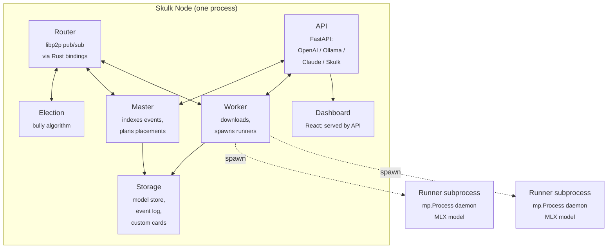
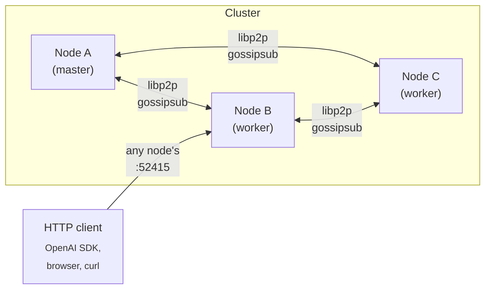
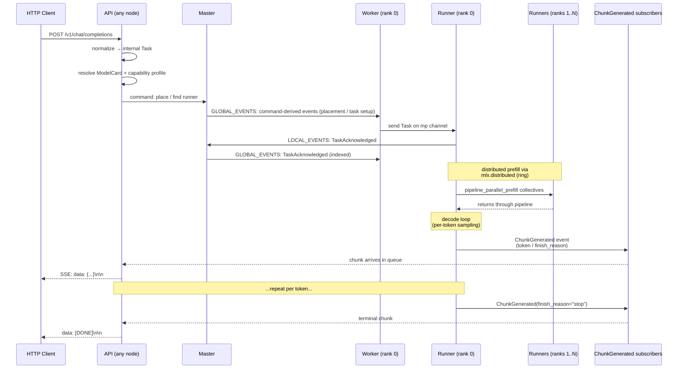

<!-- Copyright 2025 Foxlight Foundation -->

This is the long-form mental model for how Skulk is put together end to end. Read it once if you're picking the codebase up cold; come back to specific sections when you need to debug or extend a particular subsystem. For dense per-symbol lookups, see [Architecture Reference](architecture-reference).

## What Skulk is

Skulk is a distributed inference system that connects multiple Apple Silicon (and increasingly Linux/CUDA) nodes into one logical inference cluster. Models are sharded across nodes; any node's API can serve cluster-wide requests; the cluster keeps running through node arrivals, departures, and master failures. One Python binary (`uv run skulk`) is everything you need on each node — the same process is router, worker, master-eligible coordinator, election participant, API server, and dashboard host.

The design choices that shape almost everything else:

- **Event-sourced state.** All cluster-visible facts (instances, runners, downloads, tracing toggles) flow through an ordered event log. State is the result of `apply()`-ing events to a Pydantic model that is treated as immutable by convention (replaced wholesale by `apply()` rather than mutated in place).
- **One master at a time.** A bully election picks the master; only the master indexes events. Failover is automatic.
- **libp2p pub/sub for transport.** Topics carry commands, events, election messages, and connection updates between nodes.
- **MLX as the inference backend.** Pipeline-parallel and tensor-parallel sharding strategies sit on top of `mlx.distributed`'s ring or jaccl/RDMA backends.
- **Subprocess isolation for runners.** Each model instance runs in its own `mp.Process` with its own MLX/Metal context, so a crash or hang in one runner can't bring down the rest of the node.

## The shape of a node

A single Skulk process hosts seven cooperating subsystems sharing one event loop and one set of typed channels:



Each subsystem has its own concern:

- **Router** wraps libp2p (via PyO3 Rust bindings) and exposes typed pub/sub topics: `GLOBAL_EVENTS`, `LOCAL_EVENTS`, `COMMANDS`, `DOWNLOAD_COMMANDS`, `STATE_SYNC_MESSAGES`, `ELECTION_MESSAGES`, `CONNECTION_MESSAGES`. Components subscribe by topic; payloads are validated Pydantic types.
- **Election** runs the bully algorithm and broadcasts `ELECTION_MESSAGES`. The winner takes the master role.
- **Master** indexes incoming events into the event log (writing them to disk via `DiskEventLog`), publishes indexed events on `GLOBAL_EVENTS` for followers, and decides instance placements when a model is launched.
- **Worker** receives indexed events, applies them to its local view of `State`, downloads model weights to disk when assigned a placement, and spawns / supervises runner subprocesses.
- **Runner** is *not* in the same process — it's a `mp.Process` daemon spawned by the worker. It owns one model and serves inference tasks for it. Multiple runners (one per pipeline rank) coordinate via `mlx.distributed` collectives.
- **API** is a FastAPI app that exposes inference endpoints in four wire formats (OpenAI Chat Completions, OpenAI Responses, Anthropic Messages, Ollama) and Skulk-native control endpoints (placements, diagnostics, traces, config). It also serves the dashboard build at `/`.
- **Storage** is a collection of on-disk responsibilities: the event log (msgpack + zstd), the model cache directory, custom model cards (per-user TOML files), and the optional shared model store.

## The shape of a cluster



Clusters form via libp2p mDNS or via explicit `--bootstrap-peers` multiaddrs. New nodes broadcast their identity, observe the current master, and snapshot-bootstrap from the master's published `State` snapshot before applying the retained event tail. Once bootstrapped, they become first-class members.

Any node's API can serve any request — the API forwards work to the placed runners through the master/worker plumbing. Operators usually pick one node as the public entry point (commonly the most stable / best-connected one) but the cluster doesn't require a specific entry point.

## Lifecycle of a request

This is the path a chat completion takes from HTTP through to SSE response:



The eleven steps in detail:

1. **HTTP arrival.** Request hits FastAPI on any node's port (default 52415). The adapter for the wire format (OpenAI / Ollama / Claude / Responses) lives in `src/exo/api/adapters/`.
2. **Normalization.** The adapter transforms the wire-format payload into an internal `Task` (`src/exo/shared/types/tasks.py`).
3. **Capability resolution.** The API resolves the request against the bound `ModelCard` and computes a `ResolvedCapabilityProfile` (`src/exo/shared/models/capabilities.py`). This decides prompt rendering, output parsing, tool-call format, reasoning format, vision handling, and a few MLX runtime knobs.
4. **Runner discovery.** The API resolves the request against running instances via `_resolve_and_validate_text_model`. If no instance is currently placed for the model, the API returns HTTP 404 — placement is **not** automatic on chat requests; operators must call `/instance` or `/place_instance` first to spin up the model. Once an instance exists, the API issues a command on the `COMMANDS` topic that the master indexes.
5. **Worker dispatch and runner acknowledgement.** Each rank's worker forwards the `Task` over an `mp.Queue` to its runner subprocess. The runner emits `TaskAcknowledged` on its outgoing event channel (see `src/exo/worker/runner/llm_inference/runner.py:223`); the worker forwards that to `LOCAL_EVENTS`, the master indexes it, and it is republished on `GLOBAL_EVENTS` so every node observes the same acknowledged-state transition.
6. **Prompt rendering.** The runner renders the chat history into tokens. Family-specific renderers (e.g., Gemma 4's `<|turn>` template, DeepSeek's DSML) handle the format. Vision preprocessing happens here for multimodal requests.
7. **Distributed prefill.** Pipeline-parallel models split the layer stack across ranks. Each rank computes its slice's prefill, sends activations to the next rank via `mx.distributed.send`, and barriers synchronize phase transitions. Tensor-parallel models do per-layer collectives within a rank.
8. **Decode loop.** Per token, the runner runs forward through its layer slice, exchanges activations with peers, samples (or accepts an injected token from speculative decoding), and emits the resulting chunk.
9. **Chunk fan-out.** The runner emits `ChunkGenerated` events; the master indexes them; subscribers (the API queue for the originating request) receive them.
10. **SSE serialization.** The API's adapter for the wire format converts each chunk to its on-the-wire shape (`data: {...}\n\n`) and yields it on the SSE stream.
11. **Termination.** A chunk with `finish_reason != None` sends `data: [DONE]\n\n` and closes the stream. (As of writing, the stream-termination correctness work in #42 is hardening this against cancel races and silent worker failures — see the issue for current state.)

For non-streaming responses the same flow happens but the API accumulates chunks before responding once. For embeddings and image generation the runner type and Task type differ but the master/worker/runner shape stays the same.

## State and events

Skulk is event-sourced because distributed clusters need a clear notion of "what has the cluster agreed has happened." The mechanics:

- **State** (`src/exo/shared/types/state.py`) is a Pydantic model treated as immutable by convention — `apply()` returns a new `State` rather than mutating in place, even though the model is not declared `frozen=True`. It carries everything every node needs: topology, instances, runners, downloads, tracing flags, network stats, and so on.
- **`apply()`** (`src/exo/shared/apply.py`) is a pure function: `(State, IndexedEvent) -> State`. Given the same events in the same order, every node lands on byte-identical state.
- **The master indexes events.** Every event arrives at the master via `LOCAL_EVENTS`, gets a monotonically increasing index, gets persisted to the disk event log, and gets republished on `GLOBAL_EVENTS`.
- **Followers replay.** A new node bootstraps by requesting the current state snapshot, applying it, then replaying retained events at indices after the snapshot's high-water mark.

Why event sourcing here:

- **Observable history.** Every state change is replayable. Debugging a "how did we get into this state?" question reduces to inspecting the event log.
- **Deterministic recovery.** A node restart replays from the last snapshot + tail. No partial state.
- **Cheap state distribution.** Followers don't need a separate state-replication channel; events are the channel.

Operationally, the rule of thumb:

- **Events are past tense** ("`TaskStatusUpdated`", "`InstanceCreated`", "`RunnerStatusUpdated`", "`TaskDeleted`"). Once published, they're immutable history.
- **Commands are imperative** ("`PlaceInstance`", "`DeleteInstance`", "`TaskFinished`", "`SetTracingEnabled`"). They request the system change state.

A snapshot-bootstrap rollout has one operational rule: once a master starts compacting old replay history after writing snapshots, older nodes that only know how to "replay from event 0" should be considered temporary guests during the rollout window. Upgrade all nodes before relying on bounded retention as the steady state.

## The inference engine

Inference happens entirely inside the runner subprocess. Skulk wraps MLX (and the upstream mlx-lm model implementations) in a layer that handles distributed coordination, family-specific behavior, and operator-controlled knobs.

### Pipeline parallelism

For models too large for a single device, Skulk splits the layer stack across ranks. Each rank holds a contiguous range of layers (`start_layer` to `end_layer`). Layers communicate via `mlx.distributed.send` / `recv_like` over the `ring` backend (sockets) or `jaccl` (RDMA, when available).

The pipeline forward pass per rank:

1. **Receive** activations from the previous rank (or read input embeddings if rank 0).
2. **Compute** the rank's layer slice.
3. **Materialize** the output via `mx.eval(output)` — this forces the lazy MLX graph to commit before the send, so the send doesn't race the compute.
4. **Send** to the next rank (or `all_gather` the final logits if rank N).

The `mx.eval` + `mx.distributed.send` discipline is load-bearing — it's where Skulk's eval-timeout watchdog lives (`eval_with_timeout` in `auto_parallel.py`) so a stuck collective is detected within bounded time rather than wedging the cluster forever.

### Tensor parallelism

Within a rank, individual operations (attention, MLP) can be sharded across devices/contexts via per-family `*ShardingStrategy` classes (Llama, DeepSeek, Qwen, GLM, MiniMax, GPT-OSS, Step3.5, NemotronH; see `src/exo/worker/engines/mlx/auto_parallel.py`). The strategy picks shard dimensions for `q_proj`, `k_proj`, `v_proj`, `o_proj`, MLP gates, and so on. Today the strategies are dispatched via an `isinstance` chain; the ongoing modular-engine work (#130) is moving these to per-family adapters.

### Family-specific behavior

About 37% of the inference engine's code is family-specific (prompt rendering, output parsing, vision preprocessing, sharding strategy, occasional patches like Gemma 4's vision-tower wrapping). The current mechanism is a mix of capability-profile enum dispatch (`profile.prompt_renderer == Gemma4`) and direct `isinstance` checks. The umbrella issue at #130 tracks consolidation into a `FamilyAdapter` per family.

For the practical effect today: the model card declares a family (or family hints via `vision`, `tooling`, `runtime` sections), the resolver computes a profile, and the engine dispatches against the profile.

### KV cache backends

Skulk supports multiple KV cache backends, selectable per-cluster via config:

- `default` — standard MLX cache, fp16
- `mlx_quantized` — upstream MLX quantized cache
- `turboquant` / `turboquant_adaptive` — random-orthogonal-rotation + scalar quant
- `optiq` — rotated-space attention trick, decode-time perf benefit

(RotorQuant is a research backend tracked under PR #103 and is not yet in the merged backend set; check `src/exo/worker/engines/mlx/constants.py` for the current valid values.)

The choice affects memory footprint and decode throughput. See [KV Cache Backends](kv-cache-backends) for the operator-facing trade-offs.

### Per-model runtime knobs

The model card's `runtime` section carries Skulk-specific behavior overrides, the most operationally significant being `metal_fast_synch`. Gemma 4 cards explicitly disable Metal FAST_SYNCH because it deadlocks the GPU command queue under multimodal pipeline-parallel load (the wedge that caused the kernel-panic incident in 2026-04). Other models use the cluster default. See [Model Cards](model-cards) for the full set of runtime knobs.

## Diagnostics and observability

Skulk has three layers of diagnostic data, ordered from "always on" to "deliberately enabled":

### Always-on flight recorder

Each runner supervisor retains the last 128 phase updates in memory, outside the event log. The flight recorder captures: phase enter/exit events, MLX memory snapshots at significant transitions, distributed-collective state, eval-timeout signals. This data is local-only — it's not gossiped — but exposed via `/v1/diagnostics/node` and `/v1/diagnostics/cluster/{node_id}` so operators can pull it from any node.

The cross-rank stitched view at `/v1/diagnostics/cluster/timeline` merges every reachable node's flight recorder into one wall-clock-ordered timeline. This is the single most useful debugging tool for distributed deadlocks — it makes rank disagreement visible at a glance.

### On-demand capture bundles

`POST /v1/diagnostics/node/capture` (or the cluster proxy) collects: live diagnostics, the runner's flight recorder, current process tree, and best-effort macOS `sample`, `vmmap -summary`, and `footprint -p` output for the runner process. The capture is opportunistic — sampling failures are returned as partial results — and is scoped to one runner / task so it's safe to invoke during an active hang.

### Task-scoped traces

Tracing is off by default. The dashboard's tracing toggle (or `PUT /v1/tracing`) flips a cluster-wide flag for *new* requests. Each traced task accumulates `TraceEvent`s on the runner; on completion the runner emits `TracesCollected`; the master merges traces from every rank and publishes `TracesMerged`; the API persists the merged trace to disk and exposes it via `/v1/traces/{task_id}`.

Traces are intended for targeted debugging — turn on, reproduce, inspect, turn off. Permanent always-on tracing isn't the right tool; centralized logging (Vector → VictoriaLogs → Grafana) is the always-on observability surface.

### Centralized logging

Each node can emit structured JSON on stdout alongside the human-readable stderr output. A local Vector agent reads stdout and ships logs to VictoriaLogs. Grafana queries VictoriaLogs for cluster-wide log search. Configuration:

- `src/exo/shared/logging.py` — loguru setup with the JSON stdout sink
- `deployment/logging/vector.yaml` — Vector config (stdin → VictoriaLogs)
- `deployment/logging/docker-compose.yml` — VictoriaLogs + Grafana stack
- `skulk.yaml` `logging.enabled` + `logging.ingest_url` — opt-in; configurable via dashboard Settings; synced cluster-wide

Without the logging config, Skulk behaves identically to before. The logging stack is purely additive.

### Debugging MLX hangs

When a model appears stalled during warmup, prefill, or distributed generation, the flight recorder is the first thing to consult. For deeper instrumentation:

- Set `SKULK_MLX_HANG_DEBUG=1` and `SKULK_MLX_HANG_DEBUG_INTERVAL_SECONDS=10` to emit periodic Python stack traces from the stuck phase
- Set `SKULK_PIPELINE_EVAL_TIMEOUT_SECONDS=120` to raise the per-eval timeout if you're seeing false positives on cold-start
- The repro harness at `bench/repro_gemma4_hang.py` exercises the deterministic pipeline-parallel hang pattern; see the file for the operator workflow

The wider observability story (cluster timeline, hang-rate SLO, per-node panel) is being consolidated under #123. The user-facing operator workflow is documented in [Tracing and debugging](tracing) and the [API guide](api-guide).

## Storage

Three on-disk responsibilities:

### Event log

`src/exo/utils/disk_event_log.py` is an append-only log backed by zstd-compressed msgpack records. Every indexed event passes through here. Followers replay from this log on bootstrap. Snapshots can be written periodically; events older than a snapshot can be compacted (with a guarded rollout window, see "State and events" above).

### Model cache

Models live under `~/.skulk/models/` (`SKULK_HOME` overrides). The cache stores tokenizers, weights, processor configs, and metadata. Multiple nodes on the same physical machine share a cache; nodes on different machines each maintain their own.

### Model store (optional)

For multi-node deployments with shared filesystems, a model store hosts canonical model artifacts on one machine. Other nodes stage from the store (rsync-like) rather than each downloading from Hugging Face independently. This is a config-driven feature; without a store, each node downloads independently. See [Model Store](model-store) for setup details.

### Custom model cards

User-added model cards live under `~/.skulk/custom_model_cards/` as TOML files. Built-in cards live in `resources/inference_model_cards/`. The capability resolver reads both; custom cards override built-ins for the same `model_id`.

## API adapters

Skulk exposes inference through several wire-format families. The adapters all converge on the same internal `Task`:

```text
OpenAI Chat Completions  → adapter → internal text generation Task
OpenAI Responses         → adapter → internal text generation Task
Anthropic Messages       → adapter → internal text generation Task
Ollama (chat / generate) → adapter → internal text generation Task
Skulk-native             → adapter → internal text / image / embedding Task
```

This is why one placed model can be accessed through several compatibility formats simultaneously — the underlying execution path doesn't care which adapter normalized the input.

The adapters live in `src/exo/api/adapters/`. Each one handles request normalization (incoming) and chunk serialization (outgoing) for its wire format. The internal Task and Chunk types are the integration boundary.

## The dashboard

The dashboard is the operator-facing UI for the same Skulk runtime. It's a React + TypeScript + styled-components SPA, built with Vite, served by the API at `/` (the API's static-files mount).

Architecture decisions:

- **Zustand** for state (`dashboard-react/src/stores/uiStore.ts`, `dashboard-react/src/stores/chatStore.ts`). No Redux, no Context for global state.
- **Activity-style routing.** No react-router. Routes are managed via an `activeRoute` enum in the UI store. Each top-level page renders based on the current value.
- **Hooks over services.** The cluster state subscription lives in `useClusterState`; topology rendering subscribes via the hook. No service singletons.
- **Theme-token-driven styling.** `dashboard-react/src/theme/theme.ts` exports `darkTheme` and `lightTheme`; styled-components reference tokens via `${({ theme }) => theme.colors.X}`.
- **localStorage for cross-session preferences** (theme, observability panel width); sessionStorage for in-session UI state (which page, panel open/closed, scroll positions).

The dashboard's main surfaces:

- **Topology** — spatial cluster view, node-by-node status
- **Model Store** — search Hugging Face, place models, monitor downloads
- **Chat** — simple chat client against the placed models
- **Observability panel** — right-side resizable dock for live cluster health, per-node diagnostics, trace browsing (work in progress under #123)
- **Settings** — cluster config (model store, KV cache backend, logging, tracing)

## Trade-offs and constraints

The shape of Skulk reflects deliberate trade-offs. Knowing which ones helps explain why some things are the way they are:

- **Apple Silicon-first.** Skulk targets Apple Silicon as the primary deployment platform because that's where MLX runs. Linux/CUDA support exists but has fewer code paths exercised. If you're running on Linux, expect more rough edges.
- **MLX upstream coupling.** Skulk consumes mlx-lm's model implementations directly. When mlx-lm changes (model class shapes, cache APIs), Skulk has to follow. The `mlx-lm` fork pinning in `pyproject.toml` reflects which upstream issues we've worked around.
- **Subprocess-per-runner.** Each placed model runs in its own `mp.Process` daemon. The cost is higher memory overhead and more process orchestration; the win is that a runner crash or hang is contained — the rest of the node keeps working.
- **Event sourcing with disk persistence.** Cluster state is durable through restarts, but the event log grows with cluster activity. Snapshotting bounds the growth. The cost is that bootstrapping a fresh node is more elaborate than just "ask for current state."
- **Ring transport by default.** `mlx.distributed`'s ring backend uses raw sockets; `jaccl` uses RDMA. Ring is simpler to set up but more sensitive to message-ordering bugs across consecutive jobs. RDMA needs hardware support and is more complex to configure.
- **No central coordinator process.** The same binary is master / worker / API on every node; the master role is elected. There's no separate `skulk-master` daemon. The win is operational simplicity; the cost is that elections and master changeovers happen as ordinary events.
- **Why `mp.Process` instead of `subprocess.Popen`.** `mp.Process` lets us pass typed channels (`mp.Queue`, `mp.Pipe`) between parent and child with native Python object transport (pickle under the hood). We avoid hand-written JSON serialization on this boundary and can share Pydantic models directly; pickle is still doing wire-format work, but it preserves Python types end-to-end.

## Where things live

A rough file map for orientation:

```
src/exo/
├── api/                # FastAPI app, adapters (OpenAI / Ollama / Claude / Responses / Skulk-native)
├── master/             # event indexing, placement, snapshot publishing
├── worker/
│   ├── main.py         # worker loop: applies events, dispatches tasks
│   ├── plan.py         # decides what to do next (warmup, runner spawn, etc.)
│   ├── runner/
│   │   ├── bootstrap.py        # subprocess entrypoint, signal handlers, parent-pid watchdog
│   │   ├── runner_supervisor.py # parent-side lifecycle for one mp.Process runner
│   │   ├── llm_inference/      # text generation runner
│   │   ├── embeddings/         # embedding runner
│   │   └── image_models/       # image generation runner
│   └── engines/
│       └── mlx/        # MLX engine (auto_parallel, generator, vision, KV cache backends)
├── routing/            # libp2p pub/sub topics, event router
├── shared/             # types, capability resolver, tracing, election
│   ├── types/          # Pydantic models (events, commands, tasks, chunks, state, diagnostics)
│   ├── models/         # ModelCard, ResolvedCapabilityProfile, capability resolution
│   └── apply.py        # (State, IndexedEvent) → State
├── store/              # config, model store, custom card management
├── utils/              # event log, channels, dashboard path, common helpers
└── main.py             # CLI entrypoint, top-level wiring

dashboard-react/        # operator UI (React + TypeScript + Vite)
deployment/             # Vector + VictoriaLogs + Grafana docker-compose
bench/                  # benchmark + repro harnesses
docs/                   # operator guides, design docs, this file
website/                # Docusaurus site that publishes the docs
resources/
└── inference_model_cards/  # built-in TOML model cards (gemma-4, qwen, etc.)
rust/                   # Rust crates: networking (libp2p), exo_pyo3_bindings, system_custodian
```

## Glossary

**Bound instance** — A `Task` materializing a particular placement: the model card, the shard ranges per rank, the network configuration (ring or jaccl), the bound runners.

**Capability profile** — `ResolvedCapabilityProfile`. The runtime answer to "what does this model do?" — derived from the model card plus family defaults plus tokenizer hints. Drives prompt rendering, output parsing, tool grammar, vision handling.

**Card** / **Model card** — Per-model declarative metadata: model id, layer count, supported tasks, family, capabilities, modalities, tooling, runtime knobs. Stored as TOML.

**Command** — Imperative request on the `COMMANDS` topic. "PlaceInstance," "DeleteInstance," "SetTracingEnabled." Master decides whether to act on it.

**Event** — Past-tense fact on `LOCAL_EVENTS` (pre-indexing) or `GLOBAL_EVENTS` (post-indexing). "TaskAcknowledged," "RunnerFailed," "TracesMerged." Indexed events are immutable history.

**Indexed event** — An event with a monotonic index assigned by the master. The unit that gets persisted to the event log and replayed by followers.

**Instance** — One running placement of a model. Has runners across ranks. Tracked in `State.instances`.

**Master** — The currently-elected node that indexes events. Cluster has exactly one master at a time. Failover via election.

**Placement** — The mapping of a model's layers to specific runners on specific nodes. Master decides; workers execute.

**Rank** — A shard of a pipeline-parallel model. Rank 0 holds the input embeddings + initial layers; rank N-1 holds the output head. Layers send activations to the next rank in pipeline order.

**Runner** — A subprocess (`mp.Process` daemon) that owns one model and handles inference tasks for it. Exactly one runner per (instance, rank).

**State** — The cluster's current shared view, derived from applying indexed events. A Pydantic model treated as immutable by convention (`apply()` returns a new `State`; the model itself does not enforce `frozen=True`).

**Worker** — The per-node process responsible for downloads, runner supervision, and task dispatch. Every node runs a worker.

## Where to read next

- [Architecture Reference](architecture-reference) — dense, structured fact-sheet for AI assistants and operators who prefer reference style over narrative
- [API Guide](api-guide) — every endpoint with examples
- [Build and Runtime](build-and-runtime) — how to build, run, and configure
- [Model Cards](model-cards) — declarative model metadata, including runtime knobs
- [Model Capabilities](model-capabilities) — the capability spine and how the resolver works
- [Model Behaviors](model-behaviors/gemma4) — family-specific notes (Gemma 4, GPT-OSS, DeepSeek V3.2)
- [KV Cache Backends](kv-cache-backends) — operator trade-offs across cache backends
- [Tracing](tracing) — task-scoped tracing operator workflow
- [Model Store](model-store) — shared model artifact hosting

Maintenance discipline for this doc and the [Architecture Reference](architecture-reference) lives in [AGENTS.md](https://github.com/Foxlight-Foundation/Skulk/blob/main/AGENTS.md). Architectural shape changes (new component, new event, new pubsub topic, new state field, new major API endpoint, new family adapter) update these docs in the same commit as the code.
