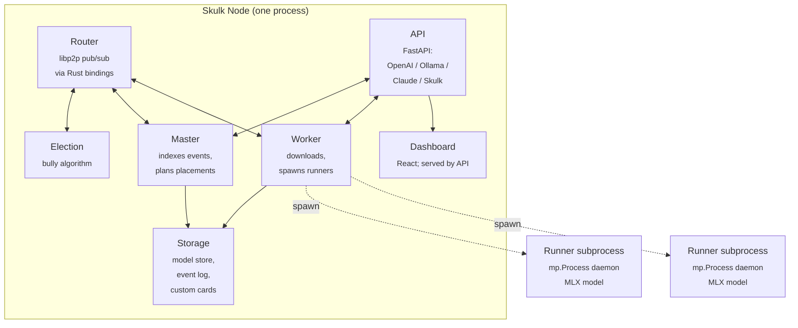
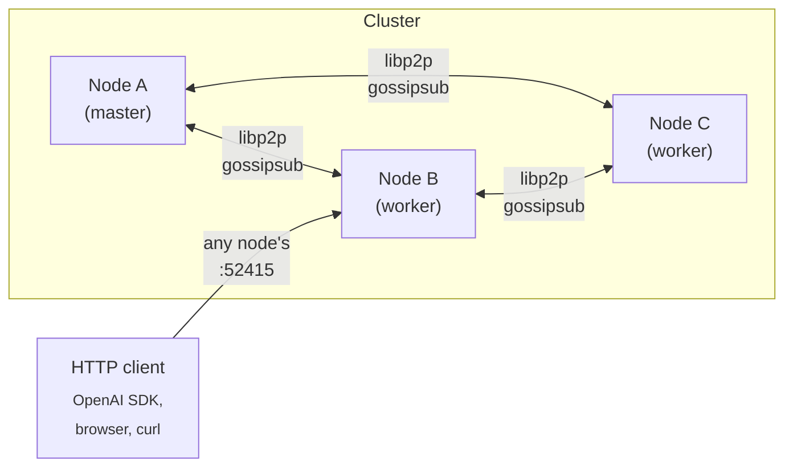
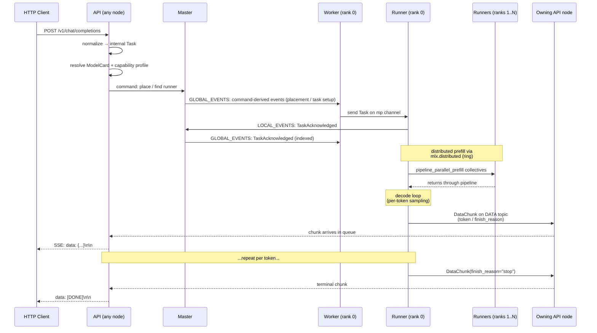

<!-- Copyright 2025 Foxlight Foundation -->

This is the long-form mental model for how Skulk is put together end to end. Read it once if you're picking the codebase up cold; come back to specific sections when you need to debug or extend a particular subsystem. For dense per-symbol lookups, see [Architecture Reference](architecture-reference).

## What Skulk is

Skulk is an interconnect fabric for multi-node AI compute: it connects multiple Apple Silicon (and increasingly Linux/CUDA) nodes into one cluster and moves work across them. Its headline use is distributed inference, where models are sharded across nodes, any node's API can serve cluster-wide requests, and the cluster keeps running through node arrivals, departures, and master failures. One Python binary (`uv run skulk`) is everything you need on each node: the same process is router, worker, master-eligible coordinator, election participant, API server, and, when its built assets are present, dashboard host. A headless node (for example a Linux worker with no built dashboard) runs as a full node and serves the API without the UI.

The design choices that shape almost everything else:

- **Event-sourced decisions.** Correctness-critical cluster facts (instances, runners, terminal download outcomes, tracing toggles) flow through an ordered event log. Observational latest-value readings stay outside it. State is the result of `apply()`-ing events to a Pydantic model that is treated as immutable by convention (replaced wholesale by `apply()` rather than mutated in place).
- **One master at a time.** A bully election picks the master; only the master indexes events. Failover is automatic, and the promoted node seeds the new session from its replicated state, so placed instances survive a master restart: workers rebuild their runners and serving resumes after a model-reload-sized gap. Instances with a rank on the dead master are cleaned up once live topology confirms the node is gone.
- **libp2p pub/sub for transport.** Topics carry commands, events, telemetry, and connection updates between nodes. Election and telemetry each use dedicated Python egress plus their own gossipsub behavior, protocol, and per-peer handler queues on the same libp2p swarm, so telemetry pressure cannot consume control or election capacity. Election alone retains its temporary legacy-protocol compatibility copy.
- **MLX as the inference backend.** Pipeline-parallel and tensor-parallel sharding strategies sit on top of `mlx.distributed`'s ring or jaccl/RDMA backends.
- **Subprocess isolation for runners.** Each model instance runs in its own `mp.Process` with its own MLX/Metal context, so a crash or hang in one runner can't bring down the rest of the node.

## The shape of a node

A single Skulk process hosts seven cooperating subsystems sharing one event loop and one set of typed channels:


```mermaid
flowchart TB
  subgraph Node["Skulk Node (one process)"]
    Router["Router<br/><sub>libp2p pub/sub<br/>via Rust bindings</sub>"]
    Election["Election<br/><sub>bully algorithm</sub>"]
    Master["Master<br/><sub>indexes events,<br/>plans placements</sub>"]
    Worker["Worker<br/><sub>downloads,<br/>spawns runners</sub>"]
    API["API<br/><sub>FastAPI:<br/>OpenAI / Ollama /<br/>Claude / Skulk</sub>"]
    Dashboard["Dashboard<br/><sub>React; served by API</sub>"]
    Storage["Storage<br/><sub>model store,<br/>event log,<br/>custom cards</sub>"]

    Router <--> Election
    Router <--> Master
    Router <--> Worker
    API <--> Master
    API <--> Worker
    API --> Dashboard
    Worker --> Storage
    Master --> Storage
  end

  Worker -.spawn.-> Runner1["Runner subprocess<br/><sub>mp.Process daemon<br/>MLX model</sub>"]
  Worker -.spawn.-> Runner2["Runner subprocess<br/><sub>mp.Process daemon<br/>MLX model</sub>"]
```

Each subsystem has its own concern:

- **Router** wraps libp2p (via PyO3 Rust bindings) and exposes typed pub/sub topics: `GLOBAL_EVENTS`, `LOCAL_EVENTS`, `COMMANDS`, `DOWNLOAD_COMMANDS`, `STATE_SYNC_MESSAGES`, `ELECTION_MESSAGES`, `CONNECTION_MESSAGES`, `TELEMETRY`, `DATA`, `PROVIDER_DATA`, `REALTIME_AUDIO`, `SPEECH_MEDIA`, `TRACE_DATA`, and `VISION_MEDIA`. Components subscribe by topic; every topic has a machine-checked control, telemetry, or data plane assignment and payloads are validated Pydantic types.
- **Telemetry plane** (`TELEMETRY` topic) carries last-write-wins readings that are *not* decisions: each node's `participation` role and `backends`, memory and system profile, observational identity/disk/rdma-ctl status, heartbeat, and non-terminal model-download progress. Local producers never wait for network capacity: a fixed 256-key admission map replaces older values for the same node/reading (download progress additionally keys by model), evicts the oldest distinct key only at the bound, and drains through a one-packet network queue. Telemetry then uses a dedicated gossipsub behavior and protocol with independent per-peer handler queues. Aggregate pressure is available at `GET /v1/diagnostics/telemetry`. Readings land in an in-memory `TelemetryView`, not event-sourced `State`; only download completion and failure remain durable. Attempt identities stop delayed progress on the independent protocol from overriding terminal/reset decisions, while `GET /state` overlays the live view to preserve the dashboard's wire shape. The system profile includes a collector-agnostic accelerator block (GPU utilization, VRAM used and total, power, temperature, clock) normalized at each platform collector. Because the context-admission ceiling must be identical across ranks but telemetry is unordered, the master computes it once at placement time and stamps it onto the instance (`context_token_limit`). **Connectivity readings stay on the control plane**: `node_network`, the thunderbolt maps, and derived `thunderbolt_bridge_cycles` define the topology graph and therefore require ordered event-sourced state.
- **Data plane** has six typed families. `DATA` carries generated token, image, embedding, transcription, and audio output; `PROVIDER_DATA` carries extension-provider stream frames without adding arbitrary provider payloads to `DataChunk`; `REALTIME_AUDIO` carries built-in realtime STT PCM from an owning API to the selected speech worker; `SPEECH_MEDIA` carries bounded request-scoped TTS reference audio and batch STT uploads; `TRACE_DATA` carries terminal per-rank diagnostic traces to the owning API; and `VISION_MEDIA` carries VLM and image-edit input from the owning API directly to every worker rank selected by the master's authoritative `TaskCreated` decision. Streaming families use explicit per-stream lifecycles and every family uses node-addressed same-node short circuit/remote delivery on Zenoh. Vision uses `opened -> chunk* -> completed -> accepted`, with a source-side deadline requiring acceptance from every selected rank. Batch STT waits for `TaskCreated`, then sends raw frames to the selected worker and gates runner dispatch on exact sequence, task owner, count, and SHA-256 verification. Trace assembly is best-effort and bounded by task count and age. Vision ingress has its own bounded network-receive lanes and remote dispatcher, stream/owner admission limits, five-minute lease, and `NodeDiagnostics.visionMediaEgress` counters so a large upload cannot delay control receive or consume generated-output capacity. Workers retain incomplete input only within fixed frame, per-command byte, process byte, stream-count, and age bounds; they expose it to planning only after the completion frame, sequence set, metadata, authoritative task owner, and SHA-256 digest verify and the acknowledgement is admitted to transport. `NodeDiagnostics.visionMediaIngress` reports API-staged commands/bytes, pending worker acknowledgements, retained worker streams/frames/bytes, verified streams, completions, rejections, and expirations. A generated-output command queue has a separate 30-minute no-frame resource lease, renewed by every producer frame observed by egress. The master never indexes, persists, or application-relays payloads from these families. OpenAI response models retain their required base64/JSON shapes, while provider, realtime audio, speech media, and vision media cluster framing uses bounded headers plus raw bytes. See [how the cluster communicates](cluster-communication) for transport and trust details.

  Vision admission is hard-bounded: an API accepts at most 64 staged plus active commands, 32 MiB per command, and 512 MiB across staged plus active transfers. The isolated remote dispatcher admits 16 streams total and per destination owner, with a 66-frame queue holding one open frame, at most 64 half-megabyte payload frames, and one completion frame per stream (512 MiB maximum queued media), 64 bounded rejection tasks, and a five-minute idle lease. Network receive has a separate 66-frame payload lane and 1024-frame metadata-only terminal lane. A worker admits 64 streams, 64 media chunks and 32 MiB per command, 512 MiB process-wide, and retains at most 64 pre-task failure reports; both worker retention and source acknowledgement expire after five minutes. Same-process delivery uses rendezvous channels rather than hidden packet queues.
- **Election** runs the bully algorithm and broadcasts `ELECTION_MESSAGES`. The winner takes the master role. The topic has its own bounded Python egress queue and is negotiated on a dedicated gossipsub protocol with its own per-peer handler queue, so saturation from control or telemetry fan-out cannot consume election capacity. A compatibility copy on the legacy protocol lets old and new nodes elect during staggered upgrades; identical candidates received on both paths count once.
- **Master** admits only an explicit allowlist of durable control decisions and ordered connectivity facts, indexes those events into the event log (writing them to disk via `DiskEventLog`), publishes indexed events on `GLOBAL_EVENTS` for followers, and decides instance placements when a model is launched. Decodable payload events, observational telemetry, and transient download progress are skipped at their source sequence before ordering, persistence, replay, state application, or global broadcast. Snapshot-tail replay runs on one coalescing background worker and emits 32-event bursts at a bounded cadence, so a joining node cannot make a retained 10k-event tail monopolize command processing or overflow slower peers. The master also warns when the log grows above 60 events/min for a full minute while no task or download is active, identifying periodic control-plane amplification before it becomes replay pressure.
- **Worker** receives indexed events, applies them to its local view of `State`, downloads model weights to disk when assigned a placement, and spawns / supervises runner subprocesses. Before spawning, it refuses a shard that won't fit local memory (a last-resort guard below the master's admission check, using the same shared estimator), and a crash circuit breaker gives up on a runner that keeps failing rather than relaunching it into another GPU-memory leak. When the give-up is driven by that *memory* guard (not a crash) the worker asks the master to re-place the model one node wider via `RefuseInstancePlacement` instead of letting the placement silently disappear (see "Placement memory admission" below).
- **Runner** is *not* in the same process; it's a `mp.Process` daemon spawned by the worker. It owns one model and serves inference tasks for it. Multiple runners (one per pipeline rank) coordinate via `mlx.distributed` collectives.
- **API** is a FastAPI app that exposes inference endpoints in four wire formats (OpenAI Chat Completions, OpenAI Responses, Anthropic Messages, Ollama) and Skulk-native control endpoints (placements, diagnostics, traces, config). It also serves the dashboard build at `/` when those assets are present; a headless node built without the UI skips that mount and serves the API alone.
- **Storage** is a collection of on-disk responsibilities: the event log (msgpack + zstd), the model cache directory, custom model cards (per-user TOML files), and the optional shared model store.

## The shape of a cluster


```mermaid
flowchart LR
  subgraph C["Cluster"]
    direction LR
    N1["Node A<br/>(master)"]
    N2["Node B<br/>(worker)"]
    N3["Node C<br/>(worker)"]
    N1 <-->|libp2p<br/>gossipsub| N2
    N2 <-->|libp2p<br/>gossipsub| N3
    N1 <-->|libp2p<br/>gossipsub| N3
  end

  Client["HTTP client<br/><sub>OpenAI SDK,<br/>browser, curl</sub>"]
  Client -->|"any node's<br/>:52415"| N2
```

Clusters form via libp2p mDNS or via explicit `--bootstrap-peers` multiaddrs. New nodes broadcast their identity, observe the current master, and snapshot-bootstrap from the master's published `State` snapshot before applying the retained event tail. Replay requests are coalesced and served asynchronously in paced 32-event bursts (a 250 ms interval between bursts), preserving live command/event scheduling and bounding the burst presented to slower followers. Once bootstrapped, nodes become first-class members. Discovery initially tries every advertised address so a direct Thunderbolt path can be established, but a link-local address that failed while the peer connected elsewhere is retried only once per minute instead of every five seconds. Connection health uses a five-second ping budget and requires three consecutive failures on the same socket before closing it. API reachability discovery continues probing advertised addresses independently so a working direct path can still become a placement and ring-transport candidate.

Any node's API can serve any request: the API forwards work to the placed runners through the master/worker plumbing. Operators usually pick one node as the public entry point (commonly the most stable / best-connected one) but the cluster doesn't require a specific entry point.

### Deployment & versioning

**All nodes in a cluster must run the same Skulk version and source build. Mixed-build clusters are unsupported for workloads: this is a degraded deployment window, not an interoperability mode.** Skulk's correctness-bearing wire types remain strict (`extra="forbid"`), so an older node can reject events, commands, or snapshots that carry a newer node's fields; serving or mutating cluster state while builds differ can produce state divergence, dropped placements, and election churn. Complete deployment across the fleet before starting new inference work. There is no cross-version snapshot-hydration concession: a node never reloads its own State across restart (node identity is ephemeral and State is rebuilt from the event log / state-sync, not persisted-and-rehydrated), so a snapshot carrying a previous version's removed fields is rejected by `extra="forbid"`. (An earlier before-validator that stripped removed keys was removed: it forced the whole model into strict Python-mode validation, where ISO datetime strings such as `lastSeen` were rejected, silently breaking state-sync.) Cross-version *interoperation* remains deliberately out of scope.

Operational diagnostics are the narrow exception required to observe and finish a staggered deployment safely. Peer diagnostic responses ignore unknown additive fields recursively, additive counters use compatibility defaults, and the collector compares each peer's reported package version and source commit. `GET /v1/diagnostics/cluster` returns aggregate and per-node `versionStatus`; `GET /state` adds a warning-level `version_mismatch` health reason while known live builds disagree. This tolerance does not extend to events, commands, state snapshots, model traffic, or inference compatibility.

## Lifecycle of a request

This is the path a chat completion takes from HTTP through to SSE response:


```mermaid
sequenceDiagram
    participant C as HTTP Client
    participant API as API (any node)
    participant M as Master
    participant W as Worker (rank 0)
    participant R as Runner (rank 0)
    participant Rn as Runners (ranks 1..N)
    participant Cb as Owning API node

    C->>API: POST /v1/chat/completions
    API->>API: normalize → internal Task
    API->>API: resolve ModelCard + capability profile
    API->>M: command: place / find runner
    M->>W: GLOBAL_EVENTS: command-derived events (placement / task setup)
    W->>R: send Task on mp channel
    R->>M: LOCAL_EVENTS: TaskAcknowledged
    M->>W: GLOBAL_EVENTS: TaskAcknowledged (indexed)
    Note over R,Rn: distributed prefill via<br/>mlx.distributed (ring)
    R->>Rn: pipeline_parallel_prefill collectives
    Rn-->>R: returns through pipeline
    Note over R: decode loop<br/>(per-token sampling)
    R->>Cb: DataChunk on DATA topic<br/>(token / finish_reason)
    Cb-->>API: chunk arrives in queue
    API-->>C: SSE: data: {...}\n\n
    Note over R,API: ...repeat per token...
    R->>Cb: DataChunk(finish_reason="stop")
    Cb-->>API: terminal chunk
    API-->>C: data: [DONE]\n\n
```

The eleven steps in detail:

1. **HTTP arrival.** Request hits FastAPI on any node's port (default 52415). The adapter for the wire format (OpenAI / Ollama / Claude / Responses) lives in `src/skulk/api/adapters/`.
2. **Normalization.** The adapter transforms the wire-format payload into an internal `Task` (`src/skulk/shared/types/tasks.py`).
3. **Capability resolution.** The API resolves the request against the bound `ModelCard` and computes a `ResolvedCapabilityProfile` (`src/skulk/shared/models/capabilities.py`). This decides prompt rendering, output parsing, tool-call format, reasoning format, vision handling, speech metadata, and a few MLX runtime knobs. Output parsing for channel-delimited reasoning formats (notably gpt-oss "harmony") is applied in the runner per engine: the MLX runner parses harmony at the token level (`parse_gpt_oss`), and the llama.cpp runner reparses it from llama.cpp's detokenized text (`HarmonyTextParser`), both splitting the `analysis` channel into reasoning and the `final` channel into content so control markers never reach the client.
4. **Runner discovery.** The API resolves the request against running instances via `_resolve_and_validate_text_model`. If no instance is currently placed for the model, the API returns HTTP 404: placement is **not** automatic on chat requests; operators must call `/instance` or `/place_instance` first to spin up the model. Once an instance exists, the API issues a command on the `COMMANDS` topic that the master indexes.
5. **Worker dispatch and runner acknowledgement.** Each rank's worker forwards the `Task` over an `mp.Queue` to its runner subprocess. The runner emits `TaskAcknowledged` on its outgoing event channel (see `src/skulk/worker/runner/llm_inference/runner.py:236`); the worker forwards that to `LOCAL_EVENTS`, the master indexes it, and it is republished on `GLOBAL_EVENTS` so every node observes the same acknowledged-state transition.
6. **Prompt rendering.** The runner renders the chat history into tokens. Family-specific renderers (e.g., Gemma 4's `<|turn>` template, DeepSeek's DSML) handle the format. Vision preprocessing happens here for multimodal requests.
7. **Distributed prefill.** Pipeline-parallel models split the layer stack across ranks. Each rank computes its slice's prefill, sends activations to the next rank via `mx.distributed.send`, and barriers synchronize phase transitions. Tensor-parallel models do per-layer collectives within a rank.
8. **Decode loop.** Per token, the runner runs forward through its layer slice, exchanges activations with peers, samples (or accepts an injected token from speculative decoding), and emits the resulting chunk. Speculative decoding runs on single-node, tensor-parallel, and pipeline placements via one loop; on multi-node *pipeline* placements exactly one rank, the decider (the last rank), drafts and makes every accept/reject decision, broadcasting draft tokens and the per-round accept outcome through fixed-shape collectives so the committed stream is identical on every rank by construction rather than by numerical luck (heterogeneous chips produce divergent per-rank logits, and relying on every rank recomputing the same decision is exactly what desynchronizes and crashes mixed-chip clusters). Multi-node *tensor* placements instead load the drafter on every rank and draft rank-symmetrically: a lone TP decider cannot draft "locally" because draft logits go through the TP-sharded lm_head, an all-rank collective that idle receivers would never join; rank-symmetric drafting relies on bit-identical per-rank logits, which TP placements already require in practice. Assistant-style drafters that cross-attend the target's KV occupy the same decider seat, since the last pipeline rank is the only rank holding the KV layers they attend; such drafters declare `reads_target_cache` so the loop keeps the target cache fully committed before every draft. It is mechanism-agnostic: the loop owns verification, accept/reject, and cache reconciliation, and talks to a `Drafter` protocol (`src/skulk/worker/engines/mlx/drafters/`) behind which family-specific draft mechanisms live: Qwen3.5 sidecar MTP heads (fc projection plus the sidecar's transformer block with a private KV cache, quantized on load to match the target), DeepSeek projection-only heads, and the Gemma 4 assistant model (a chain-trained companion that cross-attends the target's KV cache). Family facts (sidecar norm conventions, fc concat orders, hidden-state convention) are declarative data resolved from layout-keyed defaults plus model-card overrides, never constants in drafter code. The loop guarantees drafters a gapless, exactly-once stream of committed `(hidden, next-token)` pairs so stateful drafters keep positional history aligned with the target sequence. Rounds are *bonus-driven*: the loop carries an emitted-but-unforwarded bonus token, drafts up to the card's `mtp_max_depth` candidates from the bonus position, verifies `[bonus, drafts]` in a single K+1-token forward (the round's only target forward), commits the longest matching prefix, and samples the next bonus from the first non-matching row (the correction on a partial reject, the free next token on a full accept); the next round drafts from that position, so post-correction drafts, statistically the easiest, are never skipped. Cache reconciliation on a reject prefers the model's native `rollback_speculative_cache` (gemma4), else restores an SSM snapshot and *defers* the committed prefix to ride at the front of the next verify forward (extra verify width is effectively free on memory-bound decode), else plainly trims pure-KV caches. Depth is a per-model tuning knob set by measurement on the carded artifact. At temperature > 0, acceptance switches to Leviathan-Chen probability-ratio rejection sampling over the effective sampler distributions (with residual resampling on reject), preserving the output distribution exactly while keeping the speedup; depth is forced to 1 under sampling.
9. **Output streaming.** One model-family output runner publishes `started`, ordered payload frames, and one terminal frame on `DATA`: rank 0 for text, embedding, and speech families, or the primary terminal pipeline stage for image generation. The owning API validates that lifecycle before draining payloads into the request queue. On Zenoh each remote command has an independent bounded egress worker with a renewed-on-frame 30-minute idle lease, while same-node output short-circuits network egress. An omitted terminal therefore ends in typed failure and queue reclamation instead of retaining admission forever. The master does not index or relay output (see the Data plane note above).
10. **SSE serialization.** The API's adapter for the wire format converts each chunk to its on-the-wire shape (`data: {...}\n\n`) and yields it on the SSE stream.
11. **Termination.** A chunk with `finish_reason != None` sends `data: [DONE]\n\n` and closes the stream. (Stream termination is hardened against cancel races and silent worker failures.)

For non-streaming responses the same flow happens but the API accumulates chunks before responding once. For embeddings and image generation the runner type and Task type differ but the master/worker/runner shape stays the same.

## State and events

Skulk is event-sourced because distributed clusters need a clear notion of "what has the cluster agreed has happened." The mechanics:

- **State** (`src/skulk/shared/types/state.py`) is a Pydantic model treated as immutable by convention: `apply()` returns a new `State` rather than mutating in place, even though the model is not declared `frozen=True`. It carries everything every node needs: topology, instances, runners, downloads, tracing flags, network stats, and so on.
- **`apply()`** (`src/skulk/shared/apply.py`) is a pure function: `(State, IndexedEvent) -> State`. Given the same events in the same order, every node lands on byte-identical state.
- **The master indexes events.** Every event arrives at the master via `LOCAL_EVENTS`, gets a monotonically increasing index, gets persisted to the disk event log, and gets republished on `GLOBAL_EVENTS`.
- **Followers replay.** A new node bootstraps by requesting the current state snapshot, applying it, then replaying retained events at indices after the snapshot's high-water mark.

Download lifecycle is split by semantics. `DownloadPending` is a rare ordered start/reset decision that clears an older durable outcome; `DownloadCompleted` and `DownloadFailed` are terminal `NodeDownloadProgress` events retained in `State`. `DownloadOngoing` remains decodable for replay compatibility but new producers publish it only as telemetry. Repository callbacks are serialized through one bounded per-download coalescer, use the canonical registered byte total, and pass a monotonic fraction gate before latest-value telemetry admission. Every attempt has an opaque identity shared by transient and terminal status. This preserves terminal ordering even when the dedicated telemetry protocol delivers an older sample after its control event, prevents progress traffic from growing replay state, and keeps placement, workers, `/state`, and node health reading one effective overlay.

Why event sourcing here:

- **Observable history.** Every state change is replayable. Debugging a "how did we get into this state?" question reduces to inspecting the event log.
- **Deterministic recovery.** A node restart replays from the last snapshot + tail. No partial state.
- **Cheap state distribution.** Followers don't need a separate state-replication channel; events are the channel.

Operationally, the rule of thumb:

- **Events are past tense** ("`TaskStatusUpdated`", "`InstanceCreated`", "`RunnerStatusUpdated`", "`TaskDeleted`"). Once published, they're immutable history.
- **Commands are imperative** ("`PlaceInstance`", "`DeleteInstance`", "`TaskFinished`", "`SetTracingEnabled`"). They request the system change state.

`PlaceInstance` carries an optional `excluded_nodes` list. The master's placement planner treats those nodes as absent when scoring candidate cycles for that single placement only: it's a per-launch hint, not a cluster-wide flag. Already-running instances on the listed nodes are unaffected. Operators set the list from the dashboard's placement modal before pressing Launch.

The planner's memory admission is per node, not summed across the candidate cycle: Tensor sharding splits the weights evenly across ranks while Pipeline allocates layers proportionally to each node's available memory, and every node must fit its weight share times a runtime-overhead factor (KV cache, activations, MLX buffers, the runner process) plus a flat floor, and an exact weights-equal-free-memory fit is rejected because it thrashes rather than runs. "Available memory" here is the GPU-wireable figure, `total − wired − anonymous − compressor` from a `vm_stat` snapshot taken alongside each telemetry sample, not the naive free-plus-inactive figure, which counts reclaimable file cache as used (after downloading a model, the weights sitting in file cache would deflate availability by the model's full size and refuse a placement that runs comfortably; macOS evicts that cache the moment Metal wires pages). It deliberately does not credit compression of idle anonymous memory. Because that availability rides the telemetry plane (last-write-wins gossip), it lags a teardown by a few rounds: right after an instance is deleted the freed memory is not yet reflected, so a placement issued immediately afterward (a test harness or a rapid model swap) would read deflated availability and be refused until the gossip settles. To avoid that, the master credits a just-deleted instance's per-node footprint back to the admission inputs for a short grace window, then lets the credit expire so a genuine shortfall reasserts; the worker's own pre-load fit guard remains the last-resort check against an over-credit. Placement failures are typed: a topology gap, an exclusion that removed every candidate, a per-node memory shortfall (with the arithmetic), and the not-an-error startup cases where cluster info simply has not finished gossiping (`PlacementInfoPendingError`, which covers both phases: connection edges lagging node identities, and memory info lagging the edges) are all distinct, and `POST /place_instance` dry-runs the placement against replicated state so callers get the real reason as a 400/503 instead of an acknowledged command that silently fails on the master.

The master admits on the gossiped (telemetry-plane, last-write-wins) `ram_available`, while the worker's pre-spawn guard reads a fresh live `vm_stat` figure at load time. On a borderline multi-node split the live reading can sit just below the admitted estimate, so the master admits a cycle the worker then refuses. The worker guard therefore allows a small fit tolerance (10% of usable): a shard's footprint already bakes in the engine overhead factor, a full KV reservation, and a flat floor, so a sub-GB miss is within that pad and within live-versus-gossip jitter, and refusing on it would flip a placement the master admitted into a needless failure (a 0.2GB / 2% miss was observed refusing a 24B model at the load re-check across a 3-node ring). Only a shortfall beyond the tolerance, the signature of a node that genuinely lost memory since admission, trips the guard. When it does, rather than letting that instance vanish, the worker emits `RefuseInstancePlacement` and the master re-places the same model one node wider (`min_nodes` = refused width + 1) so each node holds a smaller share. On a heterogeneous cluster "wider" is not always possible even when a working placement exists: engines differ per node, so a GGUF model refused by one GPU node may fit alone on another GPU node while a Mac can never join its cycle. When no wider cycle exists, the master therefore falls back once to a single-node placement that excludes the refusing node. A refusal against that fallback is terminal: the master tears the placement down, cancels the model downloads it started, and gives up, which bounds the refusal chain at two hops so it can never oscillate between two refusing nodes. This self-corrects tight splits instead of requiring an operator to notice and re-launch.

A separate failure mode is a rank whose model **download** fails terminally (disk full, a transient Hugging Face or network error). The ring still forms and every rank waits for all ranks to become load-ready, but the failed rank never will, so the instance would otherwise sit "loading" forever with nothing to recover it. The master's plan loop detects this from replicated state (a not-yet-ready instance whose any rank node carries a terminal download failure for the model), fails any in-flight request bound to it with the download error surfaced, tears the instance down, and re-places the model at the same width while excluding the failed node(s). If no healthy node set can host the width (for example the failure was cluster-wide), the re-placement raises `PlacementError` and the master stops at the teardown, which bounds recovery to the available nodes rather than looping. A transient or single-node failure therefore self-heals onto healthy nodes; a genuine shortfall fails cleanly with the reason instead of hanging. Recovery also clears the failed download record itself (resetting that node's download status to pending), because a stale terminal failure left in session state would otherwise condemn every future placement of the same model touching that node long after the cause, such as a freed disk, is gone.

This recovery is made visible so it is not mysterious. `GET /state` attaches a derived per-node health summary (a level of ok, warn, or error plus reasons, each with a message and a remediation), computed read-only from state already in the response: a terminal download failure on a node, a low or full models-volume disk (a pre-emptive warning before a download fails), and a node whose heartbeats are late enough to be at risk of pruning. The dashboard renders an amber or red badge on the affected topology node whose hover names the problem and how to fix it, so an operator sees why a node is being routed around rather than watching placements quietly avoid a normal-looking node.

Liveness itself is judged across both planes, and the distinction matters when reading state directly. Ordered events bump a node's `last_seen` in replicated state, but a healthy node may legitimately log nothing for long stretches: readings that rarely change (connectivity among them) are forwarded only when their payload differs from the last value the master confirmed into the log (the worker keeps re-sending an unconfirmed change each poll until it sees it echoed back, then goes quiet), precisely so the event log records history rather than heartbeats. (Periodic identical events are actively harmful here: they fill the bounded replay tail that joining nodes must consume, and replaying that accumulated burst can saturate a slower node's send queues and flap it out of the cluster.) The primary live signal is a payload-free `NodeHeartbeat` reading published on the telemetry plane every two seconds. Each peer stamps its local receipt time, so liveness never trusts a sender's wall clock. Ordinary non-heartbeat telemetry receipt remains an independent fallback, and the last indexed control event remains a final fallback for a node that has just joined. The master emits a one-shot warning when the dedicated heartbeat gap reaches ten seconds, logs recovery when it resumes, and prunes only when the freshest of all three signals exceeds the 30-second timeout. `NodeTimedOut` persists the deciding last-event, heartbeat, fallback-telemetry, effective, and timeout ages so the event log explains the prune after the ephemeral receipts are gone. The API health summary uses the same three-signal freshness model. The consequence worth remembering: `last_seen` means "last logged event", not "last observed alive"; freshness lives primarily on the telemetry plane.

Task failure is part of the same event flow. The master's plan loop (the
same reconciliation pass that deletes instances on dead nodes) emits
`TaskFailed` for any in-flight API task (text generation, image generation,
image edits, embeddings) whose instance is gone or being torn down, computed before
`InstanceDeleted`/`NodeTimedOut` so the failure indexes ahead of the applies
that remove the task from state. The API reacts by delivering a terminal
error chunk into that command's stream: streaming responses close with an
error event, non-streaming requests fail instead of hanging. Two failure
shapes bypass this flow and are handled at their own boundaries: operator
instance deletion cancels in-flight tasks via `TaskStatusUpdated(Cancelled)`
(the API terminates those streams too), and a master failover starts a new
session that cannot carry the old session's tasks at all, so the API's
session reset fails every still-open command stream directly before
discarding its queue maps. Together these guarantee an open request is
terminated within seconds of any node death rather than dangling until the
client's own timeout.

A snapshot-bootstrap rollout has one operational rule: once a master starts compacting old replay history after writing snapshots, older nodes that only know how to "replay from event 0" should be considered temporary guests during the rollout window. Upgrade all nodes before relying on bounded retention as the steady state.

### Heterogeneous nodes and capability-aware placement

A cluster can mix node types: Apple Silicon nodes serving MLX models and
non-Mac (for example AMD/Linux) nodes serving GGUF models through llama.cpp.
Placement is capability-aware so each model runs only where it can.

Every node advertises the compute **backends** it can serve as
`<engine>-<compute>` tags. The tag folds two axes into one self-describing
string: the engine selects the worker runner class (`mlx` or `llama_cpp`), and
the compute names the accelerator (`metal`, `vulkan`, `rocm`, `cuda`, `cpu`). A
macOS node advertises `{mlx, mlx-metal}`; a Linux node with an importable
`llama_cpp` built for its GPU adds `{llama_cpp, llama_cpp-vulkan}` (the compute
backends come from `SKULK_LLAMA_CPP_BACKENDS`, defaulting to `cpu` when that env
var is unset so a node never over-claims a GPU). Backends are probed per node and
gossiped on the telemetry plane as part of `NodeResources`.

`NodeResources` also carries the DATA transport that startup actually resolved
(`gossipsub` or `zenoh`). This is a fleet invariant, not a placement preference:
Skulk does not bridge the transports. `GET /state` merges the live resource map
back under `nodeResources` and derives an error-level
`data_transport_mismatch` health reason when live nodes disagree. The topology
health badge and per-node diagnostics therefore fail loudly instead of leaving a
cross-transport output timeout unexplained. A missing first resource reading is
treated as unknown during startup; a mismatch requires positive advertisements
of both transports.

The llama.cpp runner loads GGUF models with Flash Attention on by default (the
modern llama.cpp default; it fixes the slow padded-V-cache and full-size
sliding-window-cache path that gemma-style interleaved attention otherwise hits).
Set `SKULK_LLAMA_CPP_FLASH_ATTN=0` to disable it on a node whose compiled build
lacks Flash Attention kernels.

Alongside the two in-process engines (MLX and llama.cpp) there is a third,
**served-backend** engine (`llama_server`). Instead of loading the model in the
worker process, it launches an external `llama-server` subprocess and proxies its
OpenAI HTTP API. This is what unlocks llama.cpp's **native multi-token-prediction
speculative decoding** for models that ship MTP heads (Qwen3.6, DeepSeek, GLM,
Kimi, Nemotron): that machinery lives in the llama-server application, not in the
library the in-process runner links, so the only way to use it is to run and proxy
the server. A node offers this engine when `SKULK_LLAMA_SERVER_BIN` points at a
`llama-server` binary (built recent enough to expose `--spec-type`), and a model
opts in through its card's `compatible_backends` (`llama_server-…`) plus the
`served_spec_type` / `served_spec_n_max` runtime fields (for example
`served_spec_type = "draft_mtp"`). Most MTP families ship the heads inside the base
GGUF, but some speculative modes need a separate small draft model: a card names it
with `served_spec_draft_repo` / `served_spec_draft_file` and the worker downloads it
as a companion and passes it to the server as `--model-draft` (this is how Gemma 4
runs MTP, via its assistant as the draft model). The engine coexists with the
in-process llama.cpp runner; the same managed-server-plus-proxy shape carries the
`vllm` engine described next. See the setup notes for a non-Mac node in
[AMD / Strix Halo nodes](amd-strix-halo-nodes) and the env vars
`SKULK_LLAMA_SERVER_BIN` / `SKULK_LLAMA_SERVER_BACKENDS`. A node-local
`SKULK_LLAMA_SERVER_FORCE_NO_SPEC=1` forces speculative decoding off even for a
card that asks for it, so the same GGUF can be served in plain decode as an
apples-to-apples MTP-off baseline (a benchmarking and diagnostics knob, not for
normal operation).

A second served-backend engine, `vllm`, reuses that same shape with a `vllm serve`
process instead of `llama-server`. vLLM is the **GPU-serving fast path**: its
continuous batching and paged attention keep latency low and grow aggregate
throughput as concurrent requests pile up, exactly where the single-stream engines
fall over. A head-to-head on a rented A100 (same gpt-oss-120B weights on both
engines) made the trade-off concrete: under 64 simultaneous requests llama.cpp's
time-to-first-token blew out to about 31 seconds while vLLM stayed near half a
second, and vLLM's total throughput kept climbing where llama.cpp flattened; but
for a *single* request llama.cpp was faster, because that particular A100 has no
native FP4 hardware and vLLM had to emulate the model's 4-bit format (a gap that
closes on newer Blackwell GPUs). So vLLM does not replace the in-process engines,
it **coexists** with them, and the planner chooses per model by the node's hardware
and how much concurrent load it expects. A node offers vLLM when `SKULK_VLLM_BIN`
points at the `vllm` CLI (it advertises `vllm-cuda` / `vllm-rocm`, GPU-only), and a
card opts in through `compatible_backends`. Because the right engine now depends on
the GPU *generation* (FP4 support and all), each node also reports its GPU compute
capability in telemetry, so placement can eventually route a model to the metal
that serves it best. Unlike the in-process runners, which serve one request at a
time, the vLLM runner keeps several generations in flight at once (one streaming
HTTP request per worker thread, bounded by `SKULK_VLLM_MAX_CONCURRENT_REQUESTS`) so
the server actually *sees* concurrent requests and its continuous batching engages
— without that the batching benefit never appears. The runner reports itself
running while any generation is in flight and returns to ready only when the last
one drains. This first slice is single-node text generation; tool calling,
logprobs, vLLM's own multi-GPU parallelism, and vLLM-aware memory admission are
follow-ups.

The `llama_server` engine is also how a GGUF model larger than any single GPU node gets
served: **multi-node memory pooling over llama.cpp's RPC backend**. When a model
fits no single node but fits the combined GPU memory of several `llama_server`
nodes, the planner places an asymmetric pair of roles instead of a ring: one
**driver** node runs `llama-server --rpc donor:port,...` and holds the model
file, and each **donor** node runs a small `ggml-rpc-server` that lends its GPU
memory. llama.cpp itself splits the weights and KV across the pooled devices in
proportion to their free memory, so Skulk assigns no layer ranges; the placement
just picks the driver (the biggest-VRAM node), chooses each donor's endpoint
address from the observed connectivity between the pair (preferring the fastest
interconnect, such as a USB4/Thunderbolt link between two Linux boxes), and
stamps both onto the instance. Pooling trades some decode speed for capacity
(the point is the model class that otherwise cannot run at all, not a speedup),
and prefill is unaffected. A single-node placement is always preferred whenever
the model fits one node, so this shape only appears for genuinely pooled-only
models. If a donor dies mid-generation the driver exits immediately and the
normal crash recovery tears the instance down and re-places it.

A model card declares two placement axes that are deliberately separate from the
memory/topology axes above:

- `compatible_backends` is a **hard filter**: the planner excludes any node whose
  advertised backends do not intersect it. A GGUF card lists the llama.cpp
  backends, so it can only land on a llama.cpp node; an MLX card lists MLX, so it
  stays on the Macs; a speech card lists `mlx_audio`, so it can only land on a
  node whose probed `mlx_audio` package can serve it. This is what keeps an MLX
  model off an AMD node, a GGUF model off a Mac without an MLX llama.cpp shim,
  and a TTS/STT model off a text-only MLX runner.
- `backend_preference` is a **soft score**: when several compatible nodes
  qualify, the planner prefers the node whose backend ranks earliest in the
  card's preference list (for example preferring a GPU backend over CPU).

The engine axis (which runtime) is orthogonal to the node axis (which machine):
the same card mechanism that routes a GGUF model to a Vulkan llama.cpp node would
route a future engine to whichever nodes advertise it. The worker resolves the
concrete engine for its node at runner-spawn time by intersecting the card's
`compatible_backends` with the node's advertised backends, ordered by
`backend_preference`. See the
[AMD Strix Halo nodes](./amd-strix-halo-nodes.md) guide for bringing up a
non-Mac node.

Cards describe the model; the platform describes itself. A card's
`compatible_backends` records which engines the model's artifacts run on
(model truth), and it never encodes a gap in Skulk's own implementation
(platform truth). When one of our runners cannot yet exploit a capability a
card declares (for example, the served llama.cpp engine cannot load a vision
model's projector yet, and only the `mlx_audio` engine currently owns TTS/STT),
that limitation lives in a code-level capability table that placement and the
worker both consult, so the model never lands where an advertised capability
would silently degrade, and the card needs no edit when the platform catches up.

Speech serving is in a staged rollout. Phase 0 added `TextToSpeech`,
`SpeechToText`, `SpeechTranslation`, the `[audio]` card section, and the
`mlx_audio` backend tags (`mlx_audio`, `mlx_audio-metal`) when the upstream
`mlx_audio` package imports on macOS. TTS serving is exposed at
`POST /v1/audio/speech`: the API validates a mounted TTS model, sends a
`SpeechSynthesis` command through the master, the worker dispatches it to the
single-node `mlx_audio` speech runner, and the runner emits `AudioChunk` output
on the data plane. TTS output streaming is stable for TTS cards that explicitly
declare `audio.supports_streaming = true`; no experiment gate is required. The
runner can emit independently encoded MP3 segments or headerless mono signed-16-bit
PCM segments. The API describes PCM framing through response headers before it
commits the body. The dashboard requests PCM, segments visible assistant output
into ordered sentences, and pauses HTTP reads against a bounded AudioWorklet
queue; stop aborts queued and active synthesis. The bundled Qwen3 TTS card
declares MP3 and PCM streaming support after live validation; Fish Audio and
the remaining bundled speech cards stay batch-only.

For cards declaring reference-audio support, the same route accepts a bounded
multipart upload. The API pins the command to one ready instance and sends the
raw file to its worker through `SPEECH_MEDIA`; only metadata enters the command.
The worker verifies ordered chunks and the terminal digest in process-local
memory, then injects bytes into the local runner task. The runner materializes a
request-scoped temporary file for upstream `mlx_audio` and deletes it in a
`finally` block. Cancellation, transport failure, malformed input, and expiry
clear pending media. Reference bytes never enter State or the event log.
Non-streaming requests use the default path where the API collects the chunks
and returns one raw audio response. Production API nodes also expose the
first-party `tts@1.0.0` provider facade over this same core path. Generic calls
open through the provider contract, become the existing `SpeechSynthesis`
command, and return `AudioChunk` output as raw MP3 `InlineMediaAttachment`
frames over `PROVIDER_DATA`. The descriptor remains available for contract
discovery, while its telemetry tag is advertised only when an eligible mounted
model and its routable runners are ready; dynamic admission rechecks the
specific model before `started`, and cancellation reaches the core command.
STT serving is exposed at
`POST /v1/audio/transcriptions`: the API validates a mounted STT model, accepts a
multipart audio upload, retains it until authoritative task placement, and sends
raw `SPEECH_MEDIA` frames directly to the selected worker. The worker verifies
the owner, frame count, and digest before dispatching the speech runner, and the
runner emits `TranscriptionChunk` output on the data plane. Audio bytes never
enter State or the ordered event log.
Batch requests collect terminal output in the requested response format. Cards
declaring `audio.supports_streaming = true` may instead return model-produced
deltas as typed SSE or progressive NDJSON; disconnect cancellation reaches the
core command and releases its queue. The built-in `stt@1.0.0` provider exposes
the same batch inference path as a Fabric transform. Its opening metadata stays control-sized while one or
more raw encoded-audio `InlineMediaAttachment` frames travel over
`PROVIDER_DATA`; caller input half-close starts inference and one completed
frame returns the final transcript. It advertises only with ready mounted STT
capacity and does not claim progressive output. The stable `stt.realtime@1.0.0`
provider adds a truthful
bidirectional path for cards backed by an upstream incremental session.
Admission pins `RealtimeAudioTranscription` to one ready single-host instance.
Bounded `REALTIME_AUDIO` packets move mono PCM16 from the owning API to that
worker, using a same-node short circuit or node-addressed Zenoh delivery, and a
bounded local channel completes the worker-to-runner hop. PCM is never event
sourced; partial plus final `TranscriptionChunk` output returns through DATA.
Remote capacity is not advertised when Zenoh is unavailable. The provider is
available only when the card declares both streaming and realtime support and
eligible mounted capacity is ready and reachable. The
`WS /v1/realtime` compatibility edge and the explicit
`WS /v1/fabric/chains/speech` composition surface adapt base64 24 kHz PCM16
append/commit events onto this same binary provider path and emit transcript
delta/final events, enforce same-origin browsers and bounded messages, and
cancel the provider on disconnect. Optional bounded server VAD incrementally
resamples input for WebRTC classification, emits start/stop events, and commits
the utterance on silence or maximum duration. VAD-enabled appends are forwarded
in classifier-sized source slices and stop at the detected boundary. The socket
serializes multiple utterances as distinct provider calls with linked item IDs,
per-turn VAD reset, and no overlapping STT provider ownership. Optional typed
response configuration routes final transcripts through the selected mounted
chat model under a strict 1-4096 output-token ceiling (256 by default), with
hidden reasoning disabled by default for speech-ready output, and then through
a normal mounted `tts@1.0.0` provider, emitting
assistant text and MP3 audio events. Explicit cancellation and VAD barge-in
cancel active model/TTS work. The Fabric path names its STT participant with
`stt_model` and otherwise reuses these lifecycle guarantees. Every API
also registers stable `vad@1.0.0` through `BuiltinVadProvider`. This reusable
bidirectional provider frames mono PCM16 for WebRTC VAD and emits typed turn
boundaries with bounded minimum-speech, hangover, preroll, and maximum-duration
state; it has no mounted-model dependency and retains no media. Dashboard chat selects
this path only when both the model card and local provider advertisement say it
is available; its AudioWorklet resamples microphone Float32 frames to the edge's
24 kHz PCM16 contract, while non-realtime models retain batch MediaRecorder
transcription. Mounted TTS cards with static `audio.voices` metadata expose it
through the Skulk `GET /v1/audio/voices` extension. Translation-capable STT
cards can reuse the bounded batch path through experimental
`POST /v1/audio/translations`; the speech runner maps the English-target intent
to model-family generation arguments. Supporting TTS cards can accept bounded
reference-audio uploads through the request-scoped `SPEECH_MEDIA` path described
above.
See [Speech Providers and Realtime Transcription](speech-fabric-realtime).
The dashboard composes the shipped speech endpoints in chat: mounted TTS models
can speak draft text, replay assistant messages, or auto-speak final assistant
responses; mounted STT models can transcribe a browser-recorded clip into the
draft box. Realtime cards use an AudioWorklet, server VAD, and a persistent
multi-turn WebSocket; batch-only cards retain `MediaRecorder`. Microphone
controls require a secure browser context such as HTTPS or localhost.

The llama.cpp runner serves GGUF models single-node and matches the MLX runner
on the capabilities llama.cpp supports natively: per-token logprobs (with the
top alternatives) and tool calling. A tool-enabled request runs unstreamed so
the caller receives an assembled tool call rather than fragile token-by-token
deltas; if the model answers in prose instead, that prose streams back normally.
Logprobs requires the model to be loaded so it retains per-token logits, which
pre-allocates a buffer proportional to context length times vocabulary. At a
model's full trained context that buffer is large enough to exhaust a node's
memory on load, so logprobs is off by default and opt-in per node; enabling it
also caps the served context so the buffer stays bounded. The default path
serves at full context without it. Whether a given GGUF emits a structured tool
call (versus describing one in prose) depends on the model and its embedded chat
template, which the runner uses as-is.

## The inference engine

Inference happens entirely inside the runner subprocess. Skulk wraps MLX (and the upstream mlx-lm model implementations) in a layer that handles distributed coordination, family-specific behavior, and operator-controlled knobs.

### Pipeline parallelism

For models too large for a single device, Skulk splits the layer stack across ranks. Each rank holds a contiguous range of layers (`start_layer` to `end_layer`). Layers communicate via `mlx.distributed.send` / `recv_like` over the `ring` backend (sockets) or `jaccl` (RDMA, when available).

The ring's per-rank addresses are chosen at placement time from the libp2p connections the cluster has *observed* between each neighbor pair, ranked by transport: Thunderbolt first, then ethernet/Wi-Fi, with VPN/overlay addresses (Tailscale's CGNAT range, detected by address) strictly last; the overlay exists for reaching nodes from outside the local network and may be relayed through a distant server, so it is only used when a pair genuinely has no local path. Group formation itself runs under a hard deadline (`SKULK_GROUP_CONNECT_DEADLINE_SECONDS`, default 120s): ring init blocks forever if a neighbor socket fails its post-TCP rank handshake, so on expiry the runner exits via the wedge path, the worker gives the instance up on the first failure, and a fresh placement (with a fresh ring port) is the recovery, instead of an instance that sits broken behind request timeouts indefinitely. An even earlier gap is covered by a first-status-report deadline (120s): a runner frozen between spawn and its very first status report (a stuck process the crash breaker cannot see, since it is still alive) would otherwise stall group formation forever because the gate waits for every rank to report. The worker gives the instance up when a runner stays silent past that deadline.

The pipeline forward pass per rank:

1. **Receive** activations from the previous rank (or read input embeddings if rank 0).
2. **Compute** the rank's layer slice.
3. **Materialize** the output via `mx.eval(output)`, which forces the lazy MLX graph to commit before the send, so the send doesn't race the compute.
4. **Send** to the next rank (or `all_gather` the final logits if rank N).

The `mx.eval` + `mx.distributed.send` discipline is load-bearing: it's where Skulk's eval-timeout watchdog lives (`eval_with_timeout` in `auto_parallel.py`) so a stuck collective is detected within bounded time rather than wedging the cluster forever.

### Tensor parallelism

Within a rank, individual operations (attention, MLP) can be sharded across devices/contexts via per-family `*ShardingStrategy` classes (Llama, DeepSeek, Qwen, GLM, MiniMax, GPT-OSS, Step3.5, NemotronH; see `src/skulk/worker/engines/mlx/auto_parallel.py`). The strategy picks shard dimensions for `q_proj`, `k_proj`, `v_proj`, `o_proj`, MLP gates, and so on. Today the strategies are dispatched via an `isinstance` chain; ongoing modular-engine work is moving these to per-family adapters.

### Family-specific behavior

About 37% of the inference engine's code is family-specific (prompt rendering, output parsing, vision preprocessing, sharding strategy, occasional patches like Gemma 4's vision-tower wrapping). The current mechanism is a mix of capability-profile enum dispatch (`profile.prompt_renderer == Gemma4`) and direct `isinstance` checks. Consolidation into a `FamilyAdapter` per family is ongoing.

For the practical effect today: the model card declares a family (or family hints via `vision`, `tooling`, `runtime` sections), the resolver computes a profile, and the engine dispatches against the profile.

### KV cache backends

Skulk supports multiple KV cache backends, selectable per-cluster via config:

- `default`: standard MLX cache, fp16
- `mlx_quantized`: upstream MLX quantized cache
- `turboquant` / `turboquant_adaptive`: random-orthogonal-rotation + scalar quant
- `optiq`: rotated-space attention trick, decode-time perf benefit

(RotorQuant is a research backend not yet in the merged backend set; check `src/skulk/worker/engines/mlx/constants.py` for the current valid values.)

The choice affects memory footprint and decode throughput. See [KV Cache Backends](kv-cache-backends) for the operator-facing trade-offs.

### Per-model runtime knobs

The model card's `runtime` section carries Skulk-specific behavior overrides, the most operationally significant being `metal_fast_synch`. Gemma 4 cards explicitly disable Metal FAST_SYNCH because it deadlocks the GPU command queue under multimodal pipeline-parallel load. Cards that declare any speculative-decoding mechanism (`mtp_heads`, `mtp_sidecar_repo`, or `assistant_model_repo`) also default FAST_SYNCH off: the flag collapses the speculative loop's per-round small-eval pattern by ~46x while leaving vanilla decode unaffected. All other models use the cluster default. Operator overrides (`--fast-synch` / `--no-fast-synch`) and explicit card pins beat both defaults.

The `runtime` section also carries `speculative_multi_node` (default unset, meaning no restriction, since only an explicit `false` gates): set `false` on cards where multi-node speculation measures slower than plain sharded decode. Fast-decoding MoE models are the known case (gemma-4-26B-A4B measured −7% on a 2-node pipeline while keeping ~2.2× single-node). The gate is evaluated rank-symmetrically from the card and world size, so every rank makes the identical speculate-or-not choice and the distributed collective schedule stays aligned. See [Model Cards](model-cards) for the full set of runtime knobs.

## Diagnostics and observability

Skulk has three layers of diagnostic data, ordered from "always on" to "deliberately enabled":

### Always-on flight recorder

Each runner supervisor retains the last 128 phase updates in memory, outside the event log. The flight recorder captures: phase enter/exit events, MLX memory snapshots at significant transitions, distributed-collective state, eval-timeout signals. This data is local-only (it's not gossiped) but exposed via `/v1/diagnostics/node` and `/v1/diagnostics/cluster/{node_id}` so operators can pull it from any node.

The API also retains bounded process-local provider metrics through `ProviderObserver`. The node diagnostics `provider` block exposes unary and streaming concurrency, admission pressure, caller-input queue depth, frame and inline-media byte volume, first-output and lifetime timing, terminal outcomes, and cancellation requests. Metrics are aggregated and grouped only by the stable qualified capability ID; call IDs and speech payloads are not retained. Router egress diagnostics remain the source of per-owner queue and publish pressure.

The API additionally builds observe-only **performance envelopes**: for each combination of hardware class, model, engine, and quantization it serves, it measures how throughput and latency change as the number of concurrent requests rises, and estimates the concurrency "knee" past which aggregate throughput stops improving. One observation is recorded per completed generation from a guarded stream tap that covers every text-generation surface (chat completions, the Claude and Responses adapters, the Ollama endpoints, and realtime turns), not just chat completions. The concurrency each observation is filed under is the serving instance's own in-flight load: the served engines (llama.cpp server, vLLM) report their true in-flight count and whether they batch concurrent requests, so the curve stays accurate across replicas and when several front-ends drive one instance; the single-stream engines fall back to the API node's outstanding-request count. The data lives in bounded memory on the API node and is exposed through `GET /v1/diagnostics/performance-envelopes` (and a cluster fan-out) and the dashboard's Performance tab. It changes no serving behavior. It is the observe-only foundation for later adaptive concurrency: the same curves an admission controller would eventually target, collected now so the fabric can start learning its own performance envelope. See the architecture reference for the record schema and bounds.

The cross-rank stitched view at `/v1/diagnostics/cluster/timeline` merges every reachable node's flight recorder into one wall-clock-ordered timeline. This is the single most useful debugging tool for distributed deadlocks: it makes rank disagreement visible at a glance.

### On-demand capture bundles

`POST /v1/diagnostics/node/capture` (or the cluster proxy) collects: live diagnostics, the runner's flight recorder, current process tree, and best-effort macOS `sample`, `vmmap -summary`, and `footprint -p` output for the runner process. The capture is opportunistic (sampling failures are returned as partial results) and is scoped to one runner / task so it's safe to invoke during an active hang.

### Task-scoped traces

Tracing is off by default. The dashboard's tracing toggle (or `PUT /v1/tracing`) flips a cluster-wide flag for *new* requests. Each traced task accumulates `TraceEvent`s on the runner; on completion the runner supervisor sends one terminal `TRACE_DATA` packet per rank directly to the API node that owns the task. That API waits for the expected rank set, merges the payloads, persists the trace to disk, and exposes it via `/v1/traces/{task_id}`. Trace payloads never pass through the master or enter the ordered event log.

Saved trace files accumulate under `SKULK_CACHE_HOME/traces/`. An hourly janitor task in the API (`prune_old_trace_files` in `src/skulk/api/main.py`) drops files older than `tracing.retention_days` from `skulk.yaml` (default 3 days). Setting `retention_days: 0` disables pruning entirely. The first sweep runs 60 seconds after API startup; janitor failures are logged but never crash the API loop.

Traces are intended for targeted debugging: turn on, reproduce, inspect, turn off. Permanent always-on tracing isn't the right tool; centralized logging (Vector → VictoriaLogs → Grafana) is the always-on observability surface.

### Centralized logging

Each node can emit structured JSON on stdout alongside the human-readable stderr output. A local Vector agent reads stdout and ships logs to VictoriaLogs. Grafana queries VictoriaLogs for cluster-wide log search. Configuration:

- `src/skulk/shared/logging.py`: loguru setup with the JSON stdout sink
- `deployment/logging/vector.yaml`: Vector config (stdin → VictoriaLogs)
- `deployment/logging/docker-compose.yml`: VictoriaLogs + Grafana stack
- `skulk.yaml` `logging.enabled` + `logging.ingest_url`: opt-in; configurable via dashboard Settings; synced cluster-wide

Without the logging config, Skulk behaves identically to before. The logging stack is purely additive.

### Debugging MLX hangs

When a model appears stalled during warmup, prefill, or distributed generation, the flight recorder is the first thing to consult. For deeper instrumentation:

- Set `SKULK_MLX_HANG_DEBUG=1` and `SKULK_MLX_HANG_DEBUG_INTERVAL_SECONDS=10` to emit periodic Python stack traces from the stuck phase
- Set `SKULK_PIPELINE_EVAL_TIMEOUT_SECONDS=120` to raise the per-eval timeout if you're seeing false positives on cold-start
- The repro harness at `bench/repro_gemma4_hang.py` exercises the deterministic pipeline-parallel hang pattern; see the file for the operator workflow

The wider observability story (cluster timeline, hang-rate SLO, per-node panel) is being consolidated. The user-facing operator workflow is documented in [Tracing and debugging](tracing) and the [API guide](api-guide).

## Storage

Three on-disk responsibilities:

### Event log

`src/skulk/utils/disk_event_log.py` is an append-only log: the live file (`events.bin`) is uncompressed length-prefixed msgpack records (4-byte big-endian length + msgpack payload). When the log rotates or the master shuts down, the live file is zstd-compressed into a rotated archive (`events.*.bin.zst`); only the rotated archives are compressed, not the active write target. Every indexed event passes through here. Followers replay from this log on bootstrap. Snapshots can be written periodically; events older than a snapshot can be compacted (with a guarded rollout window, see "State and events" above).

The log degrades rather than crashes when the disk fights back: any persistence failure (ENOSPC at init, append, or compaction) drops it into a counting-only mode where indices keep advancing (so follower replay coherence and event ordering survive) while nothing further is written. A proactive free-space floor (2 GiB, checked every 1024 appends) triggers the same degradation *before* the disk hits zero, and archive rotation is capped by total bytes (1 GiB) in addition to count, so the log can never be the thing that fills a node's disk.

### Model cache

Models live under `SKULK_MODELS_DIR`: by default that resolves to `SKULK_DATA_HOME/models`, which is XDG-based on Linux (`~/.local/share/skulk/models`) and `~/.skulk/models` on macOS/Windows. `SKULK_HOME` overrides the base; `SKULK_MODELS_DIR` overrides the models path directly. See `SKULK_MODELS_DIR` / `SKULK_DATA_HOME` in `src/skulk/shared/constants.py`. The cache stores tokenizers, weights, processor configs, and metadata. Multiple nodes on the same physical machine share a cache; nodes on different machines each maintain their own.

### Model store (optional)

For multi-node deployments with shared filesystems, a model store hosts canonical model artifacts on one machine. Other nodes stage from the store (rsync-like) rather than each downloading from Hugging Face independently. A model card can bind those artifacts to an immutable Hugging Face commit through `source_revision`; the revision is carried through metadata discovery, the store registry, direct downloads, and worker staging so a changed upstream `main` cannot silently replace a qualified artifact. Revision changes install a new canonical copy before the previous store directory is removed. This is a config-driven feature; without a store, each node downloads independently. See [Model Store](model-store) for setup details.

Staged copies have a lifecycle: by default (`cleanup_on_deactivate: true`), a staged model becomes an eviction candidate when no live runner uses it (including as a companion repo: MTP sidecar, assistant, or split vision weights, which no instance names directly but which a live runner depends on just the same). Candidates are kept newest-first by last use up to the `staging_keep_recent_gb` grace budget (default 40 GiB) and deleted beyond it; the in-use set is always kept and does not count against the budget. The same budget enforcement runs at exactly two moments, and only while `cleanup_on_deactivate` is `true` (the toggle gates the whole pass; `false` means no automatic eviction at all): at instance deactivation and at node startup. It is lifecycle-triggered, not disk-pressure-triggered: the grace budget is a recency floor, not a free-space high-water mark, so nothing evicts just because the disk is filling. The startup pass is what reconciles copies orphaned by a crashed session, and the grace budget is why a crash-restart cycle keeps its recent models warm instead of re-staging everything. `GET /store/storage` reports the per-node breakdown. Deleting a model from the store (`DELETE /store/models/{id}`) goes further than the lazy budget pass: it removes the canonical copy from the store host *and* broadcasts a cluster-wide eviction (the `EvictStagedModel` command → `StagedModelEvicted` event) so every node immediately drops its locally-staged copy, because a worker's staged shards are an independent cache the store-host delete would otherwise leave behind. `POST /store/purge-staging` clears staged copies without touching the store's canonical copy.

Companion repos follow a single download contract: `companion_download_specs()` (in `src/skulk/download/download_utils.py`) enumerates a card's companions (MTP sidecar, assistant model, split vision weights), each flagged required or best-effort, and every model resolution path (fresh download, already-staged fast path, store staging, direct-from-store) ensures companions through it before reporting the model ready. Required companions (vision weights, which the model cannot load without) fail the resolution loudly; best-effort companions (sidecar, assistant) log and continue, so a missing drafter degrades to plain decode instead of blocking the model.

### Custom model cards

User-added model cards live under `SKULK_CUSTOM_MODEL_CARDS_DIR` (default `SKULK_DATA_HOME/custom_model_cards`) as TOML files. On Linux that resolves to `~/.local/share/skulk/custom_model_cards`; on macOS/Windows to `~/.skulk/custom_model_cards`. Built-in cards live in `resources/inference_model_cards/`. The capability resolver reads both; custom cards override built-ins for the same `model_id`.

## API adapters

Skulk exposes inference through several wire-format families. The adapters all converge on the same internal `Task`:

```text
OpenAI Chat Completions  → adapter → internal text generation Task
OpenAI Responses         → adapter → internal text generation Task
Anthropic Messages       → adapter → internal text generation Task
Ollama (chat / generate) → adapter → internal text generation Task
Skulk-native             → adapter → internal text / image / embedding Task
```

This is why one placed model can be accessed through several compatibility formats simultaneously: the underlying execution path doesn't care which adapter normalized the input.

The adapters live in `src/skulk/api/adapters/`. Each one handles request normalization (incoming) and chunk serialization (outgoing) for its wire format. The internal Task and Chunk types are the integration boundary.

## Extensions (plugins)

Skulk can load separately installed Python packages as extensions and call
them at well-defined points in the serving path. Extensions are how
deployment-specific behavior (an audit logger, a request policy filter, a
prompt annotator) rides the fabric without forking Skulk: the package is
installed into the same environment as Skulk on each node, and Skulk
discovers it at startup through the `skulk.extensions` entry-point group.
The developer guide, with a complete worked example, is at
[Extensions (Plugins)](extensions.md).

The contract is deliberately small (`src/skulk/extensions/`):

- An extension exposes a zero-argument factory in the entry-point group. The
  returned object names itself, declares the Skulk versions it supports as a
  PEP 440 specifier, and can provide **chat middleware**.
- Chat middleware gets two hooks. `transform_chat_request` runs on the API
  node after the OpenAI adapter and before the request is dispatched to the
  cluster; it can return modified task params (for example, an augmented
  system region). `observe_chat_response` receives an immutable summary of
  the completed generation (final text, thinking text, finish reason) in a
  background task after the response ends.
- Each hook invocation receives an `ExtensionContext` carrying the node
  identity, the running Skulk version, programmatic access to the cluster's
  embedding serving (the in-process equivalent of `POST /v1/embeddings`), and
  telemetry-plane access. `read_cluster()` is the read surface: an immutable
  per-node snapshot of the cluster (backends, participation role, accelerator
  vendor, version, liveness, advertised capabilities) so a plugin can discover
  the fabric it belongs to. `advertise_capability(tag)` is the write surface: it
  publishes an opaque capability tag this node offers onto the plane so peers
  discover it the same way native nodes advertise their backends
  (`withdraw_capability(tag)` reverses it). Together these are first-class
  citizenship expressed as plane access: a plugin both reads and writes the
  telemetry plane.
- An extension can also be a **provider**: a plugin that serves a capability of
  its own. Because the set of future capabilities is open-ended, Skulk
  standardizes the description, not the capabilities: a provider publishes one
  `CapabilityDescriptor` per capability (id, semantic version, human/LLM-readable
  description, JSON Schemas for input and output, and the call's I/O mode:
  unary, server-streaming, client-streaming, or bidirectional). Discovery is
  two-layered: the descriptor's id is auto-advertised as the node's telemetry
  tag (cheap, gossiped), and the full descriptor travels on demand through
  `describe_node()` / `GET /v1/capabilities` (heavy, fetched). Providers also
  get an `on_start` startup hook, since a pure provider has no chat hook
  through which to reach the context. A reference provider lives at
  `examples/extensions/echo-provider/`. The generic capability call completes
  the unary loop: a provider implementing `handle_call` is callable via
  `call_capability(node, id, version, revision, payload)`. Calls are
  node-addressed and direct (the master is never in the hot path; nothing is
  event-sourced), pinned to the discovered descriptor revision, schema-validated
  in both directions, and bounded (deadline, payload caps, per-node concurrency
  bound), with every failure a typed machine-readable error. Server-streaming
  providers implement `handle_stream`; callers use
  `stream_capability(node, id, version, revision, payload)`. A control-sized
  peer-API request performs opening admission; an optional dynamic-admission
  hook can reject changing backend/model conditions before `started`. Then
  `PROVIDER_DATA` carries both active directions directly between caller and
  provider nodes (master and State remain outside the hot path). Skulk owns
  `started`, validates handler sequence and direction-specific chunk schemas,
  requires one terminal per active direction, and withholds a provider terminal
  until its handler iterator returns and completes `finally` cleanup. It
  closes closable handler iterators before publishing a synthetic failure for
  malformed output. It preserves raw inline media outside JSON, expires gaps,
  and explicitly cancels abandoned calls.
  `CapabilityStreamInput.complete()` is caller input half-close: it terminates
  only `caller_to_provider`, leaving provider output active. Remote pressure is
  isolated by owner, call, and direction. The transport now executes
  server-streaming, client-streaming, and bidirectional descriptors. The first
  built-in bidirectional consumer is `stt.realtime@1.0.0`: it admits only a
  truthful streaming STT model, pins one single-host instance, and keeps caller
  PCM off State and the event log through bounded local or node-addressed Zenoh
  ingress. After core output terminates, it sends `TaskFinished` and withholds
  the provider terminal until replicated task state is terminal or deleted, so
  the next turn cannot race stale busy admission. Remote capacity is not
  advertised without Zenoh.
- Production API nodes prepend first-party providers to the guarded extension
  registry. They include `tts@1.0.0`, a facade over mounted core `mlx_audio`
  serving rather than a duplicate runtime, and experimental
  `stt.realtime@1.0.0`. First-party contracts take deterministic precedence
  over external extensions claiming the same `id@version`.

Three invariants shape the design. First, **a raising extension never breaks
inference**: every extension call is guarded, an exception is logged loudly
and skipped, and the request proceeds as if the extension did not exist (the
guarantee covers exceptions, not latency: a transform runs inline before
dispatch, so a hanging transform delays the request it is transforming, while
observers run in the background and cannot affect request latency). Second,
**extensions never own the response stream**: Skulk does the accumulation and
hands observers a summary, so a buggy extension cannot corrupt, reorder, or
stall token delivery. Third, **no extension installed means Skulk unchanged**:
the hooks are inert when nothing is loaded.

Version discipline matches the cluster rule. An extension whose version
specifier does not match the running Skulk is refused at load time with an
error: mixed plugin/fabric versions are the same anti-pattern as
mixed-version clusters, and the fix is the same (upgrade the fleet and its
extensions together). `SKULK_EXTENSIONS_DISABLE=1` is a node-local kill
switch that skips discovery entirely.

## NVIDIA / CUDA nodes

NVIDIA GPUs join a cluster the same way AMD Strix nodes do: through the
llama.cpp engines. The node declares `SKULK_LLAMA_CPP_BACKENDS=cuda` (the
build is cross-checked so a CPU-only wheel can never masquerade as a GPU
node), telemetry comes from a passive NVML collector that fills the same
normalized accelerator profile as the Apple and AMD collectors, and
placement admission uses that telemetry identically. A one-shot install
recipe at `deployment/cuda/install-deps.sh` takes a machine with the NVIDIA
driver present (rented GPU pods ship it) to a serving node: build
toolchain, the CUDA llama-cpp-python build, the NVML binding, and
optionally the CUDA `llama-server` for native speculative decoding and the
RPC donor daemon for multi-node GGUF pooling.

## Field telemetry (opt-in)

Skulk can report anonymous performance and reliability samples to Foxlight's
benchmarks ledger, strictly opt-in and off by default. The first time an
operator opens the dashboard they are asked once (a browser-local marker
prevents re-asking; dismissing collects nothing), and both switches stay
permanently available in Settings. Consent persists in `skulk.yaml`, so it
survives restarts.

When enabled, the API node's collector records one sample per completed
generation: the model id, canonical hardware classes (for example
`apple-m4-24gb`), time to first token, decode throughput, token counts, and
a failure class when a generation errors. Node deaths are peer-observed (a
crashed node cannot report itself, but its peers see it vanish), so
reliability is measured alongside speed. Samples never include prompts,
outputs, node identifiers, addresses, or operator strings, and the ingest
service enforces the same allowlist independently. Batches flush every
minute, fail silent, and are bounded so telemetry can never affect
inference. Operators can inspect the exact pending batch at
`GET /v1/telemetry/preview`, disable collection at any time, and delete
everything previously sent using their install id, a random key that only
they hold. `SKULK_TELEMETRY_DISABLE=1` hard-disables collection on a node
regardless of fleet settings.

## Experimental features

Skulk stages in-development features behind a single node-local switch,
`SKULK_ENABLE_EXPERIMENTAL_MODE`, so a released build can carry work-in-progress
UX without exposing it by default. When the switch is on, the dashboard reveals
an "Experiments" section in Settings; when it is off, the section is hidden and
any feature that opts into the gate stays inert, so the node behaves exactly as
it does today. The gate (`src/skulk/shared/experimental.py`) is deliberately
feature-agnostic: it knows about no particular experiment. A feature that wants
to be gated reads the flag and, when it needs an operator-facing switch, adds
its own toggle under the same section, so its UX is built alongside it. This is
the fabric's discipline for shipping unfinished work safely, and it composes
with extensions: an out-of-tree capability can ride the fabric as a plugin and
still surface a gated toggle here.

Current built-in experiment toggles live under the persisted `experiments`
config section. `experiments.tts_streaming` remains as a deprecated parsing
compatibility field; stable `/v1/audio/speech` streaming ignores it and relies
on the mounted card's validated `audio.supports_streaming` declaration.
`experiments.speech_translation` enables `/v1/audio/translations` only on nodes
running with experimental mode and only for mounted cards that explicitly
declare `audio.supports_translation = true`.

## The dashboard

The dashboard is the operator-facing UI for the same Skulk runtime. It's a React + TypeScript + styled-components SPA, built with Vite, served by the API at `/` (the API's static-files mount) on nodes where the built assets are present. A node without them (a headless or non-Mac worker built without the UI) still runs the full API; operators reach the dashboard from any node that has it.

Architecture decisions:

- **Redux Toolkit + RTK Query** for dashboard state (`dashboard-react/src/store/`). UI state lives in slices such as `uiSlice` and `chatSlice`; API reads/writes go through RTK Query endpoint modules.
- **Activity-style routing.** No react-router. Routes are managed via an `activeRoute` enum in `uiSlice`. Each top-level page renders based on the current value.
- **Hooks over services.** The cluster state subscription lives in `useClusterState`; topology rendering subscribes via the hook. No service singletons.
- **Tolgee localization.** `dashboard-react/src/i18n/tolgee.ts` initializes Tolgee with the `skulk` namespace and wraps the app through `TolgeeProvider`. Dashboard code uses Tolgee's `t()` function with an English fallback for each key rather than `<T>`. Runtime translations are fetched from a CDN/static prefix (`VITE_TOLGEE_CDN_PREFIX`, default `/i18n`), with English bundled in `src/i18n/en/skulk.json` as the offline fallback. `VITE_TOLGEE_AVAILABLE_LANGUAGES` is a comma-separated list of language tags to preload/allow; English is always present.
- **Theme-token-driven styling.** `dashboard-react/src/theme/theme.ts` exports `darkTheme` and `lightTheme`; styled-components reference tokens via `${({ theme }) => theme.colors.X}`.
- **localStorage for cross-session preferences** (theme, observability panel width); sessionStorage for in-session UI state (which page, panel open/closed, scroll positions).

The dashboard's main surfaces:

- **Topology**: spatial cluster view, node-by-node status
- **Model Store**: search Hugging Face, place models, monitor downloads
- **Chat**: chat client against placed text models, with mounted TTS playback
  and mounted STT microphone transcription when speech models are ready
- **Observability panel**: right-side resizable dock for live cluster health, per-node diagnostics, trace browsing (work in progress)
- **Settings**: cluster config (model store, KV cache backend, logging, tracing), plus a gated Experiments section on nodes running with `SKULK_ENABLE_EXPERIMENTAL_MODE`

## Trade-offs and constraints

The shape of Skulk reflects deliberate trade-offs. Knowing which ones helps explain why some things are the way they are:

- **Apple Silicon-first.** Skulk targets Apple Silicon as the primary deployment platform because that's where MLX runs. Linux/CUDA support exists but has fewer code paths exercised. If you're running on Linux, expect more rough edges.
- **MLX upstream coupling.** Skulk consumes mlx-lm's model implementations directly. When mlx-lm changes (model class shapes, cache APIs), Skulk has to follow. The `mlx-lm` fork pinning in `pyproject.toml` reflects which upstream issues we've worked around.
- **Subprocess-per-runner.** Each placed model runs in its own `mp.Process` daemon. The cost is higher memory overhead and more process orchestration; the win is that a runner crash or hang is contained, so the rest of the node keeps working.
- **Event sourcing with disk persistence.** Every indexed event is appended to the master's disk log so followers can replay it. Master itself does not rehydrate state from disk on restart: `Master.__init__` (in `src/skulk/master/main.py`) initializes a fresh `State`; continuity comes from followers retaining their own `State` and from the disk log preserving the index counter so new event IDs don't collide. Snapshotting bounds replay-log growth. The cost: bootstrapping a fresh node is more elaborate than just "ask for current state."
- **Ring transport by default.** `mlx.distributed`'s ring backend uses raw sockets; `jaccl` uses RDMA. Ring is simpler to set up but more sensitive to message-ordering bugs across consecutive jobs. RDMA needs hardware support and is more complex to configure.
- **No central coordinator process.** The same binary is master / worker / API on every node; the master role is elected. There's no separate `skulk-master` daemon. The win is operational simplicity; the cost is that elections and master changeovers happen as ordinary events.
- **Why `mp.Process` instead of `subprocess.Popen`.** `mp.Process` lets us pass typed channels (`mp.Queue`, `mp.Pipe`) between parent and child with native Python object transport (pickle under the hood). We avoid hand-written JSON serialization on this boundary and can share Pydantic models directly; pickle is still doing wire-format work, but it preserves Python types end-to-end.

## Where things live

A rough file map for orientation:

```
src/skulk/
├── api/                # FastAPI app, adapters (OpenAI / Ollama / Claude / Responses / Skulk-native)
├── master/             # event indexing, placement, snapshot publishing
├── worker/
│   ├── main.py         # worker loop: applies events, dispatches tasks
│   ├── plan.py         # decides what to do next (warmup, runner spawn, etc.)
│   ├── runner/
│   │   ├── bootstrap.py        # subprocess entrypoint, signal handlers, parent-pid watchdog
│   │   ├── runner_supervisor.py # parent-side lifecycle for one mp.Process runner
│   │   ├── llm_inference/      # text generation runner
│   │   ├── embeddings/         # embedding runner
│   │   └── image_models/       # image generation runner
│   └── engines/
│       └── mlx/        # MLX engine (auto_parallel, generator, vision, KV cache backends)
├── routing/            # libp2p pub/sub topics, event router
├── shared/             # types, capability resolver, tracing, election
│   ├── types/          # Pydantic models (events, commands, tasks, chunks, state, diagnostics)
│   ├── models/         # ModelCard, ResolvedCapabilityProfile, capability resolution
│   └── apply.py        # (State, IndexedEvent) → State
├── store/              # config, model store, custom card management
├── utils/              # event log, channels, dashboard path, common helpers
└── main.py             # CLI entrypoint, top-level wiring

dashboard-react/        # operator UI (React + TypeScript + Vite)
deployment/             # Vector + VictoriaLogs + Grafana docker-compose
bench/                  # benchmark + repro harnesses
docs/                   # operator guides, design docs, this file
website/                # Docusaurus site that publishes the docs
resources/
└── inference_model_cards/  # built-in TOML model cards (gemma-4, qwen, etc.)
rust/                   # Rust crates: networking (libp2p), skulk_pyo3_bindings, system_custodian
```

## Glossary

**Bound instance**: A `Task` materializing a particular placement: the model card, the shard ranges per rank, the network configuration (ring or jaccl), the bound runners.

**Capability profile**: `ResolvedCapabilityProfile`. The runtime answer to "what does this model do?", derived from the model card plus family defaults plus tokenizer hints. Drives prompt rendering, output parsing, tool grammar, vision handling, and speech metadata.

**Card** / **Model card**: Per-model declarative metadata: model id, layer count, supported tasks, family, capabilities, modalities, audio metadata, tooling, runtime knobs. Stored as TOML.

**Command**: Imperative request on the `COMMANDS` topic. "PlaceInstance," "DeleteInstance," "SetTracingEnabled." Master decides whether to act on it.

**Event**: Past-tense control fact on `LOCAL_EVENTS` (pre-indexing) or `GLOBAL_EVENTS` (post-indexing). "TaskAcknowledged," "RunnerFailed," "InstanceCreated." Indexed events are immutable history. Runner IPC payload event types remain decodable for compatibility but the master rejects them before ordering.

**Indexed event**: An event with a monotonic index assigned by the master. The unit that gets persisted to the event log and replayed by followers.

**Instance**: One running placement of a model. Has runners across ranks. Tracked in `State.instances`.

**Master**: The currently-elected node that indexes events. Cluster has exactly one master at a time. Failover via election.

**Placement**: The mapping of a model's layers to specific runners on specific nodes. Master decides; workers execute.

**Rank**: A shard of a pipeline-parallel model. Rank 0 holds the input embeddings + initial layers; rank N-1 holds the output head. Layers send activations to the next rank in pipeline order.

**Runner**: A subprocess (`mp.Process` daemon) that owns one model and handles inference tasks for it. Exactly one runner per (instance, rank).

**State**: The cluster's current shared view, derived from applying indexed events. A Pydantic model treated as immutable by convention (`apply()` returns a new `State`; the model itself does not enforce `frozen=True`).

**Worker**: The per-node process responsible for downloads, runner supervision, and task dispatch. Every node runs a worker.

## Where to read next

- [Architecture Reference](architecture-reference): dense, structured fact-sheet for AI assistants and operators who prefer reference style over narrative
- [API Guide](api-guide): every endpoint with examples
- [Build and Runtime](build-and-runtime): how to build, run, and configure
- [Model Cards](model-cards): declarative model metadata, including runtime knobs
- [Model Capabilities](model-capabilities): the capability spine and how the resolver works
- [Model Behaviors](model-behaviors/gemma4): family-specific notes (Gemma 4, GPT-OSS, DeepSeek V3.2)
- [KV Cache Backends](kv-cache-backends): operator trade-offs across cache backends
- [Tracing](tracing): task-scoped tracing operator workflow
- [Model Store](model-store): shared model artifact hosting

Maintenance discipline for this doc and the [Architecture Reference](architecture-reference) lives in [AGENTS.md](https://github.com/Foxlight-Foundation/Skulk/blob/main/AGENTS.md). Architectural shape changes (new component, new event, new pubsub topic, new state field, new major API endpoint, new family adapter) update these docs in the same commit as the code.
