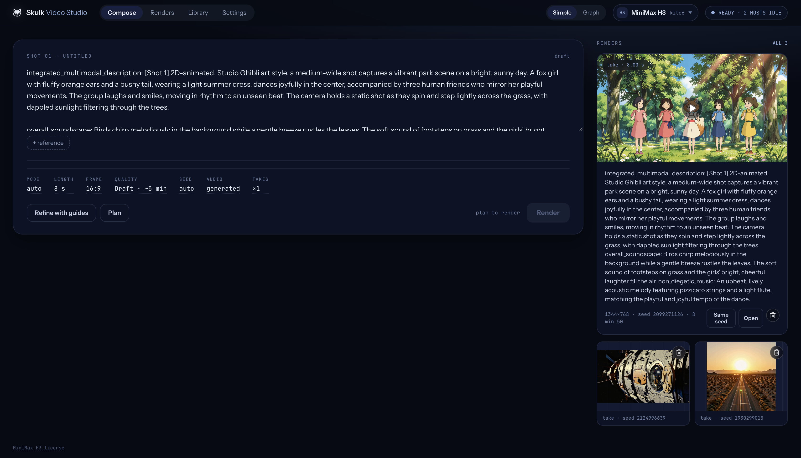
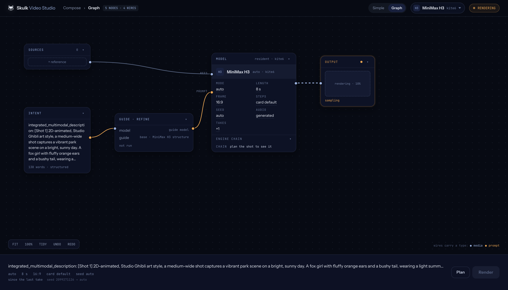
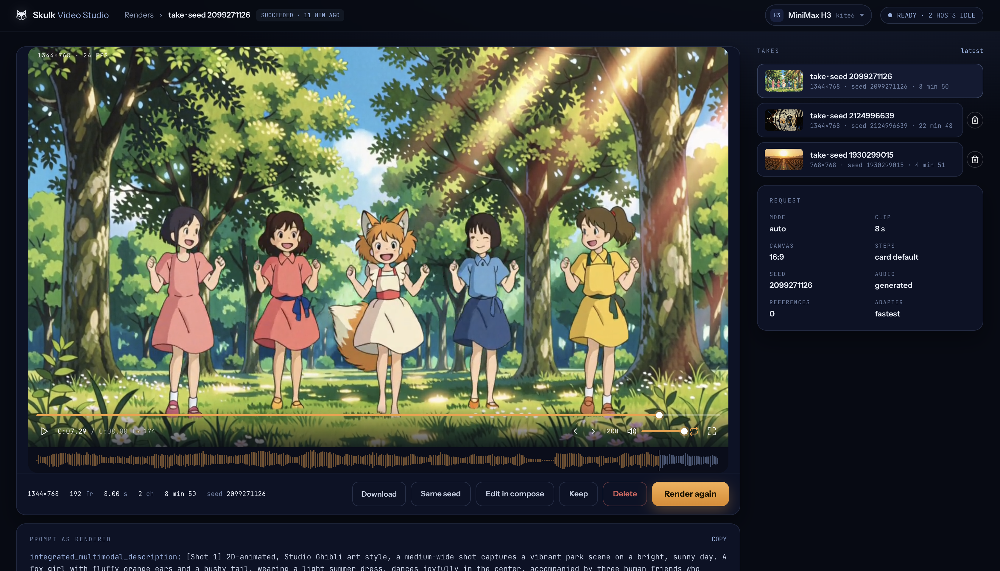

Capabilities extend Skulk into a platform for services, tools, and applications.
They can use the fabric's models and compute, integrate another service, and
provide a purpose-built interface alongside callable operations. Inference is
one foundation on which these applications can build.

| Term | Meaning |
| --- | --- |
| **Capability** | A declared operation or service the fabric can provide |
| **Plugin** | An installable package that supplies one or more capabilities |
| **Capability node** | A logical provider with its own identity, health, settings, and available actions |
| **Satellite** | The topology's representation of a capability node sharing a host with a Skulk compute node |

A capability node is not necessarily another physical machine. Multiple
capability nodes can share a host. Some provide an application interface; others
expose operations for clients and tools. Built-in speech providers use Skulk's
own mounted model capacity, while plugins add independently packaged services.

## Discover and open a capability

Open **Cluster** and look for capability nodes. On a host that also runs a Skulk
compute node, capabilities appear as satellites beside that host. Select a
satellite to see the provider's name, readiness, and available actions.

<figure>
  <a href={require('./imgs/capability-satellite.png').default} target="_blank" rel="noreferrer">
    

      
    

  </a>
  <figcaption>A capability satellite opens its own action menu. Select the image to see the full cluster screenshot.</figcaption>
</figure>

Choose the application link to open a ready interface, or **Details** to inspect
the capability. Available actions come from the provider; a capability without
an application interface can still expose useful operations. Opening an interface
does not itself launch a model or submit work.

Application links must be reachable from your browser. A surface published only
on its host's loopback address needs a browser on that host; discovery alone does
not make it remotely accessible. Configuration and management actions can also
require access to the dashboard on the capability's host.

## Example: Skulk Video Studio

Skulk Video Studio shows how a plugin can deliver a complete application on the
fabric. It provides a workspace for MiniMax H3 video creation, using Skulk's model
inventory and video-job API, and a ready text model for optional prompt refinement.
The Studio has its own interface, reference library, operation history, and saved
takes. Its application process can run on a different machine from the model
performing the render.

### Compose a shot

Write the intended scene in **Compose**, add reference media when needed, and
choose the available duration, framing, quality, seed, and audio settings.
**Refine with guides** uses a ready text model to help structure the prompt.
**Plan** resolves the request against the selected model and available capacity;
review the plan before choosing **Render**.

### Follow the work

The **Graph** view presents the shot as connected sources, intent, refinement,
model, and output. The output reports render progress while Skulk executes the
video job. These are the application's workflow elements, distinct from the
physical and capability nodes in Skulk's cluster topology.

### Review and keep the result

Open a completed take in **Renders** to play it, inspect its request and seed,
download it, or return to Compose. **Keep** protects a take from the Studio's
normal retention pruning; **Delete** removes that take's stored media.

*These are real application captures. Models, available
controls, resource readings, and render times reflect that session.*

The plugin exposes planning, readiness, rendering, prompt refinement, asset, and
take-management contracts. Its UI is one way to use those capabilities. The
application is packaged separately from Skulk core and calls Skulk through its
APIs, illustrating how developers can build applications on the platform.

## Manage plugins

Skulk core owns discovery, routing, plugin management, and the dashboard. A
plugin supplies its implementation, configuration schema, setup checks, and
provider-specific policy. Use **Plugins** to install and manage these packages;
use their topology actions to discover and open what they provide.

Process separation helps lifecycle management; it is not a sandbox against
malicious code running as the same operating-system user. Install bundles from
publishers you trust.

## Get a compatible plugin

**A public plugin store is coming soon.** For now, obtain plugins directly from
their publishers.

Obtain the release and owner instructions from its publisher. Check supported
platforms, exact runtime compatibility, permissions, required services, costs,
and cleanup procedures before installing. A matching version label alone is not
proof of compatible bytes or dependencies.

The RunPod cloud-capacity plugin is distributed privately to owners with access.
Its supplier must provide the compatible release,
trusted publisher information, download access, and complete administration
handoff. You do not need to clone its private source repository for ordinary use.

## Install and enable

Open **Plugins** on the host that will manage the installation. Initial service
setup and publisher trust require owner access; a paired browser cannot grant
itself that authority.

1. Prepare the host's plugin-management service according to the supplied release
   instructions. This can require a one-time local administrator step.
2. In **Add plugin**, enter the supplied release source, metadata filename,
   publisher trust, and feed credential where required.
3. Save the source and inspect the release. Review its signature, compatibility,
   expiry, and permissions before downloading.
4. Download and install, then accept the reviewed permissions and activate the
   staged release.
5. Configure the capability, supply credentials through the separate credential
   controls, complete its setup actions, and select **Check setup**.
6. Correct any reported issues and enable the capability once checks pass.

Installation, activation, configuration, readiness, and enablement are different
states. An installed plugin can expose setup controls without advertising a ready
capability. Credentials are write-only through management: read responses show
requirements and readiness, not the secret values.

If a download or setup request loses its connection, inspect the existing
operation and its recovery action. Accepted work may continue after the browser
closes; creating another installation is not a safe way to resume it.

## Permissions and remote management

[Browser access](remote-access.md#pair-a-browser-for-plugin-operations) supports
three separate grants:

| Scope | Authority |
| --- | --- |
| `plugins:read` | Read installation state, checks, setup progress, and proposal reviews |
| `plugins:manage` | Perform supported configuration and management actions |
| `plugins:approve` | Approve an exact reviewed proposal or a setup action that requires approval |

Ordinary pairing grants none of these automatically. Trust setup and changes to
credential destinations remain direct-owner operations. Plugin management does
not imply permission to spend money.

## Example: adding cloud GPU capacity

The RunPod plugin can prepare a temporary GPU for a selected model, join that
capacity to Skulk, and make the ready model available through ordinary inference.
The plugin's owner distribution requires a supported management host and a
separate cleanup host, a RunPod account and API key, a verified secure connection
between hosts, and explicit spending and lifetime limits. The cleanup host must
remain available until outstanding resources are confirmed gone.

After the supplier's setup procedure, enable **Intelligent Fabric** in Skulk
Settings and enable proposals in the plugin's configuration. These controls
permit proposal preparation, not purchases.

A typical request to the Skulk conversation is:

> Prepare a RunPod capacity proposal for MODEL_ID with an 8192-token context.
> Show the hardware, cost limits, and cleanup terms for review.

Replace `MODEL_ID` with an exact catalog selection. This example does not imply
that every model has suitable cloud capacity or that every placement shortfall
automatically rents a GPU.

Open **Plugins → Review proposals**, refresh, and review the retained proposal.
Check the model, context, hardware, location, price, maximum cost, campaign usage,
resource lifetime, and approval expiry. **Approve and execute reviewed proposal**
is the distinct action that can begin paid work. Keep its operation ID and follow
progress; a created Pod is not yet a ready model. Start chat only once the requested
model instance reports ready.

If approval or acquisition has an uncertain result, observe that same operation.
Do not submit another acquisition to retry an ambiguous create. Proposal records,
approval history, and cleanup receipts must be preserved across restarts.

## Finish work and confirm cleanup

For a cloud rental, prepare and review a release proposal, approve it, and follow
cleanup until the provider confirms the resource is **absent**. An acknowledged
delete is not proof of absence. Independent expiry cleanup retains its obligation
if the management host stops, but provider outages can delay observation or
termination; the deadline is not a guaranteed billing cutoff.

**Disable** and **Uninstall** withdraw future plugin work. Neither confirms that
an existing cloud resource is gone. RunPod Network Volumes are separate storage
resources and are not removed by Pod cleanup. Use the supplier's recovery
instructions before purging installation state or replacing an owner.

## For capability authors

Skulk exposes generic capability discovery and call contracts alongside separate
plugin-management APIs. Implementations should declare their schemas, effects,
readiness, bounds, and lifecycle explicitly. Model tools can prepare supported
proposals, but the provider's authority checks remain responsible for execution.
See [Extensions](extensions.md), the [Architecture reference](architecture-reference.md),
and the [API guide](api-guide.md) for core contracts.

A capability implementation declares its operations and schemas, reports
readiness, and defines the interfaces and actions its node exposes. Its plugin
packages that implementation for installation and lifecycle management. Keep
application logic in the plugin and use Skulk APIs for compute and model jobs,
as Video Studio does. Distribution of an individual plugin does not imply that
its source or all authoring tools are public; obtain the applicable SDK and
release tooling through the publisher's supported developer channel.
