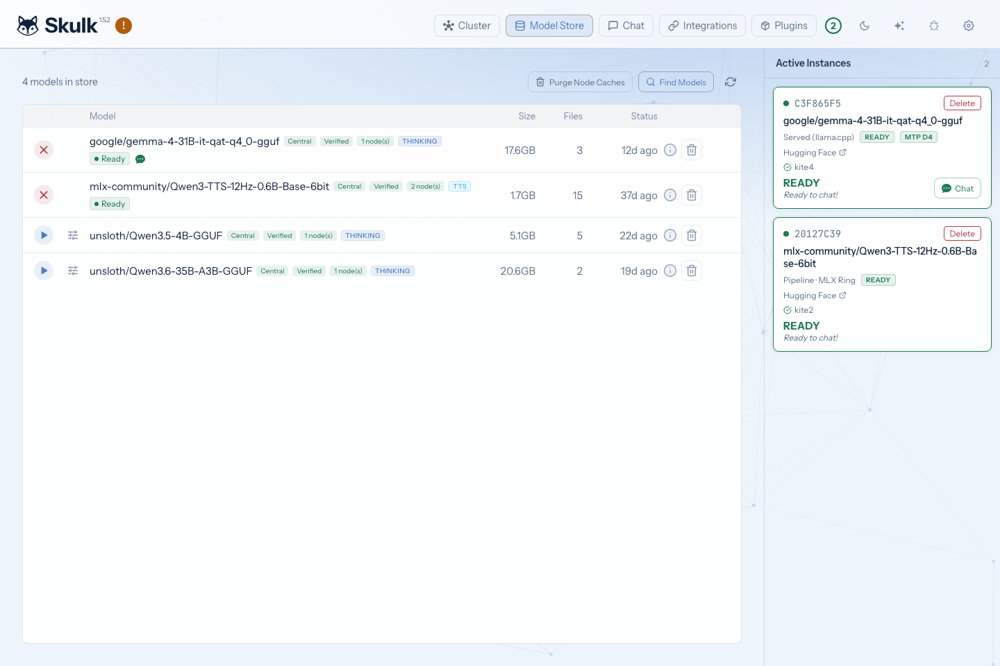
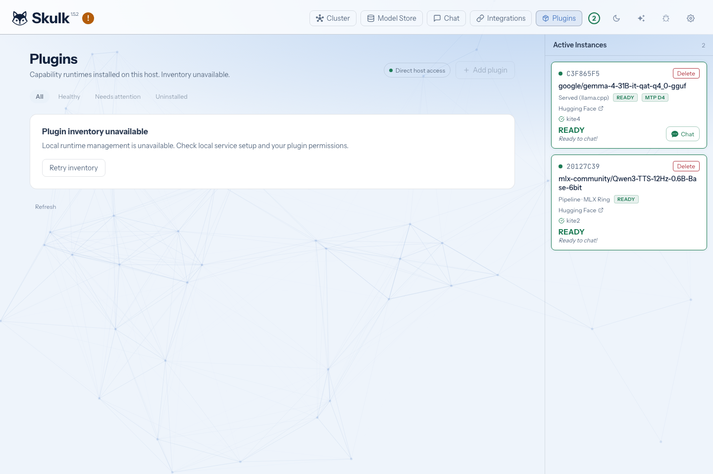
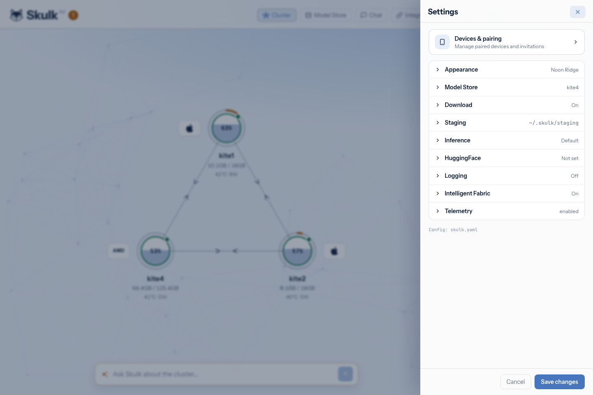
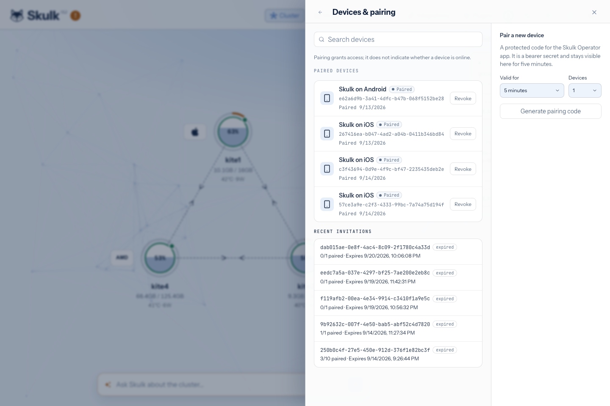

The Skulk dashboard is served by each node with dashboard assets installed.
Open it from the desktop app or visit `http://localhost:52415` on that machine.
A dashboard connected to one node can show the cluster; you do not need to find
the elected master first.

The screenshots below show the actual dashboard and live cluster state at
capture time. Available models and resource readings change as the cluster runs.

## Cluster: see where work is running

The topology shows the connected machines and their reported resource use.
Select a node to inspect its observations. The **Active Instances** panel
separates ready, loading, and failed model placements and identifies their
participating nodes. The panel toggle in the header opens or closes it.

A node being connected does not mean its model is ready. Wait for a ready
instance before chatting or sending an API request. If a runner fails, inspect
the reported reason and the node's diagnostics before retrying; the
[operator runbook](operations) explains common failures.

When enabled, the **Ask Skulk** control opens the resident Steward conversation.
You can ask it to investigate the cluster and review any proposed operation
before approving it. See [Talk to Skulk](steward).

## Model Store: separate downloads from placements

Open **Model Store** to inspect canonical downloads, then **Find Models** to
browse and filter models. Search results describe catalog entries; store
inventory describes downloaded artifacts; Active Instances describes running
placements. These are different views of the model lifecycle.

Choose **Launch** for a model to review placement options. Skulk considers the
model's exact artifacts and capabilities, installed engines, current memory,
and topology. Review the proposed nodes and launch settings. An accepted launch
still has to finish staging and loading before it is ready.

Stopping an instance frees its runtime resources. Deleting a canonical download
removes stored files. Clearing staging removes eligible node-local copies. Use
the action that matches your intent; the [model store guide](model-store)
explains retention and recovery.

## Chat: choose a ready model

Choose a ready chat model in the composer. Conversations, model selection,
attachments, and generation controls live in the Chat view; history and active
instances can be shown alongside it on wider displays. Model-specific controls
appear only where the selected model supports them.

Image input requires a vision-capable placement. Microphone transcription and
spoken responses require the corresponding ready speech models; realtime
capture additionally needs realtime capability. Browser microphone access is
subject to the browser's permission and secure-context rules. See
[inference](inference) and [speech](speech-fabric-realtime) before assuming that
an installed model provides every modality.

Selecting **Skulk** as the chat target uses the fabric's Steward rather than a
normal application model. Its authority and proposal rules are described in the
[Steward guide](steward).

## Integrations: connect another tool

**Integrations** generates configurations for coding agents, chat clients, and
workflow tools using the node address and ready model inventory. Select a tool,
choose its model where offered, and copy its configuration. The
[integration guide](integrations) explains API formats and address selection.

## Plugins: inspect installed capabilities

**Plugins** shows installed managed runtimes, availability, and lifecycle
controls. Inspect a runtime's status or configuration before using its
capability. A stopped or unavailable plugin is different from an empty plugin
inventory, and installing a plugin does not grant authority for external
operations. See [capability nodes](capability-nodes) for installation,
configuration, proposals, and cleanup.

## Settings and pairing

For a packaged Skulk installation, use **Settings** in the dashboard to configure
the cluster. You do not need a terminal or a hand-edited configuration file for
the controls exposed here. Expand a section, change its values, and choose
**Save changes**.

| Section | What you configure |
| --- | --- |
| **Appearance** | Dashboard color theme |
| **Model Store** | Store enablement, host, HTTP listener, port, and canonical path |
| **Download** | Hugging Face fallback |
| **Staging** | Node-local cache, path, and cleanup on deactivate |
| **Inference** | KV cache backend for subsequent model launches |
| **HuggingFace** | Access token for models requiring authorization |
| **Logging** | Structured logging and ingestion URL |
| **Intelligent Fabric** | Fabric capability enablement |
| **Telemetry** | Usage and diagnostic sharing choices |

The [Settings guide](configuration) explains each control, when changes take
effect, and which configuration is shared with other nodes. Advanced file and
command-line configuration is available for headless deployments and development.

Open **Settings → Devices & pairing** to connect the native operator app. Choose
the invitation lifetime and device limit, then **Generate pairing code**.

Scan the resulting QR code in the mobile app. This pairs an operator device; it
does not add a compute node. Invitations and device revocations take effect
immediately, independently of the Settings **Save changes** button. Follow
[remote access](remote-access) for the full generation-and-scan workflow.

## Observability and phone layouts

**Observability** provides live runner observations, node details, and saved
traces. Tracing is an explicit debugging control, while the live status panels
remain useful without recording a trace. See [tracing and diagnostics](tracing).

On a phone, the header navigation becomes a menu and side panels become drawers.
The [mobile dashboard guide](mobile-dashboard) explains that browser layout.
The [native app](native-app) is a separate remote operator interface with its
own pairing, device storage, and activity history.
