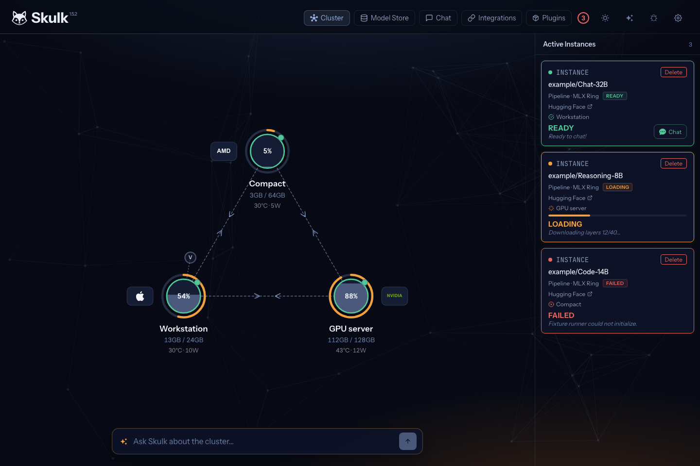
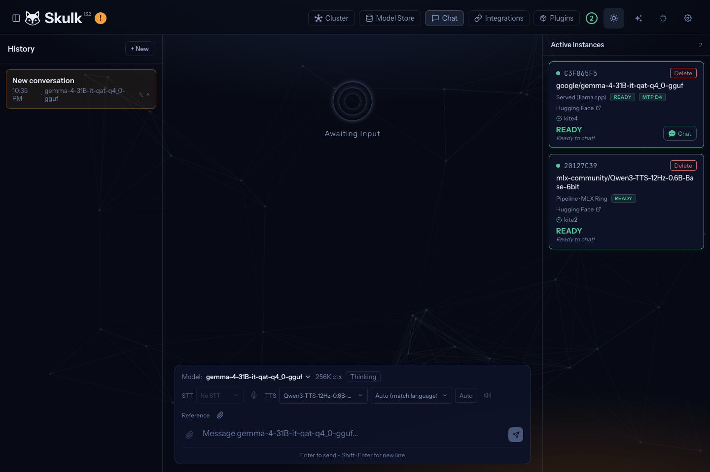

<!-- Copyright 2025 Foxlight Foundation -->

The packaged Skulk apps are the recommended way to install and operate Skulk.
They give the runtime a stable application identity, include the matching
dashboard and native components, and let you start, stop, inspect, and open a
node without managing a source checkout or Python environment.

Choose the path that matches the machine:

| Machine | Recommended install |
| --- | --- |
| Apple Silicon Mac running macOS 15 or newer | Signed and notarized Skulk menu-bar app through a DMG or Homebrew |
| Ubuntu or Debian desktop, `amd64` or `arm64` | Skulk app and runtime through the Foxlight APT repository |
| Headless Ubuntu or Debian, `amd64` or `arm64` | Runtime-only APT package |
| Contributor workstation, development branch, or another Linux distribution | [Source installer](#source-and-development-installs) |

## macOS

Download the current stable signed and notarized app directly:

**[Download Skulk 1.5.1 for Apple Silicon (.dmg)](https://releases.foxlight.ai/desktop/macos/1.5.1/3/Skulk-1.5.1-3-macOS-arm64.dmg)**

Open the DMG, drag **Skulk** to **Applications**, eject the DMG, and open Skulk
from Applications. macOS verifies the Developer ID signature and stapled
notarization ticket before launch.

Homebrew is an equally supported install and update channel:

```bash
brew install --cask Foxlight-Foundation/skulk/skulk
```

Skulk is a menu-bar app: it does not keep a window or Dock icon open. After
launch, click the Skulk fox in the macOS menu bar. The menu shows the node state
and provides **Start Skulk**, **Stop Skulk**, **Open Dashboard**, and
**Reveal Runtime Log**. The app includes the exact Skulk runtime and dashboard
built for its release, so you do not need to install or approve `uv`, Python,
Node.js, or a source tree.

### First run on macOS

1. Open **Skulk** from Applications. The menu initially reports **Stopped**;
   that is expected because V1 never joins a cluster until you choose to start.
2. Click the Skulk menu-bar fox and choose **Start Skulk**.
3. Approve macOS **Local Network** access. Skulk needs it to discover and
   communicate with nodes on your LAN. Skulk does **not** require Screen &
   System Audio Recording; deny that permission and [report the app
   version](https://github.com/Foxlight-Foundation/Skulk/issues) if macOS ever
   presents it.
4. Wait for the menu to report **Ready**, then choose **Open Dashboard**.
5. Confirm that your Mac appears in the topology. A single Mac is a complete
   one-node cluster, so you can launch a model and chat before adding more
   machines.

To update later:

```bash
brew upgrade --cask Foxlight-Foundation/skulk/skulk
```

Skulk checks Foxlight's stable release manifest when the app starts and also
offers **Check for Updates…** in the menu. When a newer stable version is
available, **Download _version_…** opens its signed DMG. The app never silently
downloads or replaces itself; Homebrew users can continue to update with the
command above.

To uninstall:

```bash
brew uninstall --cask skulk
```

If you installed from the DMG, quit Skulk and move **Skulk** from Applications
to the Trash.

## Ubuntu and Debian

Install the Foxlight repository keyring, refresh APT, and install Skulk:

```bash
curl -fLO https://apt.foxlight.ai/foxlight-archive-keyring.deb
sudo apt install ./foxlight-archive-keyring.deb
sudo apt update
sudo apt install skulk
```

When `sudo` asks for your Linux login password, type it and press Enter. The
terminal deliberately shows no dots or other characters while you type.

The public keyring package contains only the repository's public signing key
and APT source definition. The repository's private signing key is never
distributed.

The `skulk` package installs both the desktop controller and the matching
runtime. Open **Skulk** from the application menu and select **Start Skulk**.
The app enables and starts the packaged `skulk.service` user unit, then gives
you controls for the dashboard, logs, node lifecycle, and cluster namespace.
Installing the package alone does not start the service without your action.

### First run on Linux desktop

1. Open **Skulk** from the application menu.
2. Choose **Start Skulk** and wait for the status to report **Ready**.
3. Choose **Open Dashboard**.
4. Confirm that the local machine appears. One machine is a valid one-node
   cluster; add more machines only after this first node works.

The runtime package contains the exact reviewed Skulk source, locked Python
environment, built dashboard, native bindings, launcher, and user service unit
for that release. Linux inference engines are selected from the hardware Skulk
detects; see the [NVIDIA](nvidia-cuda-nodes) and
[AMD](amd-strix-halo-nodes) guides for hardware-specific preparation.

To update later:

```bash
sudo apt update
sudo apt install skulk
```

To uninstall the app and runtime:

```bash
sudo apt remove skulk skulk-desktop skulk-runtime
```

### Headless Ubuntu or Debian

On a machine with no graphical session, install only the runtime after adding
the repository above:

```bash
sudo apt install skulk-runtime
systemctl --user daemon-reload
systemctl --user enable --now skulk
```

A systemd user service normally runs only while that user has a session. For an
unattended node that must survive logout, an administrator can enable lingering
for the service account:

```bash
sudo loginctl enable-linger "$USER"
```

## Form a cluster

1. Get one node to **Ready** and confirm it in the dashboard.
2. Install the same Skulk version on every additional machine.
3. Start Skulk on each machine from the app or service manager.
4. Open the dashboard from any running node and confirm the machines appear in
   the topology.
5. Pick and launch a model. Skulk places it on compatible hardware and begins
   serving when the placement is ready.

Nodes on the same network use Skulk's shared default namespace and discover one
another automatically. You do not need to invent an identifier for an ordinary
cluster. If multiple independent Skulk clusters share a network, set a custom
namespace in the app on **every** node that should belong together. Nodes with
different namespaces cannot form one cluster.

## What success looks like

The dashboard first shows every connected node and its available memory. Start
with one node, then add machines one at a time so a discovery or permission
problem is easy to isolate.



After a model reports ready, open Chat and send a short prompt. The response is
generated by your own Skulk node or cluster.



## First-run troubleshooting

| What you see | What to do |
| --- | --- |
| Skulk opened but no window appeared on macOS | Click the Skulk fox in the menu bar. A persistent Dock window is intentionally not shown. |
| The menu remains at **Stopped** | Choose **Start Skulk**. Startup is deliberately user-triggered. |
| The runtime does not reach **Ready** | Choose **Reveal Runtime Log** on macOS, or inspect `journalctl --user -u skulk` on Linux. |
| A second local node never appears | Confirm every node uses the same version and namespace. On macOS, enable **System Settings → Privacy & Security → Local Network → Skulk**, then stop and start Skulk. |
| macOS asks for Screen & System Audio Recording | Deny it. That permission is not part of the Skulk desktop contract. Include the app version when reporting the prompt. |
| The dashboard opens but shows only one node | That is a working one-node cluster. Start the other nodes, then troubleshoot discovery only if they do not join. |
| `sudo` looks frozen while asking for a password | Type the Linux account password and press Enter; no typing feedback is shown. |

The desktop app does not start Skulk automatically at login in V1. Linux
headless operators can explicitly enable the user service as described above.

## Source and development installs

Use the source installer when you are contributing to Skulk, testing the
development branch, installing on a Linux distribution that the packages do
not cover, or need direct control over the source environment:

```bash
curl -fsSL https://raw.githubusercontent.com/Foxlight-Foundation/Skulk/main/install.sh | bash
```

The stable installer targets `main`. To install the development branch that
matches the `/next/` documentation:

```bash
curl -fsSL https://raw.githubusercontent.com/Foxlight-Foundation/Skulk/main/install.sh | bash -s -- --ref dev
```

See [Source builds and runtime paths](build-and-runtime) for deterministic
commit pins, manual setup, and the exact work performed by the installer.
