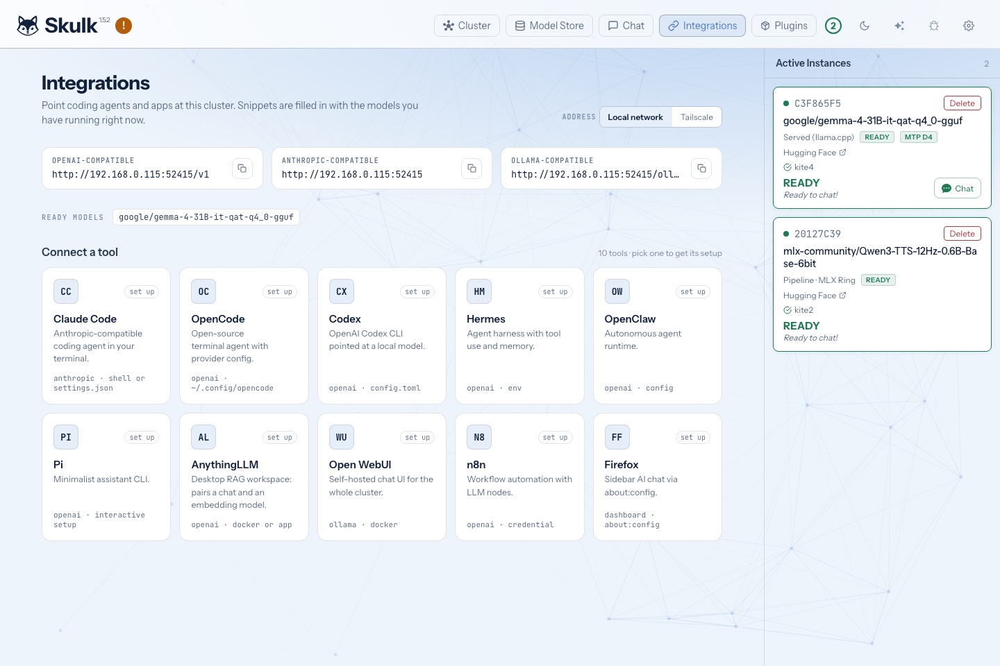

# Connect coding agents and apps to your cluster

Your cluster speaks the API formats these tools already know, so pointing them at
it is a configuration change rather than an integration project. The dashboard's
**Integrations** page writes that configuration for you.

Choose **Open Dashboard** from the Skulk desktop app, then select
**Integrations** in the dashboard navigation. You can also bookmark `/integrations`.
These recipes configure the external tool; Skulk's own options stay in dashboard
[Settings](configuration), without editing a Skulk configuration file.

*The screenshot shows live model availability at capture time.*

## What the page gives you

Pick a tool and you get the exact blocks it needs: a shell command, a config
file, or the settings to type into an application's own screen. Each block has a
copy button.

The blocks are not generic examples. They are generated from your cluster as it
stands right now, so they already contain:

- the address of this node that other machines can actually reach, rather than
  `localhost`
- the ids of the models that currently have a ready instance
- each model's real context window
- per-model capability flags, so a vision model is declared as accepting images
  and a reasoning model is set up to send its thinking back on later turns

If nothing is running yet, the blocks still show the correct shape with a
placeholder where the model id belongs. Mount a model and they fill themselves
in.

## Supported tools

**Coding agents**

| Tool | What you get |
| --- | --- |
| Claude Code | A shell command and a `~/.claude/settings.json` block. Choose which of your models answers as Opus, Sonnet and Haiku. |
| OpenCode | An `opencode.json` provider block covering every ready model. |
| Codex | A `~/.codex/config.toml` with the provider and a filesystem MCP server, plus a launch command. |
| Hermes | A `~/.hermes/config.yaml` for its custom endpoint provider, the interactive setup command, and the stream timeout to raise for long turns. |
| OpenClaw | A `~/.openclaw/openclaw.json` and the commands that start its gateway. |
| Pi | A `~/.pi/agent/models.json` and a launch command. |

**Applications and workflows**

| Tool | What you get |
| --- | --- |
| AnythingLLM | A Docker command, the equivalent desktop-app settings, and the optional embedder settings so document indexing also runs on the cluster. |
| Open WebUI | A Docker command using the Ollama-compatible surface, plus the equivalent Ollama CLI command. |
| n8n | A Docker command, the OpenAI credential to create, and the workflow nodes to wire up. |
| Firefox | The `about:config` keys that make this dashboard Firefox's built-in AI sidebar. |

## The three surfaces

Every recipe uses one of the three request formats the cluster serves, all shown
at the top of the page:

| Surface | Address | Used by |
| --- | --- | --- |
| OpenAI-compatible | `<node>/v1` | Most tools |
| Anthropic-compatible | `<node>` | Claude Code |
| Ollama-compatible | `<node>/ollama` | Open WebUI, the Ollama CLI |

Other tools can connect through a custom OpenAI base URL when the endpoints and
features they require match Skulk's [API contract](api-guide). Point them at
`<node>/v1` and use a model id from the ready-models list. On the trusted local
listener, a client-required API key may be a non-empty placeholder; the paired
operator gateway requires real scoped credentials.

## Choosing which address to embed

A configuration file is usually pasted into a tool running on a different
machine, so the page prefers the node's reported local or Tailscale address. If neither
is available, it falls back to the browser's current origin. Check that the
result is reachable from the client before copying it.

When the node is also reachable over Tailscale, an **Address to use** control
appears so you can choose between the local network address and the Tailscale
one. Pick Tailscale when the tool runs outside your home network. See
[Tailscale](./tailscale.md) for setting that up.

For Docker recipes, loopback addresses (`localhost` and `127.0.0.1`) are
rewritten to `host.docker.internal`; LAN and Tailscale addresses are retained.
A container's loopback interface reaches the container itself, so verify host
name resolution and routing in your Docker environment.

## Authentication

These recipes target the trusted local cluster listener. Its placeholder key
is for clients that require a key field; it is not an access-control boundary.
Keep that listener on a trusted network and do not expose it directly to the
internet.

The paired operator gateway is a different boundary: it validates scoped bearer
credentials and permits an explicit route set. A placeholder key cannot grant
gateway access, and a recipe does not automatically configure the native relay
carrier. See [Remote access](remote-access) and
[operator authentication](api-guide#operator-device-pairing).
