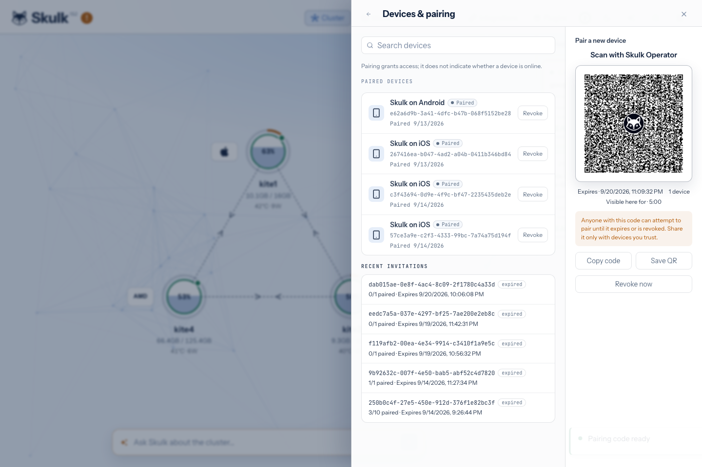

Skulk provides several ways to operate a cluster. Choose the connection that
matches the client and the access your cluster owner has configured.

| Connection | Requirements | Intended use |
| --- | --- | --- |
| Local dashboard | A browser that can reach a dashboard-serving node | Operate the cluster on its trusted network |
| Dashboard over Tailscale | The browser's device and node can reach each other through the authorized tailnet | Private remote browser access |
| Native operator app through the relay | A provisioned cluster gateway, relay service, and valid pairing | Remote iOS/Android access without a VPN on the phone |
| Paired browser session | The intended gateway served through HTTPS or localhost, an owner invitation, and appropriate grants | Scoped browser operations such as plugin management |

A browser session is not the native app's relay carrier. Browser pairing binds
the tab to the gateway serving its page; it does not create an internet tunnel.
Do not expose the unauthenticated local API listener directly to the internet.

## Prepare remote access

A cluster administrator must provision matching gateway and relay configuration,
including the cluster's TLS identity and protected carrier credentials. Installing
Skulk or opening **Remote Access** alone does not enroll a hosted relay service.
Use the provisioning handoff supplied with your relay service; there is no
public relay administration endpoint that a phone can use to create this trust.

Use the dashboard's **Remote Access** view to find local LAN and Tailscale
connection options. These addresses are not a relay-health check. Diagnose relay provisioning and gateway reachability through the
administrator's supplied service controls. Keep provider and gateway secrets out
of screenshots and support messages.

## Create and revoke invitations

On the configured gateway, open **Settings → Devices & pairing** from localhost
or an authorized direct Tailscale connection. Ordinary LAN access and the public
relay cannot administer pairing invitations.

Choose the validity period and allowed device count, then select **Generate
pairing code**. The displayed code/QR is a bearer secret. Its on-screen visibility
window is separate from the invitation's validity period: hiding the code does
not revoke it. Review recent invitations and revoke any that should no longer
admit devices. On the phone, choose **Scan pairing code**, allow camera access,
and center the displayed QR code in the frame. Review the cluster identity
before confirming. See the [native app guide](native-app.md#pair-with-your-cluster).

Invitation creation and revocation happen when their own controls are selected;
they do not wait for the main Settings **Save changes** button.

*This invitation was revoked immediately after capture. The pictured code cannot
pair a device; generate your own invitation in Settings.*

An invitation admits pairing; the resulting device has its own identity and
credentials. Revoking an invitation prevents further use of that invitation.
To remove an already paired device, revoke the device itself. Device credentials
use short-lived access tokens with refresh rotation; successful pairing does not
grant every administrative permission.

## Pair a browser for plugin operations

From **Plugins**, open **Browser access**:

1. Paste the owner's invitation and select **Review invitation**.
2. Verify the cluster name, fingerprint, and gateway displayed by the page.
3. Give the tab a recognizable name and select **Pair this browser**.
4. Give the displayed device ID to the owner if additional plugin access is needed.

Credentials remain in tab memory and disappear on reload or disconnect. Pairing
does not automatically grant plugin privileges. The owner grants
`plugins:read`, `plugins:manage`, and `plugins:approve` separately. Read access,
configuration authority, and approval of a reviewed proposal are distinct
permissions. Publisher-trust and credential-destination setup remains a direct
owner operation even for a browser with plugin-management grants.

## How the native relay path works

The designated operator gateway connects outward to the relay. The app connects
to that relay and establishes a separate, pinned TLS connection through it to the
cluster gateway. Application TLS terminates at the cluster, so the relay forwards
encrypted bytes without reading prompts, answers, model names, commands, or
canonical API bearer credentials.

Each request or stream has an independent connection lane. The on-demand
connector keeps a control connection and opens bounded data lanes when requests
arrive; the legacy provisioning format uses a bounded pool of waiting lanes.
These are provisioning choices, not different model APIs.

The relay still handles connection-routing metadata and aggregate resource
usage. Content encryption does not mean the relay sees no network metadata.
The gateway enforces cluster authentication and route permissions after
termination. If the designated gateway or relay is unavailable, remote app access
is unavailable; local cluster operation can continue.

## Troubleshooting

| Symptom | Check |
| --- | --- |
| Invitation generation is refused | Use the configured gateway through localhost or its authorized direct Tailscale connection |
| Pairing is refused | Check invitation expiry, device limit, revocation, and cluster identity; obtain a current invitation |
| App is paired but offline | Check gateway availability, relay configuration, and network connectivity; remembered identity is not live health |
| Browser loses access after reload | Pair the tab again; browser credentials intentionally stay in memory |
| Plugin controls are unavailable | Ask the owner to verify the exact plugin grants and manager readiness |
| An operation's response is uncertain | Observe its retained operation ID before trying another mutation; a disconnect is not proof that the operation failed |

For endpoint contracts, scopes, and response codes, see the [API guide](api-guide.md).
