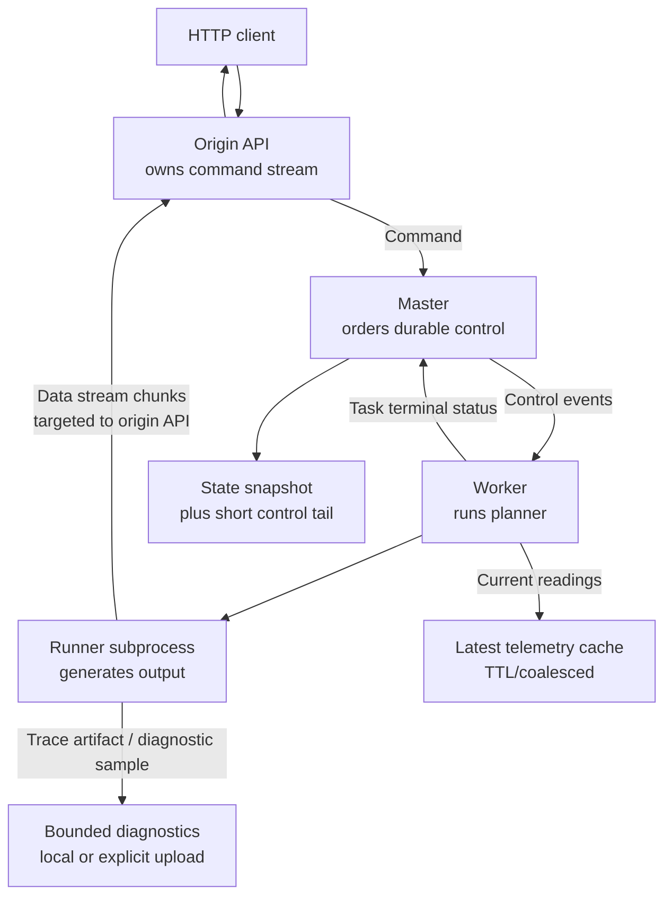

<!-- Copyright 2025 Foxlight Foundation -->

# Runtime Plane Separation

This is a design proposal for separating Skulk's runtime traffic into three
planes:

- **control plane**: durable cluster decisions and live task lifecycle
- **telemetry plane**: current observations where only the latest value matters
- **data plane**: generated tokens, images, embeddings, input payload bytes, and
  trace payloads

The goal is to keep cluster synchronization deterministic without forcing every
token, telemetry sample, and old task cleanup event through the same
master-indexed event log.

## Problem

The current event stream mixes different kinds of information:

- placements and task lifecycle events that change cluster state
- telemetry updates such as node memory, disk, network, and topology readings
- generated output chunks such as `ChunkGenerated(TokenChunk(...))`
- input payload chunks such as `InputChunkReceived`
- diagnostic trace payloads

That makes the event log look like the cluster's source of truth for
everything, even when the event has no lasting state consequence. In practice
this creates several failure modes:

- followers can spend time replaying stale operational history instead of
  hydrating current state
- token streaming goes through master indexing and global event fan-out before
  the API can write to the HTTP stream
- per-token events can be serialized and appended to disk despite not changing
  `State`
- telemetry history consumes replay budget even though placement only needs the
  freshest observations
- diagnostics and traces compete with control-plane events for ordering and
  backpressure

Issue #278 exposed the replay side of this design smell: large session history
and repeated task lifecycle events made catch-up expensive enough to destabilize
elections. The token path exposes the throughput side: generated chunks are
data-plane payloads, but they are currently represented as cluster events.

## Design Principle

Skulk should replicate **current state plus a bounded recent tail**, not a
cluster diary.

The cluster only needs old history when that history is still the cheapest way
to bridge a recent gap. Once a snapshot covers the consequence of an event, the
event itself is no longer part of synchronization.

The invariant:

> No healthy node should need to replay more than the retained control tail to
> become synchronized. If its gap predates the retained tail, it must hydrate a
> fresh snapshot.

The corollary:

> Data-plane payloads and soft telemetry must never be required for follower
> replay.

## Target Architecture



The master remains responsible for ordering durable control-plane decisions.
It is not on the generated-token hot path.

## Event Taxonomy

### Durable Control

Durable control events are the only events that belong in the master-indexed
replay tail.

Examples:

- `InstanceCreated`
- `InstanceDeleted`
- `TaskCreated` for live tasks
- `TaskAcknowledged` while the task is live
- `TaskStatusUpdated` while the task is live
- `TaskFailed` while the task is live
- `TaskDeleted` as a live-task tombstone until the next snapshot
- `TracingStateChanged`
- `CustomModelCardAdded`
- `CustomModelCardDeleted`
- failover seed events such as `StateSnapshotHydrated`

Retention rule:

- snapshots are authoritative
- the replay tail is bounded by age and count
- `TaskDeleted` and terminal task statuses may be dropped after a snapshot in
  which the task is absent
- a replay request older than the retained tail returns "snapshot required"
  rather than clamping to the oldest retained index

### Soft Telemetry

Soft telemetry is current observation, not durable history.

Examples:

- `NodeGatheredInfo`
- `NodeDownloadProgress` progress percentages
- runner phase and memory samples
- topology edge observations
- liveness timestamps
- RDMA, Thunderbolt, disk, and network readings

Target behavior:

- publish on a telemetry topic or state-sync side channel
- keep latest value by `(node_id, metric_kind)` with sequence and timestamp
- coalesce frequent updates before publication
- expire values by TTL
- include only fresh latest values in snapshots
- never require telemetry replay for follower bootstrap

Some telemetry still informs placement. That does not make it durable control
state. The master should plan from its latest observed telemetry view. Followers
may display the same latest view, but old samples should not participate in
catch-up.

### Data Plane

Data-plane messages are request payloads and generated outputs.

Examples:

- token chunks
- tool-call chunks
- image chunks
- embedding chunks
- input image chunks
- trace payloads

Target behavior:

- send directly to the node/API stream that requested the command
- preserve per-command ordering with a local sequence number
- rely on transport backpressure, not the master event log
- send a terminal data-plane chunk to finish the client stream
- separately emit a compact control-plane task outcome for cluster state
- never write generated chunks to the master event log
- do not replay old generated chunks to bootstrapping followers

## Data Stream Protocol

Introduce a data-stream message family separate from `Event`.

Minimal shape:

```python
class DataStreamChunk(CamelCaseModel):
    command_id: CommandId
    task_id: TaskId
    target_node_id: NodeId
    producer_node_id: NodeId
    sequence: int
    chunk: GenerationChunk


class DataStreamClosed(CamelCaseModel):
    command_id: CommandId
    task_id: TaskId
    target_node_id: NodeId
    producer_node_id: NodeId
    final_sequence: int
    outcome: Literal["complete", "cancelled", "failed"]
    error_message: str | None = None
```

The `target_node_id` is the API node that owns the HTTP response stream. The
API includes this route when it submits the command. The master records the
route in the live task metadata, and the worker passes it to the runner.

The first implementation can use a typed `DATA_STREAM_MESSAGES` topic with
target filtering if that is the fastest path through the existing router. That
still removes master indexing, disk persistence, and global state replay from
the token path. The preferred final implementation is a direct libp2p stream or
request-response channel between the producing worker and the origin API node,
so non-target nodes do not even receive the payload.

Ordering is per command:

- the producer increments `sequence` for every emitted chunk
- the origin API expects a contiguous sequence
- a gap or duplicate is a stream error, not a replay request
- on stream error, the origin API sends `TaskCancelled` and terminates the HTTP
  stream with an error

Generated output is not durable cluster state. If the client disconnects, the
API cancels the task. If the API node dies, the stream dies; the control plane
cleans up the live task and runners.

## Control Snapshot And Replay Protocol

The control plane keeps the current snapshot and a bounded tail.

Required behavior:

1. The master persists and serves `StateSnapshot(session_id, revision, state)`.
2. The master retains only recent control events after the latest durable
   snapshot.
3. Followers bootstrap from snapshot first.
4. Followers replay only events after the snapshot revision.
5. If a follower requests a revision older than the retained tail, the master
   responds with `SnapshotRequired`.
6. The follower clears its event buffer, hydrates a fresh snapshot, and requests
   only the tail after that snapshot.

The master must not satisfy stale replay by silently clamping the requested
index to `event_log.start_idx`. Clamping can leave the follower waiting for an
event it will never receive, or can make it apply a tail against the wrong local
base.

Retention should be bounded by both count and age:

- count bound protects replay and disk under high event rate
- age bound preserves the operational intent that catch-up is for recent gaps
- five minutes is a reasonable default target for live catch-up

The exact constants can be tuned, but replay should be an optimization, not a
requirement for correctness.

## Telemetry Protocol

Telemetry needs latest-value convergence, not historical replay.

Introduce a `TELEMETRY_MESSAGES` family or equivalent state-sync payload:

```python
class TelemetrySample(CamelCaseModel):
    node_id: NodeId
    kind: TelemetryKind
    sequence: int
    observed_at: datetime
    expires_at: datetime
    payload: TelemetryPayload
```

Rules:

- accept a sample only if it is newer than the current sample for that node and
  kind
- expire stale samples without creating tombstone events
- coalesce high-frequency updates before publishing
- snapshot only non-expired latest samples
- derive liveness from fresh samples and connection state, not from replayed
  old samples

Placement still sees telemetry through `State` or a master-local view, but
historical telemetry is not part of durable recovery.

## Diagnostics And Traces

Diagnostics should be explicit artifacts, not hidden state-replay payloads.

Rules:

- runner flight recorders remain local bounded rings
- trace payloads are uploaded or fetched through diagnostics APIs
- saved traces are retained by diagnostic retention policy
- diagnostics never block control replay
- diagnostics never ride the per-token stream unless the client explicitly
  requested trace output

This preserves forensic value without letting diagnostics affect election,
placement, or token throughput.

## Migration Plan

### Phase 1: Stop Logging Data-Plane Events

Goal: remove the worst throughput and disk pressure without changing transport.

- exclude `ChunkGenerated`, `InputChunkReceived`, `TracesMerged`, and
  `TracesCollected` from master and API disk event logs
- keep enough in-memory routing to preserve current behavior during migration
- add metrics for chunk count, stream latency, and event-log append count
- prove generated chunks no longer increase event-log size

This phase does not fully separate the master path yet, but it makes data-plane
events non-durable.

### Phase 2: Add Targeted Data Stream

Goal: remove master indexing from generated output.

- add `DATA_STREAM_MESSAGES`
- include origin API route information in generated task metadata
- have runner/worker send chunks to the origin API stream via data messages
- keep task lifecycle events on the control plane
- make API stream completion depend on terminal data message or terminal control
  failure, whichever arrives first
- gate with a compatibility flag until all nodes support the topic

This phase eliminates the master as the token fan-out point.

### Phase 3: Move Input Payloads Off The Control Plane

Goal: keep large request bodies out of the ordered control stream.

- replace `SendInputChunk` -> `InputChunkReceived` with data-plane upload
  messages or object-store references
- keep only payload references, hashes, and readiness state in control metadata
- let workers fetch or receive payload bytes before dispatch
- expire payload blobs when the task finishes or is cancelled

This protects VLM and image-edit workloads from the same data/control mixing.

### Phase 4: Split Telemetry From Durable Control

Goal: stop replaying old observations.

- introduce latest-value telemetry messages with TTL
- remove high-frequency `NodeGatheredInfo` history from the durable event tail
- snapshot only current fresh telemetry
- make placement explicitly tolerate missing or stale telemetry with typed
  pending-info errors
- keep liveness/election independent of replayed telemetry

This keeps placement state fresh without making catch-up process old samples.

### Phase 5: Enforce Snapshot-First Recovery

Goal: make replay bounded by design.

- add a `SnapshotRequired` response for stale `RequestEventLog`
- remove replay-index clamping as a recovery mechanism
- test follower bootstrap when requested index predates retained tail
- test election churn with high historical event counts
- assert startup catch-up time stays below the liveness timeout budget

This phase closes the #278 class of failures.

### Phase 6: Direct Transport

Goal: remove non-target network fan-out.

- replace target-filtered data pub/sub with direct libp2p stream or
  request-response transport
- apply flow control at the stream layer
- cancel generation when the origin stream closes
- keep target-filtered pub/sub only as a compatibility fallback

This is the final throughput-oriented architecture.

## Phase 6 Realization: Eclipse Zenoh Data-Plane Transport

Phase 6 shipped as an **Eclipse Zenoh** transport for the `DATA` topic rather
than a hand-rolled libp2p stream. Zenoh is a purpose-built data-in-motion
transport, so it supplies the direct routing, FIFO ordering, and stream-layer
flow control that Phase 6 calls for without Skulk owning that machinery. The
control, telemetry, and election planes stay on libp2p; only `DATA` moves.

Transport selection is **soft default-on** (#315, `_resolve_zenoh_enabled` in
`Node.create`): an explicit `SKULK_ZENOH_DATA_PLANE` of `1`/`true`/`yes`/`on`
forces Zenoh on (and still requires an explicit `SKULK_ZENOH_LISTEN`, see
Security below), `0`/`false`/`no`/`off` forces gossipsub, and an unset value uses
Zenoh when `SKULK_ZENOH_LISTEN` is configured and gossipsub otherwise. A bare
node with no Zenoh config stays on gossipsub instead of failing the listen
requirement, so the listen endpoint is the opt-in signal under the default. The
two transports are interchangeable per node; gossipsub remains a first-class
fallback.

How it satisfies the Phase 6 goals:

- **No non-target fan-out (key-addressed delivery).** The owning API node stamps
  `owner_node` on the serving command; the master carries it onto the task, and
  the rank-0 supervisor stamps it onto each `DataChunk`. The `Router` publishes
  to the Zenoh key `data/<owner_node>` and every node subscribes only to
  `data/<own_node_id>`, so output reaches just the owner. On gossipsub the
  `owner_node` is ignored (bare-topic broadcast), which is why the transports
  stay interchangeable.
- **Ordering by construction.** The session is a Zenoh `peer` (multicast
  scouting off, gossip plus explicit `SKULK_ZENOH_CONNECT` endpoints) publishing
  `Reliable` + `Block` on a single priority, so a single rank-0 producer's chunks
  are FIFO per key. Because Zenoh preserves per-publisher order, the app-layer
  reorder buffer is **transport-conditional** (#311): kept for gossipsub (which
  reorders), skipped under Zenoh. The per-command `sequence` number is still
  stamped (gossipsub needs it) but unused under Zenoh, and is retained until
  Zenoh is the sole DATA transport.
- **Flow control at the stream layer.** DATA egresses on its own loop
  (`Router._zenoh_networking_publish`) over a **bounded** channel
  (`_ZENOH_DATA_OUTBOUND_BUFFER`, #309/#312). A stalled or slow subscriber
  backpressures the producer (the rank-0 emit) rather than growing memory without
  bound. Backpressure, not drop: the plane is reliable and ordered, so dropping
  would corrupt the stream. The bounded loop also keeps Zenoh's blocking
  backpressure off the shared control-plane publish path.
- **Cancel on origin close.** Generation is cancelled through the control plane
  when the owning API node closes the stream, exactly as for the gossipsub path.

### Security posture

The Zenoh session is **namespace-isolated** (#308): it sets a `namespace` derived
as a SHA-256 hash of the exact token libp2p isolates on (`SKULK_LIBP2P_NAMESPACE`
when set, else the `NETWORK_VERSION` default), and Zenoh transparently prefixes
every key with it. This is **isolation between distinct clusters**, so two
separate Skulk fleets sharing a network do not cross-deliver `data`. It is **not
confidentiality against an adversary already on the same Zenoh network**: with no
TLS the prefix is the only barrier and its seed is non-secret operator config.
For untrusted networks, enable Zenoh TLS or firewall the listen endpoint.
`SKULK_ZENOH_LISTEN` must be set explicitly (no `0.0.0.0` default), and neither
the token nor the derived namespace is logged (startup logs only a non-routing
fingerprint).

### Interaction with speculative decoding

Speculative decoding (MTP) and the Zenoh data plane operate on **different
interconnects and do not meet in the decode loop**. Speculation runs entirely
inside the worker ranks on the MLX compute ring (jaccl over RDMA / Thunderbolt):
drafting, the K+1-token verify forward, accept/reject, and cache reconciliation.
On a multi-node pipeline placement the cross-rank lockstep (#254) also rides the
compute ring, not the data plane: one collective lands the draft tokens and a
second lands the accept length plus the next bonus token. Zenoh is not in that
path and does not even run for output on non-owner ranks.

Zenoh sees only the **committed tokens** that fall out of the loop. The one
observable interaction is **bursty emission**: a speculative round verifies
`[bonus, draft_1 .. draft_K]` in a single forward and commits the longest
matching prefix, so a good round commits several tokens at once. The supervisor's
emit therefore hands the data sender a burst of `DataChunk`s per accepted round
rather than a steady one-per-step trickle, and Zenoh transports that burst.

This is precisely why the Zenoh ordering guarantee matters. On the old
unordered gossipsub DATA topic, multi-node sampled-MTP bursts could reorder and
produce garbled output (#297). Zenoh's single-publisher FIFO delivers each burst
in commit order by construction, which both removes that failure mode and lets
the reorder buffer be skipped. The bounded egress channel keeps a burst intact
under a slow consumer by backpressuring the producer instead of dropping chunks.
Swapping the data plane from gossipsub to Zenoh changes nothing about how
speculation works; it only changes whether the committed-token stream arrives in
order (Zenoh: yes by construction; gossipsub: only via the reorder buffer).

See `architecture-reference.md` for the concrete env vars, the
`_resolve_zenoh_enabled` truth table, and the Rust session details.

## Acceptance Criteria

The migration is complete when these statements are true:

- generated token chunks never enter the master event log
- generated token chunks are not replayed to new followers
- generated token chunks do not require the master to forward them to the API
- input payload bytes do not enter the durable control event log
- telemetry replay is not required for bootstrap
- a node with an old or missing index hydrates from snapshot instead of replaying
  ancient history
- control replay is bounded by configured age and count
- a full-fleet restart with large diagnostic history forms a cluster without
  election churn
- event-log growth under sustained generation is independent of generated token
  count
- per-token p50 and p99 stream latency improve or stay flat under concurrent
  decode load

## Compatibility Notes

Mixed-version clusters need care because old nodes expect `ChunkGenerated` on
`GLOBAL_EVENTS`.

The rollout should use capability discovery:

1. nodes advertise supported runtime-plane features in node identity or config
   sync
2. the master chooses the lowest common protocol for each task
3. if any participant lacks data-stream support, the task falls back to the old
   `ChunkGenerated` event path
4. once all nodes advertise support, the master disables the legacy data-plane
   event path for that task

The fallback should be temporary and visible in diagnostics. Operators need to
know when a single old node is keeping the cluster on the slower path.

## Non-Goals

This proposal does not require replacing the master election system, introducing
consensus, or making generated token streams durable across API-node failure.

It also does not remove event-sourced control state. The control plane still
benefits from ordered decisions and pure state application. The change is that
only durable control belongs in that ordered stream.

## Implementation Checklist

- define `ControlEvent`, `TelemetryMessage`, and `DataStreamMessage` type
  families
- add a runtime-plane capability advertisement
- add target route fields to live task metadata
- add `DATA_STREAM_MESSAGES` as an interim targeted transport
- route runner output to data stream instead of `ChunkGenerated`
- preserve terminal task outcome on the control plane
- exclude data-plane and diagnostics events from disk logs
- add `SnapshotRequired` handling to replay catch-up
- add telemetry latest-value cache with TTL
- update architecture docs once implementation begins
- add stress tests for concurrent generation, stale replay requests, and
  full-fleet restart after large historical traffic
