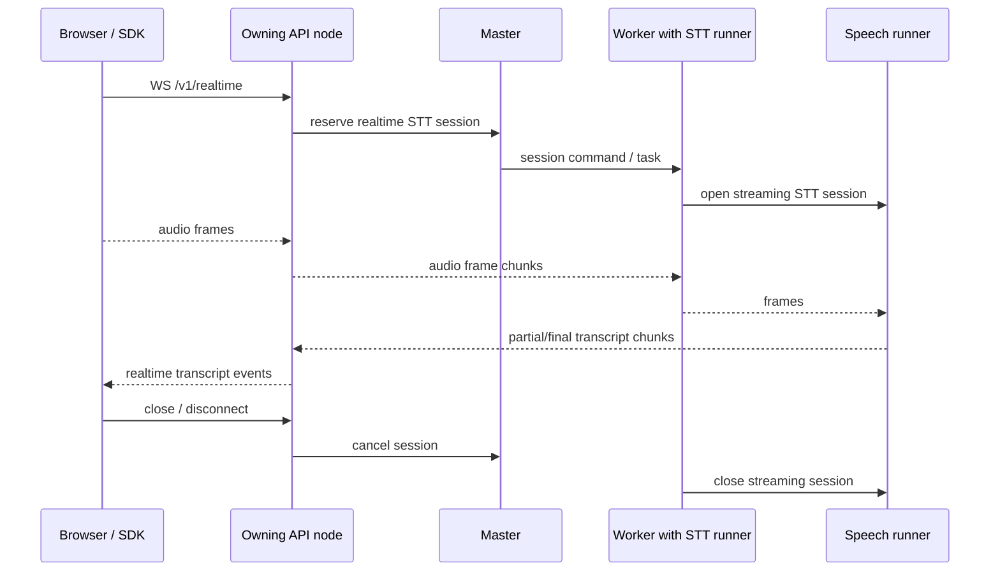

<!-- Copyright 2025 Foxlight Foundation -->

Skulk's first speech serving path is deliberately REST-shaped:

- `POST /v1/audio/speech` turns text into an encoded audio response. Its
  `stream=true` path is experimental and remains inert unless the node runs
  with `SKULK_ENABLE_EXPERIMENTAL_MODE`, the cluster config enables
  `experiments.tts_streaming`, and the mounted TTS card explicitly declares
  `audio.supports_streaming = true`.
- `POST /v1/audio/transcriptions` turns an uploaded audio clip into text or
  transcript metadata.
- `stt@1.0.0` accepts bounded encoded-audio provider frames, begins batch
  transcription on input half-close, and returns one final transcript.
- `stt.realtime@1.0.0` is an experimental bidirectional provider for truthful
  incremental STT models. It accepts mono PCM16 on any API node and uses
  node-addressed Zenoh ingress when the mounted runner is remote.
- The dashboard voice loop composes those endpoints with chat.

This page records the next architectural step. Realtime speech and fabric speech
nodes should make `audio -> text` and `text -> audio` reusable cluster
transforms, not dashboard-only helpers.

## Current Boundary

The shipped speech runner is single-node. TTS cards can opt in to streamed MP3
output chunks. Batch STT remains bounded and non-streaming, while the first
experimental realtime STT path now uses an upstream incremental session with
node-addressed ingress:

- speech model placement is capability-gated by `mlx_audio` backend tags;
- the API owns request validation, upload caps, and response formatting;
- the worker assembles bounded audio uploads before dispatching STT tasks;
- the speech runner emits `AudioChunk` output for TTS and terminal
  `TranscriptionChunk` output for STT on the data plane;
- production nodes expose a built-in `tts@1.0.0` server-streaming provider
  facade over that same core TTS path. It emits raw MP3 media over
  `PROVIDER_DATA`, advertises liveness only while eligible mounted capacity is
  available, and propagates provider cancellation to the core command;
- eligible API nodes expose a built-in `stt.realtime@1.0.0` bidirectional
  provider. It pins one realtime task to a selected single-host instance and
  moves ordered PCM frames through a same-node short circuit or bounded
  node-addressed Zenoh ingress, then bounded worker-runner IPC, without putting
  audio in State or the event log. Remote capacity is not advertised when Zenoh
  is unavailable;
- browser microphone capture and playback stay in the dashboard layer.

Realtime should not bypass those contracts. It adds session lifetime and partial
results, but it still needs placement, cancellation, diagnostics, upload/privacy
guardrails, and data-plane ownership.

## Realtime STT Target

The first realtime transport target is the generic provider contract, followed
by an OpenAI-compatible edge:

```text
CapabilityDescriptor(io_mode="client_streaming" or "bidirectional")
then WS /v1/realtime
```

The provider layer lands first so dashboard, SDK, agent, and future orchestration
callers all use one speech capability rather than coupling the Fabric node to a
WebSocket route. The initial scope is realtime STT, not full duplex voice chat.
A session accepts ordered client audio frames, applies an explicit input
half-close, forwards them to one mounted STT runner session, and emits partial
and final transcript events only when the underlying model truthfully supports
progressive transcription.

### Session Ownership

A realtime session has one owner: the API node that accepted the WebSocket. That
owner is responsible for:

- authenticating and validating the session request;
- selecting a mounted STT model instance;
- routing the session to the serving worker or rejecting when no compatible
  runner is ready;
- draining partial/final transcript events to the WebSocket;
- cancelling the runner session on disconnect, timeout, or explicit close;
- recording latency and cancellation metrics.

The runner session is single-serving-runner owned. Do not broker one realtime
session across multiple STT runners until there is a measured model that needs it
and a tested ordering contract for partial transcripts.



### Current Contract And Remaining Decisions

- **Audio format negotiation:** version 1 accepts mono signed little-endian
  PCM16 at 8-96 kHz and resamples to the upstream session rate. Browser encoded
  formats and codec negotiation remain follow-ups.
- **Backpressure:** API-to-worker Zenoh streams and worker/runner channels are
  bounded; the worker also caps pre-dispatch input at 256 frames or 16 MiB and
  cancels overflow. Transport rejection is source-routed to fail only the
  affected provider call. Audio-duration diagnostics remain a follow-up.
- **VAD ownership:** decide whether voice activity detection lives inside the STT
  model session, a dedicated VAD runner, or an API-side preprocessor.
- **Cancellation:** a WebSocket close must release the runner session and any
  buffered audio promptly.
- **Failover:** a realtime session may fail on runner/node loss; it should not
  silently migrate mid-utterance until replayable audio buffering exists.
- **Telemetry:** expose time to first partial transcript, final transcript
  latency, queued audio duration, frame drops, and cancellation reason.

## Fabric Transform Nodes

Speech is becoming two typed provider capabilities:

| Node | Input | Output |
| --- | --- | --- |
| `SpeechToTextNode` | `audio/*` frames or bounded clips | `text/plain`, optional language, segments, word timings |
| `TextToSpeechNode` | `text/plain`, optional voice controls | `audio/*`, sample rate, duration, byte count |

These nodes are not new physical processes at first. They are first-party
provider facades over existing placed speech models. The TTS facade is the first
implementation. The contract lets other workflows ask for a transform without
knowing whether it was invoked by the dashboard, an extension, or a future
planner-built chain.

### Transform Descriptor

The common descriptor is the shipped `CapabilityDescriptor`: id + semantic
version, human/LLM-readable description, JSON Schemas, annotations, and an I/O
mode (`unary`, `server_streaming`, `client_streaming`, or `bidirectional`). Calls
pin the descriptor revision and carry caller/target identity plus one deadline.
Binary audio rides raw `InlineMediaAttachment` frames or a managed
`BlobMediaAttachment`; it never becomes a server-local file path or a large
base64 field in the generic contract.

Current and planned speech contracts:

| Capability | Mode | State |
| --- | --- | --- |
| `tts@1.0.0` | server streaming | Built-in facade implemented; experimental until fleet validation passes |
| `stt@1.0.0` | client streaming transport, batch inference | Implemented for bounded inline encoded audio; managed blobs remain later |
| `stt.realtime@1.0.0` | bidirectional | Built-in local facade implemented behind experiment and truthful-card gates |

### Composition Examples

- dashboard microphone -> `SpeechToTextNode` -> chat draft;
- chat assistant text -> `TextToSpeechNode` -> dashboard playback;
- workflow text output -> `TextToSpeechNode` -> audio artifact;
- uploaded speech -> `SpeechToTextNode` -> routing decision -> model call.

The first planner should build only explicit chains. Automatic graph search can
wait until transform costs, latency, and failure modes are measured.

## Data And Control Plane Rules

Realtime/fabric speech must preserve the existing plane split:

- core model placement, runner lifecycle, and core task cancellation stay on
  the control plane;
- provider opening is node-addressed and direct; provider lifecycle/media uses
  `PROVIDER_DATA`, never event-sourced State;
- built-in realtime STT PCM ingress uses node-addressed `REALTIME_AUDIO`, never
  event-sourced State, and requires Zenoh for a remote serving worker;
- generated audio, partial transcripts, and final transcript chunks stay off the
  event log;
- binary audio payloads must not be logged;
- per-session data needs an owner node so it can route to the API node that owns
  the WebSocket or transform request;
- dropped terminal data must have a control-plane backstop so HTTP/WebSocket
  clients do not hang forever.

For clip-based REST STT, the current base64 chunk path is acceptable only because
the upload is bounded and non-streaming. It is not a no-retention path: the
current `AudioInputChunk` control-plane events are indexed and can be retained in
the disk event log. Realtime audio frames must not reuse that event-sourced input
path; they need a streaming input path with bounded queues and
cancellation-aware cleanup.

## Metrics

Track speech transforms separately from text/image generation:

- request/session wall time;
- audio input bytes, duration, sample rate, and frame count;
- audio output bytes, duration, sample rate, and format;
- real-time factor for TTS and STT;
- time to first partial transcript;
- time to final transcript;
- queued audio duration;
- partial/final transcript counts;
- cancellation reason;
- invalid-audio and unsupported-format counts;
- runner load time and memory footprint.

These fields should feed diagnostics first and the results ledger once the
ledger has a speech result schema.

The first diagnostics slice now exposes active provider calls, stream admission
and overload pressure, caller-input queue depth, input/output frame and inline
media byte volume, admission-to-first-output latency, total stream lifetime,
terminal outcomes, cancellation requests, and missing terminals. These are
available in `NodeDiagnostics.provider`, both aggregated and grouped by
qualified speech capability. Audio duration, real-time factor, sample-format
breakdowns, transcript partial/final counts, detailed cancellation reasons, and
runner memory attribution still require speech-runner instrumentation and the
results-ledger schema; they are not inferred from byte counts.

## Privacy And Retention

The target policy for realtime/fabric speech is no payload retention by default:

- do not log audio payloads;
- do not retain browser recordings or uploaded clips after the request/session
  ends;
- delete temporary files in `finally`;
- redact transcripts before any optional result publication;
- make any retention or benchmark publication mode explicit and opt-in.

The current REST STT implementation still routes bounded upload chunks through
the event-sourced control plane, so its audio bytes can persist in event history.
Moving input audio onto a non-event streaming/blob path is a prerequisite before
Skulk can truthfully claim no-retention semantics for uploaded speech.

Reference-audio voice conditioning should use managed uploads or voice IDs, never
caller-provided filesystem paths.

## Implementation Backlog

1. **Complete:** validate the built-in `tts@1.0.0` facade locally and
   cross-node, including progressive playback, cancellation, deadline,
   pressure, and terminal gates.
2. **Complete:** caller-to-provider media frames and explicit input half-close
   for `client_streaming` / `bidirectional` descriptors.
3. **Complete:** add a built-in realtime STT facade only for models whose runner
   can open a true streaming session; batch-backed models do not advertise
   progressive output.
4. **Complete for bounded inline media:** add the `stt@1.0.0` batch facade.
   Binary audio uses client-streaming transport plus input half-close rather
   than the JSON-only unary call envelope. Managed blob resolution remains a
   follow-up requiring a general immutable blob service.
5. **Partial:** add provider diagnostics for active requests/sessions, admission
   pressure, queue depth, media bytes, first audio/transcript latency, terminal
   outcomes, and cancellation requests. Detailed cancellation reasons and
   audio-duration/real-time-factor metrics remain runner/result-ledger work.
6. **Complete:** add remote serving-node realtime audio ingress with bounded,
   no-event-retention semantics, a same-node short circuit, Zenoh-only remote
   delivery, source-routed transport failure, and master-side instance
   reservation.
7. Add `WS /v1/realtime` as a compatibility edge over the provider contract,
   behind capability checks and feature flags.
8. Add dashboard and SDK smoke tests with synthetic microphone input.
9. Add result-ledger speech metrics once the ledger schema can represent audio
   and transcript artifacts safely.

## Acceptance Gate

Realtime/fabric speech is ready to ship only when:

- a realtime session cannot block unrelated REST speech or chat requests;
- disconnect and cancel release runner-side session resources;
- partial transcript ordering is deterministic;
- telemetry can explain latency and queue buildup;
- binary audio never appears in normal logs or event history;
- a failed runner produces a terminal client-visible error instead of a hanging
  socket.
