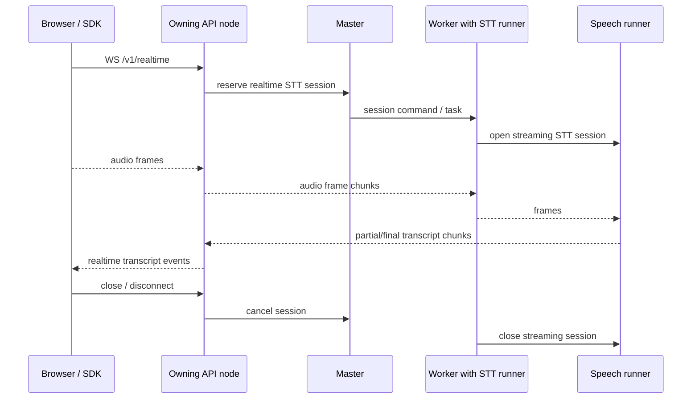

<!-- Copyright 2025 Foxlight Foundation -->

Skulk's first speech serving path is deliberately REST-shaped:

- `POST /v1/audio/speech` turns text into an encoded audio response and can
  stream chunked HTTP MP3 bytes with `stream=true` when the mounted TTS card
  explicitly declares `audio.supports_streaming = true`.
- `POST /v1/audio/transcriptions` turns an uploaded audio clip into text or
  transcript metadata.
- The dashboard voice loop composes those endpoints with chat.

This page records the next architectural step. Realtime speech and fabric speech
nodes should make `audio -> text` and `text -> audio` reusable cluster
transforms, not dashboard-only helpers.

## Current Boundary

The shipped speech runner is single-node. TTS cards can opt in to streamed MP3
output chunks, while STT is still bounded and non-streaming. That is
intentional:

- speech model placement is capability-gated by `mlx_audio` backend tags;
- the API owns request validation, upload caps, and response formatting;
- the worker assembles bounded audio uploads before dispatching STT tasks;
- the speech runner emits `AudioChunk` output for TTS and terminal
  `TranscriptionChunk` output for STT on the data plane;
- browser microphone capture and playback stay in the dashboard layer.

Realtime should not bypass those contracts. It adds session lifetime and partial
results, but it still needs placement, cancellation, diagnostics, upload/privacy
guardrails, and data-plane ownership.

## Realtime STT Target

The first realtime API target is an OpenAI-compatible subset:

```text
WS /v1/realtime
```

The initial scope is realtime STT, not full duplex voice chat. A session accepts
client audio frames, forwards them to one mounted STT runner session, and emits
partial and final transcript events.

### Session Ownership

A realtime session has one owner: the API node that accepted the WebSocket. That
owner is responsible for:

- authenticating and validating the session request;
- selecting a mounted STT model instance;
- routing the session to the serving worker or rejecting when no compatible
  runner is ready;
- draining partial/final transcript events to the WebSocket;
- cancelling the runner session on disconnect, timeout, or explicit close;
- recording latency and cancellation metrics.

The runner session is single-serving-runner owned. Do not broker one realtime
session across multiple STT runners until there is a measured model that needs it
and a tested ordering contract for partial transcripts.



### Required Decisions Before Shipping

- **Audio format negotiation:** define accepted browser formats, sample rates,
  channel counts, and whether the API performs resampling or refuses mismatches.
- **Backpressure:** define the maximum queued audio duration per session and the
  behavior when clients send faster than the runner can consume.
- **VAD ownership:** decide whether voice activity detection lives inside the STT
  model session, a dedicated VAD runner, or an API-side preprocessor.
- **Cancellation:** a WebSocket close must release the runner session and any
  buffered audio promptly.
- **Failover:** a realtime session may fail on runner/node loss; it should not
  silently migrate mid-utterance until replayable audio buffering exists.
- **Telemetry:** expose time to first partial transcript, final transcript
  latency, queued audio duration, frame drops, and cancellation reason.

## Fabric Transform Nodes

Speech should become two typed transforms:

| Node | Input | Output |
| --- | --- | --- |
| `SpeechToTextNode` | `audio/*` frames or bounded clips | `text/plain`, optional language, segments, word timings |
| `TextToSpeechNode` | `text/plain`, optional voice controls | `audio/*`, sample rate, duration, byte count |

These nodes are not new physical processes at first. They are a fabric contract
over existing placed speech models. The contract lets other workflows ask for a
transform without knowing whether it was invoked by the dashboard, an extension,
or a future planner-built chain.

### Transform Descriptor

The common descriptor should include:

- `transform_id`;
- `input_media_type`;
- `output_media_type`;
- `model_id`;
- `owner_node`;
- `timeout_seconds`;
- `priority`;
- `privacy_policy`;
- model-specific options such as language, voice, speed, response format, and
  timestamp granularity.

The descriptor should avoid server-local file paths. Binary audio either rides a
bounded chunk protocol or a managed blob reference with expiry and deletion
semantics.

### Composition Examples

- dashboard microphone -> `SpeechToTextNode` -> chat draft;
- chat assistant text -> `TextToSpeechNode` -> dashboard playback;
- workflow text output -> `TextToSpeechNode` -> audio artifact;
- uploaded speech -> `SpeechToTextNode` -> routing decision -> model call.

The first planner should build only explicit chains. Automatic graph search can
wait until transform costs, latency, and failure modes are measured.

## Data And Control Plane Rules

Realtime/fabric speech must preserve the existing plane split:

- placement, session reservation, cancellation, and terminal status stay on the
  control plane;
- generated audio, partial transcripts, and final transcript chunks stay off the
  event log;
- binary audio payloads must not be logged;
- per-session data needs an owner node so it can route to the API node that owns
  the WebSocket or transform request;
- dropped terminal data must have a control-plane backstop so HTTP/WebSocket
  clients do not hang forever.

For clip-based REST STT, the current base64 chunk path is acceptable only because
the upload is bounded and non-streaming. It is not a no-retention path: the
current `AudioInputChunk` control-plane events are indexed and can be retained in
the disk event log. Realtime audio frames must not reuse that event-sourced input
path; they need a streaming input path with bounded queues and
cancellation-aware cleanup.

## Metrics

Track speech transforms separately from text/image generation:

- request/session wall time;
- audio input bytes, duration, sample rate, and frame count;
- audio output bytes, duration, sample rate, and format;
- real-time factor for TTS and STT;
- time to first partial transcript;
- time to final transcript;
- queued audio duration;
- partial/final transcript counts;
- cancellation reason;
- invalid-audio and unsupported-format counts;
- runner load time and memory footprint.

These fields should feed diagnostics first and the results ledger once the
ledger has a speech result schema.

## Privacy And Retention

The target policy for realtime/fabric speech is no payload retention by default:

- do not log audio payloads;
- do not retain browser recordings or uploaded clips after the request/session
  ends;
- delete temporary files in `finally`;
- redact transcripts before any optional result publication;
- make any retention or benchmark publication mode explicit and opt-in.

The current REST STT implementation still routes bounded upload chunks through
the event-sourced control plane, so its audio bytes can persist in event history.
Moving input audio onto a non-event streaming/blob path is a prerequisite before
Skulk can truthfully claim no-retention semantics for uploaded speech.

Reference-audio voice conditioning should use managed uploads or voice IDs, never
caller-provided filesystem paths.

## Implementation Backlog

1. Add a realtime session model and command/task vocabulary without enabling a
   public WebSocket route.
2. Add speech transform descriptors and result summaries that can represent both
   REST requests and future realtime sessions.
3. Add diagnostics for active speech requests/sessions and queue depth.
4. Add a bounded streaming input path for realtime audio frames.
5. Add a runner-owned STT streaming-session adapter for models that expose
   `create_streaming_session`.
6. Add `WS /v1/realtime` behind capability checks and feature flags.
7. Add dashboard or SDK smoke tests with synthetic microphone input.
8. Add result-ledger speech metrics once the ledger schema can represent audio
   and transcript artifacts safely.

## Acceptance Gate

Realtime/fabric speech is ready to ship only when:

- a realtime session cannot block unrelated REST speech or chat requests;
- disconnect and cancel release runner-side session resources;
- partial transcript ordering is deterministic;
- telemetry can explain latency and queue buildup;
- binary audio never appears in normal logs or event history;
- a failed runner produces a terminal client-visible error instead of a hanging
  socket.
