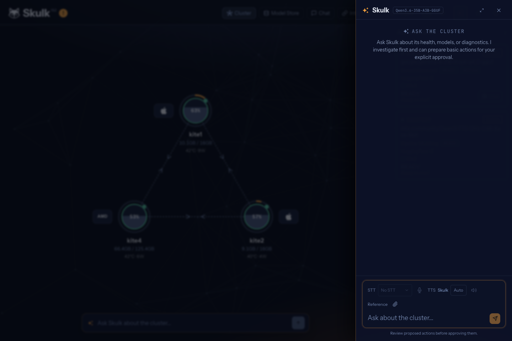

Skulk can answer questions about its own cluster, investigate problems using live
read-only tools, and prepare actions for an operator to review. The resident model
and its server-side investigation loop are called **Steward** in the configuration
and API. In the dashboard, you are talking to Skulk itself.

This is more than an ordinary model chat: every turn receives a fresh, validated
cluster-state observation before an answer can be generated. Additional tools
inspect diagnostics, node health, versions, model availability, capability nodes
and Skulk's bundled documentation. Questions such as “Which models are running?”,
“Why can this model not fit?” and “How do I configure logging?” therefore use the
cluster's observations and documentation.



*The actual dashboard conversation panel at capture time.*

## Enable the resident model

Open the dashboard **Settings → Intelligent Fabric**, turn **Enabled** on,
and select **Save changes**. Skulk prepares its resident model automatically;
the first start may download weights. Turning the setting off removes the
system placement. Packaged-app users do not need a terminal for this.

For headless administration, the equivalent configuration is:

```yaml
intelligent_fabric:
  enabled: true
```

The default `steward_models` list prefers the Qwen3.6 35B tier and falls back through
Qwen3.5 4B to a 0.8B GGUF model. Skulk picks the first card that the cluster can
serve, accounting for available engines and memory. Advanced administrators can override the ordered
`steward_models` list in configuration with compatible tool-calling text cards;
the Settings panel exposes the enable toggle, not this model preference list. The resident instance consumes
real cluster memory and uses the same download, staging and runner lifecycle as
other models.

Skulk maintains one system-role placement and repairs it after node loss or
master failover. It also considers a better preferred model after capacity has
remained available for five minutes, prestages its weights, and waits for an idle
window before switching. Ordinary instance deletion cannot remove the resident
placement while intelligent fabric is enabled; disable the feature to remove the
requirement to keep one resident.

Read `GET /v1/steward` before sending a request. Its lifecycle distinguishes
**disabled**, **downloading**, **starting**, **ready** and **degraded**, with
additional information about the selected model and any transition. Presence in
state alone does not prove that a model can answer; periodic canary requests also
check generation health.

## Use the dashboard or an OpenAI-compatible client

The dashboard exposes Skulk conversation alongside ordinary model chat. An
OpenAI-compatible client uses the same chat-completions endpoint with the reserved
model ID `skulk/steward`:

```bash
curl http://localhost:52415/v1/chat/completions \
  -H 'Content-Type: application/json' \
  -d '{
    "model": "skulk/steward",
    "messages": [{"role": "user", "content": "Which models are ready, and are any nodes unhealthy?"}],
    "stream": true
  }'
```

Use the [API authorization](api-guide.md) appropriate to your connection. The
reserved model returns a service-unavailable response when the resident instance
is not ready. Streaming includes investigation progress as reasoning content,
followed by the answer. Client tool definitions are rejected and client system
prompts do not replace Skulk's own system instructions. Calling the underlying
model's ordinary card ID gives ordinary inference without Steward's cluster tools.

The server bounds the investigation to eight tool calls and disables the resident
model's thinking mode. If the mandatory cluster-state observation is unavailable
or invalid, the turn fails instead of generating an answer without it. This also
applies to follow-ups. Fresh evidence does not guarantee a correct interpretation:
inspect the relevant state or diagnostic endpoint when a consequential conclusion
needs verification.

Some standalone inventory questions, including supported node-count and download
status questions, are answered deterministically from the observations. Counts
refer to transport peers or node staging records as labeled; capability nodes,
physical computers, external resources and store downloads are different objects.
Unknown or partial observations must remain unknown or partial.

## Review actions before execution

With operator mutation authority, a conversation can prepare proposals to place a
model, stop or restart an operator instance, or cancel a download. Preparing a
proposal does not perform the action. The proposal records the exact target,
rationale, evidence, expected effect and expiry.

1. Review the proposal in the dashboard or with `GET /v1/steward/proposals`.
2. Approve or reject that exact proposal through the separately authorized
   decision endpoint.
3. Observe its lifecycle and the resulting cluster state. `dispatched` records
   command acceptance, not completed model loading or successful inference.

The elected master consumes approval once and revalidates current conditions.
Changed targets, expired evidence and protected system-role placements can prevent
execution. Restart and download cancellation retain exact instance or attempt
identity so approval does not silently apply to replacement work. The
`SKULK_FABRIC_CAPABILITIES_DISABLE=1` master-side switch disables action dispatch.
There is no autonomous model approval.

Installed capability plugins can add bounded read tools and inert proposal tools.
External-provider approval is a separate provider-owned workflow with explicit
plugin approval authority; enabling Skulk conversation or preparing a proposal
does not grant spending authority. See [Extensions](extensions.md) and the
[proposal API](api-guide.md).

## Speak with Skulk

With ready speech models, the dashboard can transcribe microphone input and speak
Skulk's replies. Fabric conversation requires the bundled `skulk` voice on a ready
streaming TTS model; it does not silently substitute another voice. Realtime
microphone behavior depends on a ready STT model and live realtime provider
advertisement. Batch-only STT models use recorded-clip upload. See
[Speech and realtime transcription](speech-fabric-realtime.md).

## Runtime and evaluation repository

The production placement, status, tools and approval loop live in the main Skulk
runtime. The separate **skulk-steward** repository contains the model-evaluation
bench, fixtures, scoring and harness experiments used to assess candidate models.
It is not another service that an operator must install. Benchmark results test
particular model and scenario combinations; they do not establish the correctness
of every live answer. The production contract is the implementation in Skulk and
its [API guide](api-guide.md).
